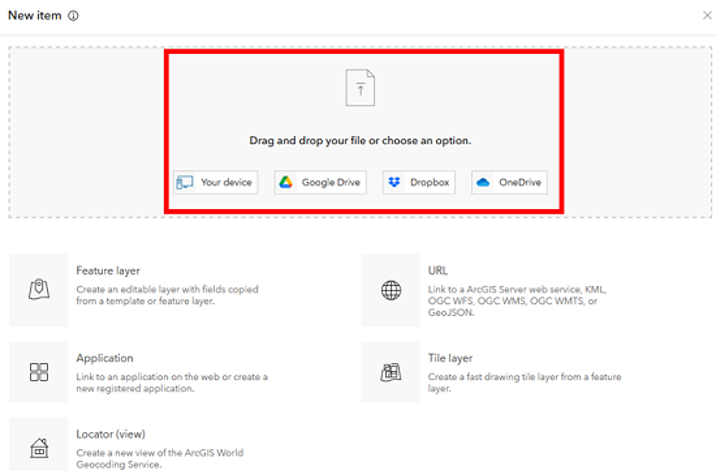
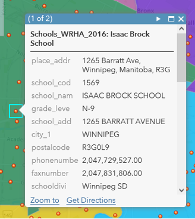

# ArcGIS Online Exercise – Census Geography and Winnipeg Schools

---
<kbd></kbd>

---
## 0. **Housekeeping**:  
This session we will be:  
1. Creating a map from scratch  
2. Discussing census geographies
3. Joining census data to spatial data 
4. Exploring symbology and analysis options 

# Exploration 

## 1. Access your **Map** workspace to create your own map from scratch:  
 
1. Navigate to UM's ArcGIS Online Portal (https://univmb.maps.arcgis.com) and ensure you are signed in.  
2. Access the **Map** area by clicking on that option in the top navigation.  
   
 
 
## 2. **Add** data from your local machine:  
We want to add some data we have downloaded to our empty map.    
1. Select the **Add** option from the top left of your page and select the option to add the layer from a file.  
   
 
2. From the options that appear we want to **Browse** to the data folder you have downloaded to select to select the zipped census dissemination area shapefile (WpgDA2016).  
   
  
3. Click **Import Layer** and wait for the service to be created.
4. The import wizard will want you to adjust your **Symbology** to display the data.  
In the series of dialogue boxes that follow:  
    1. Select the option to **show location only**  
	    
 
	2. Click on the **Options** button to change the colour or transparency of the Dissemination Areas if you wish.
	3. Click the blue **Done** button at the bottom of your Table of Contents to finish the import.  
2. Save your new map by clicking the **Save** button above the workspace. Give it a meaningful name.
3. Your screen should now look something like:  
   
 
 
 ## 3a. Access your **Content** workspace to create your own feature service:  
1. Access the **Content** area by clicking on that option in the top navigation.  
   
 
 
2. **New Item** to create a feature service from a .csv file:  
We want to add our tree data to our Content area in the form of a feature service so that we can publish content with it.    
1. Select the **New Item** option from the top left of your content area.  
 
 
2. From the options that appear we want to select the **From your device** option to select to .csv file from your downloaded data.  
   
  
3. **Navigate** to your WpgDALabour.csv file and add it.  
In the series of dialogue boxes that follow:  
    1. Select the optio to create a **hosted feature layer** from the .csv.  
	 
    
	2. Double-check your field types and if they are not listed as **double**, change them in the drop-downs.
	  
  
	3. Ensure the **location settings** are listed as _None_.  
	  
  
	4. _Title_: **WpgDALabour_yourInitials** 
        
 

4. Click the _Save_ button, and wait while your service publishes.  
5. You should now have your own **feature service** to use in your map. 
6. Return to your **personal** content area.

## 3b. Add your **table** of census data to the map.  
1. From your personal content list click the map title and select the **Open in Map Viewer** option on the right side of your screen.
   
 
2. Select the **Add** option from the top left of your page and select the option to **Search for Layers** to add the table you just created in your workspace.
   
 
2. From the options that appear we want to **select** to the table you just created to add it to the map.  
   
  
3. **Return** to your Table of Contents
4. The import wizard will want to know if your table has any spatial reference (Latitude/Longitude fields). Select the option for _None_, and then add the layer.
   
5. Now there should be three items in your Table of Contents:
- Dissemination Area polygons
- Topographic base map
- Table of labour statistics
6. **Save** your changes

 
## 4. **Join** the data from the table to the census geography file.  
If we explore the Attribute Tables of both DA files by clicking on the  icon, we can see the disconnect between the two files.
1. From the **Analysis** options above your Table of Contents, open the heading to **Summarize Data** and select the **Join Features** option.  
   
 

4. In the _Join Wizard Dialogue_ select the following options. Note that most options and tools have a blue circle you can hover over for more information.  
    1. _Target_: **WpgDA2016**  
    2. _Join Layer_: **WpgDALabour** table  
    3a. _Type_: **Choose the fields to match**
    3b. _Target_: **DAUID** , _Join_: **DAUID**  
    4. _Operation_: **one to one**  
    5. Name the file something meaningful including your initials.  
   
 
5. Click the _Run Analysis_ option, wait for the data to join and be added to the map
6. Check the attribute table of your newly created layer. Now you should be able to symbolize based on census information.  
 
   
7. Don't forget to save your work.  

## 6. **Share** your map  
There are many ways you can share your work with the world so they can explore your work.  
1. Click the **Share**   button above the map and explore the options available to you.  
    - Share map with a **group** (1) or via **link**(2)  
    - **Embed** Map in a website (3)  
    - Create a stand-alone **application** (4)  
   

 
 
Congratulations! You made it through!  

Questions? Concerns?  
 

<small> Data: [Statistics Canada, 2016](https://www12.statcan.gc.ca/census-recensement/2011/geo/bound-limit/bound-limit-2016-eng.cfm)</small>  

