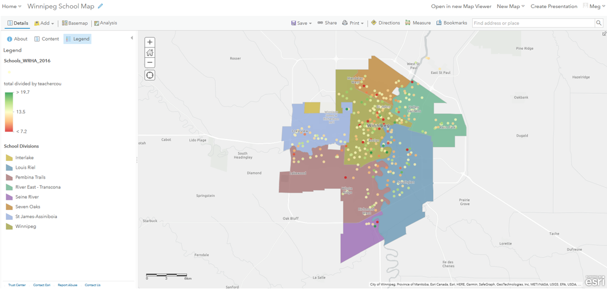

# ArcGIS Online Exercise – Pretend you're a dishonest schoolboard trustee...
<small>(Basic)</small>

---
<kbd></kbd>

---

## 0. Housekeeping: 
Today we will be **exploring** the ArcGIS Online interface by:
1. Finding data available data   
2. Integrating files  
3. Adjusting dataset parameters  
4. Discussing export options  

## Exploration 
## 1. Access your **workspace**: 
1. Navigate to UM’s **ArcGIS Online Portal** [https://univmb.maps.arcgis.com](https://univmb.maps.arcgis.com)  
2. **Log-in** by entering your UM email and password.  
3. The Home page is your Landing Page.  
  

 
## 2. **Explore** AGOL Interface: 
Numbers 1-3 illustrate the locations of the following elements:
1. **Account** (includes link to training materials)
2. **Tools** (all of the different ESRI Apps available to you)
3. **Options** (pages for different purposes (your content, maps, etc.)
  
 
## 3. Explore **Training** options: 
1. Click on your **username** in the top right corner of the screen.
2. Select the **Training** option half way down the list.
  

3. At the top of the page select the **Catalog** option, then the **Course Catalog**
 
4. Take a bit of time to browse through the training options available to you.
5. Return to the UM AGOL Home page.

## 4. Explore available **tools**: 
1. Click on the **waffle button** that is to the left of your username in the top right of the screen to see the tools that are available.
2. Today’s session will be focusing on **ArcGIS Online** (also linked in the top navigation of your Home page).  
  

## 5. Explore AGOL **Home** options: 
Numbers 1-2 illustrate the most useful **navigation** options of the Landing Page:
1. **Map** (where to go to create a new map in AGOL)
2. **Content** (where all of your data, objects and organizational content is stored)
  

## **Creation** 
## 1. Access your Content **workspace**: 
1. Access the **Content** area by clicking on that option in the top navigation.
  
 
## 2. Explore the **Content Panel**: 
Numbers 1-4 illustrate the locations of the following elements:
1. **Personal content** (includes all data and objects you have created)
2. **Filters** (allows you to easily limit the things that show up in your content area)
3. **Create New** (one of many ways to create/ add content to your workspace)
4. **Available content** (items that have been shared to you through groups, University of Manitoba or ESRI’s Living Atlas.)  
  

 
## 3. View **Organization** data options: 
1. Click on **My Organization** in the blue Content navigation bar.
This brings up data that has been **shared** at the Organizational level. Be aware, not all of it is available for reuse.  
  
 
2. Search for **Street Outline: City of Winnipeg**. Click on the title to see more details about the file.  
  

3. Now we can see a _Description_ and the _Terms of Use_ for the file, as well as options to explore the data further.  
  
 
4. Return to your **personal content** page.

## 4.1 View **Group data** options: 
1. Click on **My Groups** in the blue Content navigation bar.
2. This brings up items that have been shared at the Group level, I have shared one (1) map and two (2) feature layers with you.
3. Click on the **Winnipeg School Map** map that has been shared with you.  
  
 
4. Click on the **Open in Map Viewer** option.  
  
 
5. Your screen should now look something like:  
  

 
6. Save your map by clicking the **Save As** option above the map and adding your initials to the end of the name. Your map is now saved to your personal content area.  
  
 
## 4.2 **Add data** that has been shared with you through a Group: 
1. Click on the **Add data** option above your map. Select the **Search for layers** option.  
  
 
2. Ensure the **My Groups** option is selected from the dropdown  
  
 

3. This brings up items that have been shared at the Group level, I have shared two feature layer with you.  
4. Click on the **WinnipegSchools** layer that has been shared with you.  
 
  
5. **Add item** to map using the **plus sign** in the bottom right corner of the item.
Your map should now look something like:  
  
 
6. **Save** your work.

## 5. Explore the workspace. 
Numbers 1-4 illustrate the locations of the following elements:
1. **Tool** options
2. **Actions** (allows add new content to the map, change your base map, conduct simple analyses)
3. **Table of Contents** (properties options for individual layers such as: attributes, symbology and pop-up configuration)
4. Your map **workspace**   
  

Numbers 5-12 illustrate the purpose of the icons found in the Table of Contents:
- 5 - **Legend**
- 6 - **Attribute table** (information about each data point displayed as a table)
- 7 - **Symbology** (change the appearance of feature)
- 8 - **Filter** (show a subset of your data)
- 9 - **Perform analysis** (analyze this specific layer)
- 10  **More options** (zoom, transparency, pop-ups, labels…)  
  
 

## 6. Change **symbology styles** to reveal an invisible pattern in the schools data
1. Ensure you are in the **Content** area of your Table of Contents to change symbology. The third tile from the left (3 stacked shapes) is the option to **change styles**.  
  
 

2. In the Styles dialogue that opens: 
    - Attribute: **Total**
    - Drawing Style: **Counts and Amounts** (size or colour), then select **Options**.  
  
 
3. In the **Counts and Amounts** dialogue that opens: 
    1. _Symbols:_ change the colour.
    2. _Classify:_ No need to check off, we just want to see the data points relative to one another.
    3. _Transparency:_ Adjust as you want.  
  
 
4. Select **OK** and then **Done**. Don’t forget to **save**. Your workspace should look something like:  
  

5. Try changing the **symbology**:
    - School division layer so it is less aggressive, can you figure out how to add labels? 
    - Show a different attribute than population on the schools layer.

 
 
Congratulations! You made it through!  

Questions? Concerns?  
 

<small> Data: [Winnipeg School Divisions ](https://data.winnipeg.ca/City-Planning/School-Division/jhqm-mmeu), [Winnipeg Schools ](https://data.winnipeg.ca/Education-and-Training/Province-of-Manitoba-Public-And-Independent-School/ukha-ify8/data)</small> 

