# Piktochart exercise – Making a bite-size visual

---
<kbd>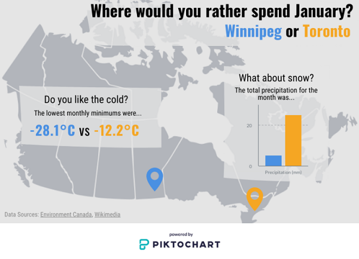</kbd>

---

## 0. **Step back**:  
Before we dive in to making a graphic you need to decide what your purpose is…  
- Is it exploratory or explanatory? If exploratory, maybe an infographic isn’t the best option.  
- Where will it be used? This will help us select appropriate size, and visual elements.  
- What is your data capable of? Don’t mislead the audience or create chart-junk!  

Then decide what your actual object will look like. The goal of creating an infographic is to educate your user by providing context and supporting visuals around a certain theme or trend. Physically sketch out what you are thinking about.  

In this case:  
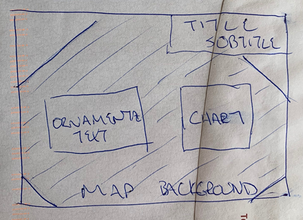
  

## 1. **Access** your workspace:  
1. Log-in to your free Piktochart account (https://create.piktochart.com/)  
2. The dashboard page is your landing page.  
 

## 2. **Create** a new item:  
1. Click on the option to create a **new item**. 
2. Select the **infographic** option
3. We will use the **blank template**

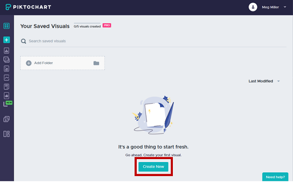  
 
 
## 3. **Explore** Piktochart Workspace:  
Numbers 1-4 illustrate the locations of the following elements:  

1. Piktochart **options**  
2. **Objects** (to create a new elements)  
3. **Properties** (options for each of the specific objects)
4. **Workspace** (where you build your visual)  

	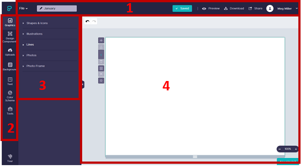  
 

## 4. **Name** your item:  
In the top left corner of the page there is a **textbox** for you to name your file. I’ve named mine _January_. Name yours whatever you would like.  
	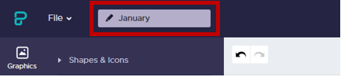  
 

## 5. Change **workspace size**.  
We want our workspace to be smaller and in landscape orientation.  
1. Click the **gear** next to the workspace to open the properties menu  
2. Change the **height** to be _500px_  

	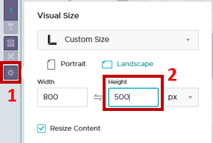 
 

## 6. Set **background**.  
Stark white and black are hard on the eyes, so we will start by setting the background colour to a light grey.  
1. Select the **Background** option from the list of tools  
2. Under the **Background Colours heading**, select light grey by clicking on the paint bucket (or type Hex code #e5e5e5 into the box).  
  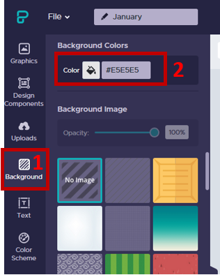 
3. Your workspace should look something like:
  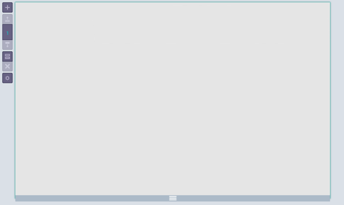	
 

## 7. **Upload** an image.  
We are going to use a map of Canada as a background image to provide some visual interest and ground the audience.  
1. Select the **Uploads** option from the list of tools  
2. **Browse** to your data folder and select the map image to upload.  
 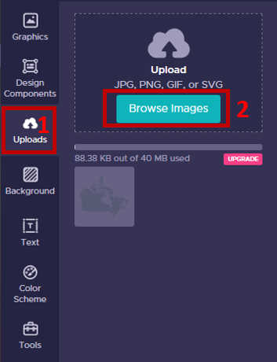  
 
3.	Once the image has uploaded, **drag and drop** it into your workspace  
 

## 8. **Scale** the image to act as a background.  
We are going to scale this image up and set it so that it acts as a background.  
1. Left click the image once to **select** it  
2. So that it doesn’t skew, hold down the shift key and drag and of the handles that appear along the edge to increase the size to be roughly the width of the page  
3. The top and bottom of the map are cut off, but that’s ok. We just need to make sure the positions for Toronto and Winnipeg are visible  
4. In the **image properties toolbar** that appears while the image is selected  
    1. Change the **opacity** of the image to make it less dominant, by clicking the checkerboard  
    2. Then click the **lock** so that the image doesn’t accidentally get selected and shift, we will be placing other elements on top of it.  
	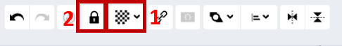 
 
5.	Your workspace should now look something like:  

	   
 

## 9. Add a Title/ Subtitle/ Surround **text**.  
We don’t want to overwhelm the user, but we do want to create something visually interesting. A good way to think about it is to select one ornamental text for titles/ emphasis and one plain one for everything else. I selected Oswald and Roboto Condensed, but you can select whatever you want.  
1. Select the **Text** option from the list of tools  
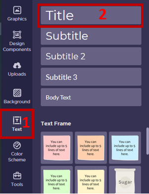
 
2. **Drag and drop** the Title block onto your workspace  
Copy and paste the following text into the block that has appeared in your workspace:  
_Where would you rather spend January?  
Winnipeg or Toronto_  
3. You can select text within the block and change its properties using the text properties menu that appears.  
I am going to:  
    1. _Bold_ the first line of the Title,  
    2. _Right justify_ for visual interest  
    3. Apply a _different colour_ to each city name  
	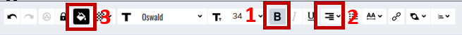
4. Your workspace should look something like:  
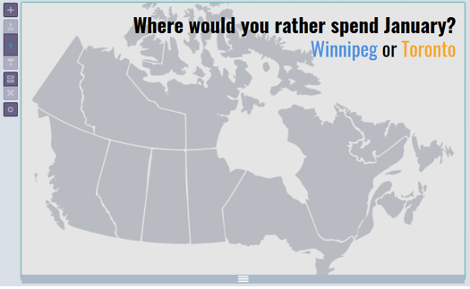
  

## 10. Add some **graphics**
We are going to add some icons to the image and carry our colour scheme through the infographic with (in my case) blue being used to represent Winnipeg, and Orange for Toronto.  
1. Select the **Graphics** option from the list of tools.  
2. To add a **marker icon** select the Shapes & Icons option and search the word _marker_. 
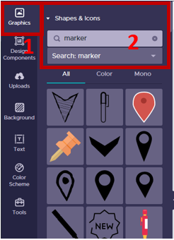
 
3. **Select** any of the black (mono) options available and **drag and drop** it onto the workspace.  
4. Hold down the **shift key** to keep proportions and drag the handles to resize (once something is in the workspace you can copy + paste it to duplicate).  
5. Add a second marker to the map  
6. Drag one the markers to the vague locations of Winnipeg and Toronto on the map  
7. Select each marker and use the graphic toolbar to **change their colours** by clicking on the paint can icon:  
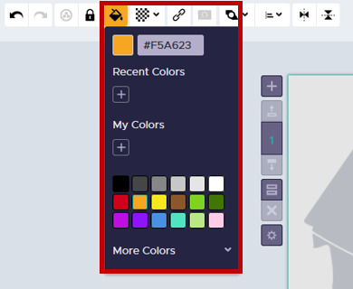
 
8.	Your workspace should look something like:
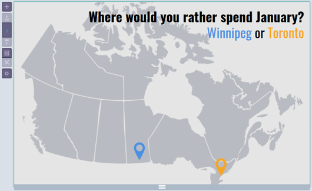
   
 

## 11. Add a **chart**
We are going to add a bar chart visualizing total precipitation to our graphic.  
1. Select the **Tools** option from the list to tools  
2. Add the **Chart** option by clicking on it once:  
	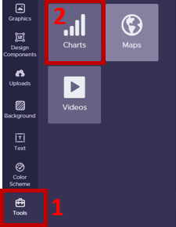
 
3. In the Chart dialogue box that opens  
    1. Select the first chart option on the left for **vertical bars**  
    2. **Delete** the sample data and paste in the following:  
  <table style="width:60%">
  <tr>
    <th></th>
    <th>Winnipeg</th>
    <th>Toronto</th>
  </tr>
  <tr>
    <td>Precipitation (mm)</td>
    <td>5.4</td>
    <td>25.1</td>
  </tr>
  </table> 

4. To edit the chart properties click the **gear** in the top right corner of the dialogue box.  
    a. For a **title** we can add:  
	_The total precipitation for the month was..._   
    b. To change the bar colours to match our colour theme select: **Individual color setting**, and select your city colours to represent their respective values by clicking on the colour swatches.  
	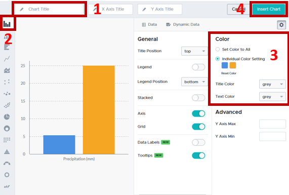
 
5. Click **Insert Chart** in the top right corner  
6. With the chart selected use the handles to shift and resize it to sit over top of the Maritime provinces with the entire title visible.  
7. Your workspace should look something like:  
	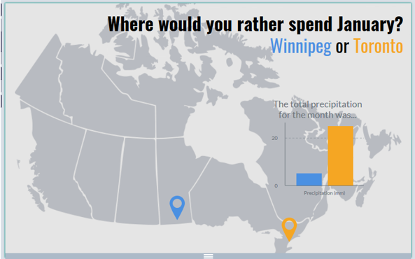
 
	
## 12. Reduce visual clutter  
You can see that the image in the background is competing with our text. To deal with this we will use some semi-transparent boxes.  
1. Select the **Graphics tool** from the left side of the screen  
2. Under the **Shapes & Icons** options select the _square_  
  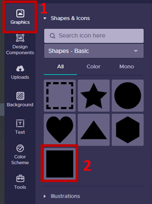  
3. Resize the square so that it is slightly larger than your chart.  
4. Use the image graphic toolbar to:  
    1. Change the **colour** to _light grey_  
    2. **Transparency** to _80%_  
    3. **Arrange** option to _send backward_ behind the chart and in front of the map  
	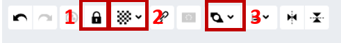
5. It should look something like:  
	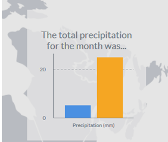  
 
6. Copy and paste this box **two times** to create a background for our title, as well as our descriptive text.  
    1. Resize and position one behind the **title**  
    2. Resize and position the other over the western territories and provinces,  
7. Your workspace should look something like:  
	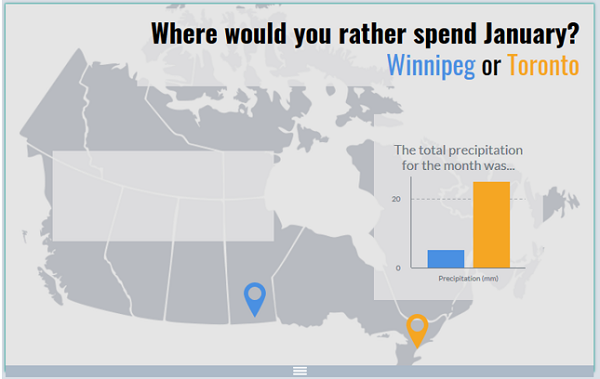  
   

## 13. Add decorative descriptive **text**  
The built in options in are sometimes very limited, so finding work abounds is important. Here we will use three separate blocks of _Body text_ to add some visual interest to our descriptive text.  
	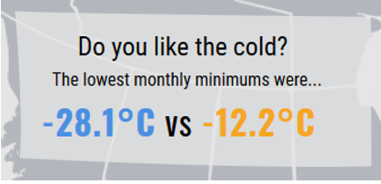  
 
1. Select the **Text** option from the list of tools  
2. Drag and drop three **Body Text blocks** onto your workspace  
3. Copy and paste the following text into each of those blocks that has appeared in your workspace:  
  _Do you like the cold?  
  The lowest monthly minimums were…  
  -28.1°C vs -12.2°C_  
4. Select the text within each block and change it's properties using the **text properties menu** that appears.  
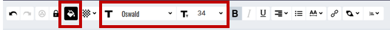  
  _Line 1: Roboto Condensed 23  
  Line 2: Roboto Condensed 16  
  Line 3: Oswald, Bold, 30, colours to match the cities_  
	
5.  I added a bit more descriptive text: a title for the graph, and the data source  
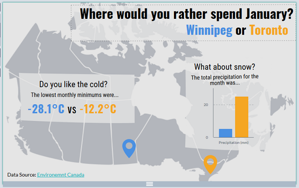
 

Congratulations! You made it through!  

Questions? Concerns?  
 

<small> Data: [Climate Summary Data (Environment Canada)](https://climate.weather.gc.ca/prods_servs/cdn_climate_summary_e.html), [Map of Canada (Wikimedia)](https://upload.wikimedia.org/wikipedia/commons/3/38/Canada_blank_map.svg)</small>  
