# Conducting analysis using ArcGIS Online tools

---
<iframe width="720" height="480" frameborder="0" marginheight="0" marginwidth="0" style="border:12px solid  #fcfcfc" src="https://meginwinnipeg.github.io/slides/RVanalyzing.html"></iframe>

---

## 0. **Summary**:  
In this step we will be creating three (3) different type of maps, and an additional feature layer to support our story.  

- Species Map  
- Heat map  
- Proportional symbology  
- Summary Statistics 

---

## 1. Select the **map** you made in the previous step, we're going to use it as a template to create our other maps. 
 
1. Navigate to UM's ArcGIS Online Portal (https://univmb.maps.arcgis.com) and ensure you are signed in.  
2. Access the **Content** area by clicking on that option in the top navigation.  
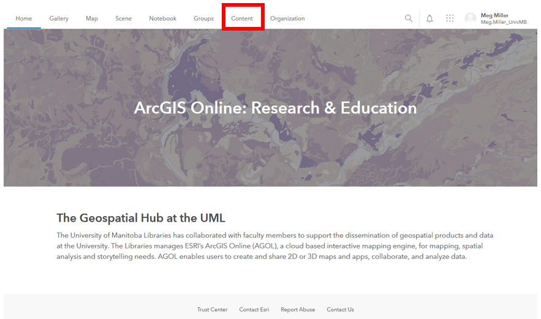   

3. Click the **map** title in your Contents area.  
4. On the details page that opens, select the **Open in Map Viewer** option to open our map.  
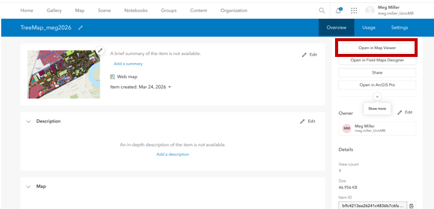   
 
5.  Save multiple copies of the map to your personal content area by selecting the **Save As** option.   
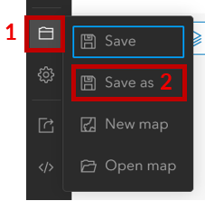 
We will be creating the following maps, so save one copy for each (name it something meaningful and be sure to add your initials to the end of the filename).  
    1. Tree Species Map     
	2. Heat Map of Trees  
	3. Proportional Symbology Map  
6. When you return to your **content** area, you should now see **four (4)** maps listed.   
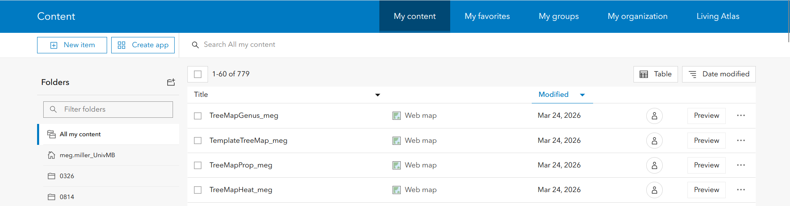   

## 2a. Create a **Species map** to show distribution around campus.  

1. Click the **Species map** title in your Contents area.  
2. On the details page that opens, select the **Open in Map Viewer** option to open our map.  
 

3. In the Table of Contents ensure that:
   1. The Space Inventory is hidden  
   2. The Tree Inventory is selected  
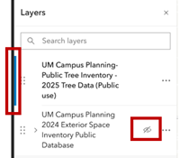   

4. Select the **Styles** toolbar at the right side of the screen. 
5. Then click the **Field** button.  
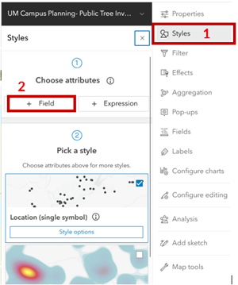  

6. Check off **Species** in the list that opens, and then **Add** to the map.  
7. Your map should now look something like:  
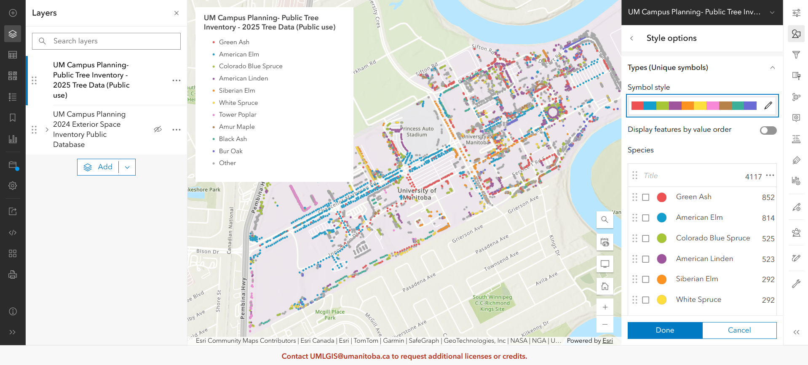 

## 2b. **Configure pop-up** in your map for visual clarity.  
Right now, our pop-up contains a lot of extra information that our audience may not be interested in:  
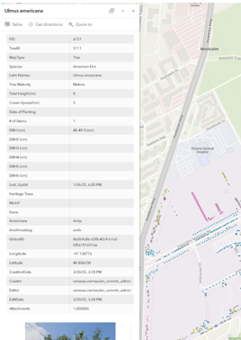 
 
1. To edit, ensure the **Tree Inventory** layer is selected in your Table of Contents and select the **Pop-up** toolbar on the right side of the screen.  
2. We can see there is a title block coming from the Latin Names_ field, a list of 30 fields, and an attachment image.  
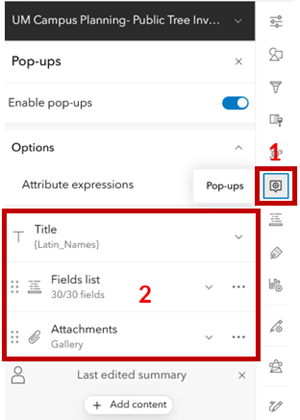   

3. Delete the list of fields by clicking the 3 dots to the right of the item and selecting **delete**.  
4. Select the **add content** option at the bottom of the menu, and select **Text**.  
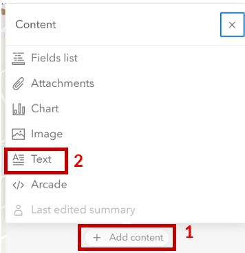    

5. Paste the following code into the text box and click OK:  

`This {Species} is listed as {Tree_Maturity} and stands at {Height}m tall, with a crown that is {Spread}m wide.
We are currently updating our dataset to include names of our campus trees in Indigenous languages.
The {Species} ({Latin_Names}) is known as:
Michif: {Michif}
Dene: {Dene} 
Anisininew: {Anisininew}
Anishinaabeg: {Anishinaabeg}`
 
6. Your pop-up should now look something like:  
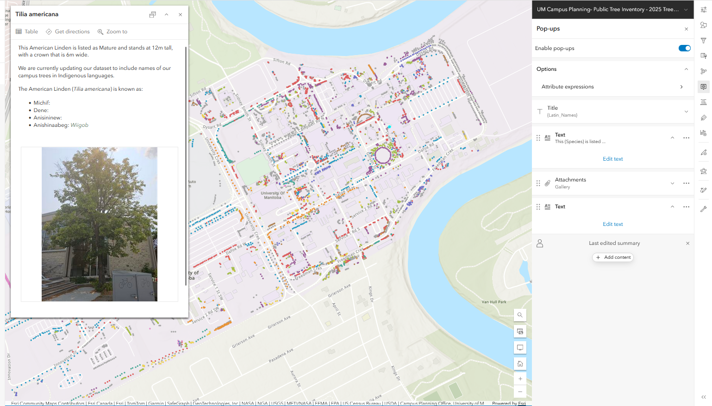  

7. Don't forget to **Save** your edits. 
8. Return to your **personal content** page.
 
 
## 3. Create a **Heat map** to show distribution around campus.  

1. Select the **Heat Map** you have created from the template.  
2. On the details page that opens, select the **Open in Map Viewer** option to open our map.  
3. In the Table of Contents ensure that the __Space Inventory__ layer is hidden and the __Tree Inventory__ is selected.  
   

4. Select the **Styles** toolbar at the right side of the screen. 
5. The style options for trees should open automatically on the right side of your screen.  
    1. _Drawing style_: **Heat Map**  
    2. Explore **options** for _Heat Map_  
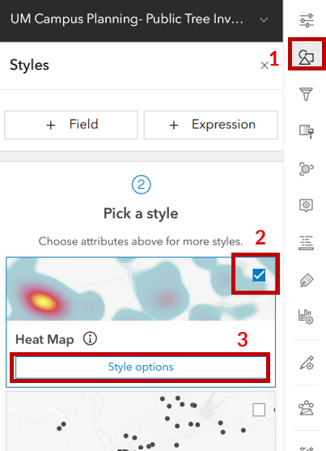   
     
    3. In the Heat Map options that open select a colour ramp that works for you.  
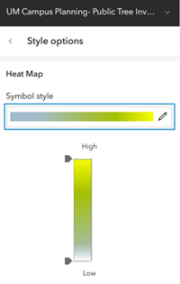   
 
6.  Your map should look something like:  
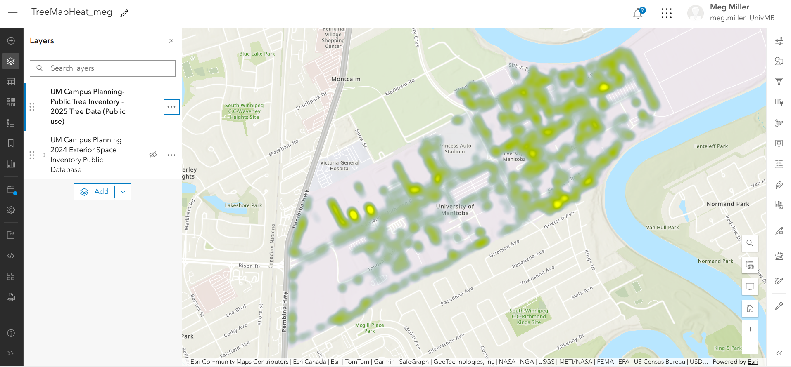   

7. Don't forget to **Save** your edits. 
8. Return to your **personal content** page.  

 
## 4. Use **Proportional Symbology** to show relative tree sizes around campus.  

1. Select the **Proportional Symbol Map** you have created from the template.  
2. On the details page that opens, select the **Open in Map Viewer** option to open our map.  
3. In the Table of Contents ensure that the __Space Inventory__ layer is hidden and the __Tree Inventory__ is selected.  
4. Select the **Styles** toolbar at the right side of the screen. 
5. The style options for trees should open automatically on the right side of your screen.  
    1. _Choose Attribute_: **Field**  
	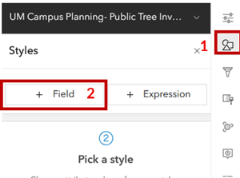   
	2. Use the checkbox to select __Crown Spread__.  

2. Ensure you are in the **Content** area of your Table of Contents to change symbology. The third tile from the left (3 stacked shapes) is the option to **change styles**.  
  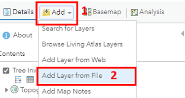   

3. In the _Styles_ dialogue that opens:  
    1. _Attribute_: **Diameter at Breast Height**  
    2. _Drawing Style_: **Counts and Amounts (size)**, then select **options**.  
	  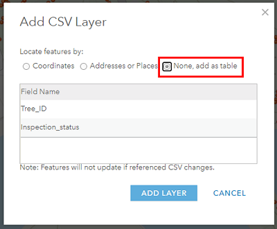   

4. In the _Counts and Amounts_ dialogue that opens:  
    1. _Symbols_: change the colour to **green**.   
    3. _Classify_: No need to check off, we just want to see the data points relative to one another.    
    5. _Transparency_: Adjust as you want.  
	  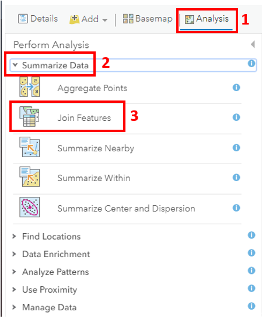   

5. Select _OK_ and then _Done_. Don’t forget to save. Your workspace should look something like:  
  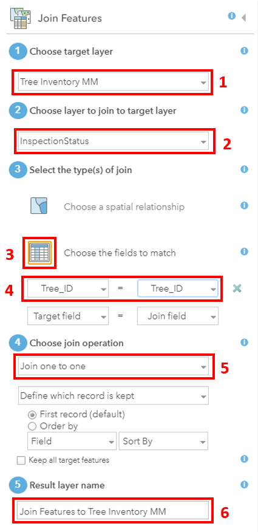   
  

## 6. **Open** your newly saved _TreeStatsMap_ map to calculate some tree statistics for the park:  
  
1. From your personal content list click the map title and select the **Open in Map Viewer Classic** option on the right side of your screen.  
 
 
2. You will see a new layer for park boundary appearing in your Table of Contents.  
3. From the **Analysis** options above your Table of Contents, open the heading to **Summarize Data** and select the **Summarize Within** option.  
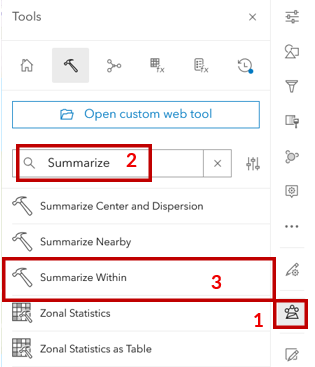   

4. In the _Summarize Within Dialogue_ select the following options. Note that most options and tools have a blue circle you can hover over for more information.  
    1. _Boundary_: **Polygon**  
	2. _Layer_: **Park and Open space**  
    3. _Summarize_: **TreeInventory** layer    
    4. _Add Statistics_: **Diameter at Breast Height**, **Min, Max, Avg**  
    5. _Group By_: **Genus**, add **minority, majority** and **percentages**    
    6. Name the file something meaningful including your initials.  
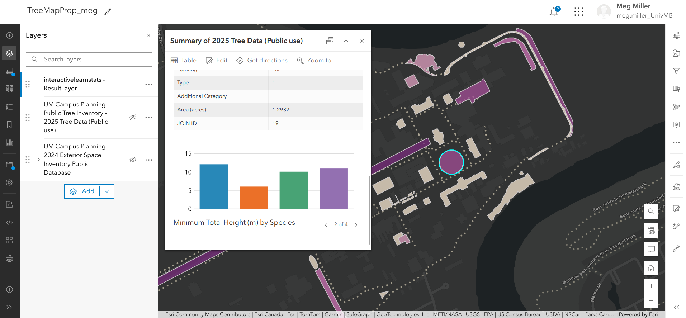   

5. Click the _Run Analysis_ option, wait for the data to be added to the map  
6. Don't forget to save your work.  
7. There have been two new items added to your Table of Contents- a layer and a table   
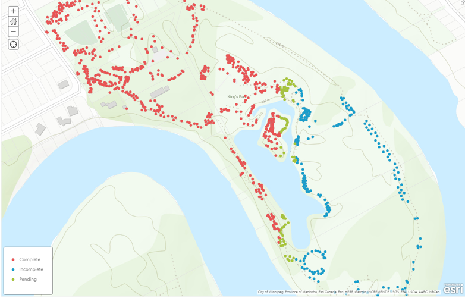   
 
9. Consider how you could use this information in a Story Map.  

That’s it! We now have the building blocks to create a **StoryMap** in the next section!  

