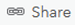
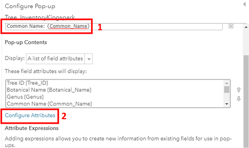
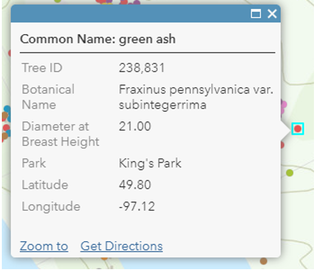
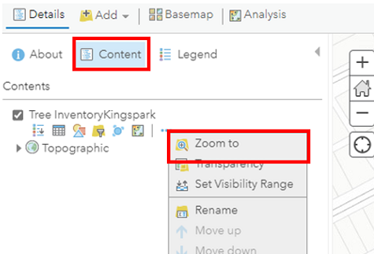
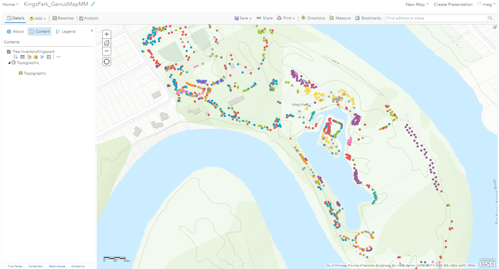
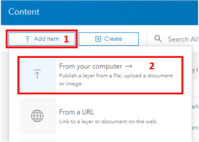
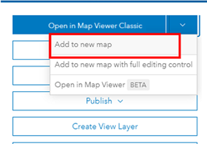
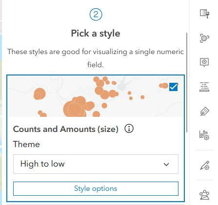

# Conducting analysis using ArcGIS Online tools

---
<iframe width="720" height="480" frameborder="0" marginheight="0" marginwidth="0" style="border:12px solid  #fcfcfc" src="https://meginwinnipeg.github.io/slides/RVanalyzing.html"></iframe>

---

## 0. **Summary**:  
In this step we will be creating three (3) different type of maps, and an additional feature layer to support our story.  

- Genus Map  
- Heat map  
- Proportional symbology  
- Summary Statistics 

---

## 1. Access your **Content** workspace to create your own feature service:  
 
1. Navigate to UM's ArcGIS Online Portal (https://univmb.maps.arcgis.com) and ensure you are signed in.  
2. Access the **Content** area by clicking on that option in the top navigation.  
   

## 6. **Configure pop-up** in your map for visual clarity.  
Right now, our pop-up contains a lot of extra information that our audience may not be interested in:  
 
 
1. To edit, ensure the **Content** option is open in your Table of Contents and hover over the _TreeInventory_ layer to reveal its options.  
2. Select the three small dots on the right to open the **properties**, then the **Configure Pop-up** option,  
 
 
3. Edit the title for the pop-up so that the label is _Common Name_:  instead of the feature service name.  
4. Select the blue **Configure Attributes** text to select which attributes you want to show up.  
 

5. Click _OK_ to save your changes, now your pop-up should look something like:  
 

## 7. **Center/ zoom** your map for reuse.  
We will be reusing this map later in a StoryMap. How your map looks here is how it will look when it is reused so we want to center it/ set base maps accordingly.  

1. To **center**, ensure the _Content_ option is open in your Table of Contents and hover over the _TreeInventory_ layer to reveal its options.  
2. Select the three small dots on the right to open the **properties**, then the **Zoom to** option,  
 

3. Your map should now look something like:  
 

4. **Save** your edits. 

s

 
## 2. **New Item** to create a feature service from a .csv file:  
We want to add our tree data to our Content area in the form of a feature service so that we can publish content with it.    

1. Select the **New Item** option from the top left of your content area.  
 
2. From the options that appear we want to select the **From your device** option to select to .csv file from your downloaded data.  
   
 
3. **Navigate** to your TreeInventory_KingsPark.csv file and add it.  
In the series of dialogue boxes that follow:  
    1. Select the optiom to create a **hosted feature layer** from the .csv.  
	    
	2. Double-check your field types and location fields: _Diameter at Breast Height_ should be a **double**, _Latitude_ and _Longitude_ set as the **double** fields.
	   
	3. Ensure the **location type** matches the selected location fields.  
	   
	4. _Title_: **TreeInventory_yourinitials**, _Tags_: **2200_yourinitials**   
        

4. Click the _Save_ button, and wait while your service publishes.  
5. You should now have your own **feature service** to use that looks something like:  
   

 
## 3. Create a **heat map** to show distribution.  

1. Click the  dropdown arrow beside the **Open in Map Viewer Classic** option at the top of the list of options on the right side of your feature service window.  
2. Select the **add to new map** option. The data may take a couple of seconds to load.  
   

3. The style options should open automatically in your Table of Contents.  
    1. _Choose an attribute to show_: **Show location only**  
    2. _Drawing style_: **Heat Map**  
    3. Select **options** for _Heat Map_  
   
     
3. In the Symbology options that open select the small icon on the right and select a colour ramp that works for you.  
   
 
4. Click _OK_ and then _Done_ at the bottom of the Table of Contents. Your map should look something like:  
   

5. **Save** a copy of the map to your personal content area by selecting the **Save As** option. Call it something meaningful and be sure to add your initials to the end of the filename.  
   

6. Return to your **personal content** page.  

## 4. Save copies of other workshop maps shared in **My Groups** to your personal content:  

1. Click on **My Groups** in the blue Content navigation bar.  
2. This brings up items that have been shared at the Group level, I have shared three (3) maps and two feature layers with you.  
3. Save a copy of  _TreeDiameterMapKP_demo_ and _TreeStatsMapKP_demo_ to your personal account  
    1. Open each map and select the **Open in Map Viewer Classic** option on the right side of your screen.  
     
   
    2. **Save** a copy of the map to your personal content area by selecting the **Save As** option. Add your initials to the end of the filename.  

   

 
## 5. **Open** your newly saved _TreeDiameter_ map to edit symbology:  
  
1. From your personal content list click the map title and select the **Open in Map Viewer Classic** option on the right side of your screen.  
 

2. Ensure you are in the **Content** area of your Table of Contents to change symbology. The third tile from the left (3 stacked shapes) is the option to **change styles**.  
     

3. In the _Styles_ dialogue that opens:  
    1. _Attribute_: **Diameter at Breast Height**  
    2. _Drawing Style_: **Counts and Amounts (size)**, then select **options**.  
	     

4. In the _Counts and Amounts_ dialogue that opens:  
    1. _Symbols_: change the colour to **green**.   
    3. _Classify_: No need to check off, we just want to see the data points relative to one another.    
    5. _Transparency_: Adjust as you want.  
	     

5. Select _OK_ and then _Done_. Don’t forget to save. Your workspace should look something like:  
     
  

## 6. **Open** your newly saved _TreeStatsMap_ map to calculate some tree statistics for the park:  
  
1. From your personal content list click the map title and select the **Open in Map Viewer Classic** option on the right side of your screen.  
 
 
2. You will see a new layer for park boundary appearing in your Table of Contents.  
3. From the **Analysis** options above your Table of Contents, open the heading to **Summarize Data** and select the **Summarize Within** option.  
   

4. In the _Summarize Within Dialogue_ select the following options. Note that most options and tools have a blue circle you can hover over for more information.  
    1. _Boundary_: **Polygon**  
	2. _Layer_: **Park and Open space**  
    3. _Summarize_: **TreeInventory** layer    
    4. _Add Statistics_: **Diameter at Breast Height**, **Min, Max, Avg**  
    5. _Group By_: **Genus**, add **minority, majority** and **percentages**    
    6. Name the file something meaningful including your initials.  
   

5. Click the _Run Analysis_ option, wait for the data to be added to the map  
6. Don't forget to save your work.  
7. There have been two new items added to your Table of Contents- a layer and a table   
   
 
9. Consider how you could use this information in a Story Map.  

That’s it! We now have the building blocks to create a **StoryMap** in the next section!  

