# Conducting analysis using ArcGIS Online tools

---
<iframe width="720" height="480" frameborder="0" marginheight="0" marginwidth="0" style="border:12px solid  #fcfcfc" src="https://meginwinnipeg.github.io/slides/RVanalyzing.html"></iframe>

---

## 0. **Summary**:  
In this step we will be creating three (3) different type of maps to support our story.  

- Heat map  
- Proportional symbology  
- Map bases on joined data  

---

## 1. Access your **Content** workspace to create your own feature service:  
 
1. Navigate to UM's ArcGIS Online Portal (https://univmb.maps.arcgis.com) and ensure you are signed in.  
2. Access the **Content** area by clicking on that option in the top navigation.  
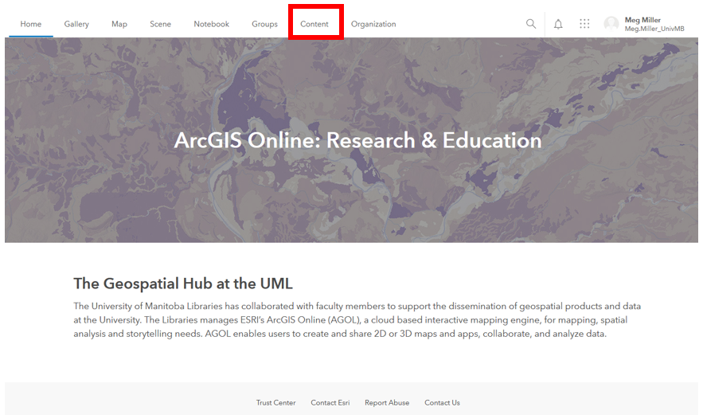   

 
## 2. **Add Item** to create a feature service from a .csv file:  
We want to add our tree data to our Content area in the form of a feature service so that we can publish content with it.    

1. Select the **Add Item** option from the top left of your content area.  
2. From the options that appear we want to select the **From your computer** option to select to .csv file from your downloaded data.  
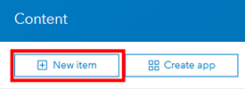   
 
3. **Navigate** to your TreeInventory_KingsPark.csv file and add it.  
In the Dialogue Box that follows:  
    1. _Title_: **TreeInventory_yourinitials**  
    2. _Tags_: **2200_yourinitials**   
    3. **Check off** the option to _publish the file as a hosted layer_.  
    4. Double-check your field types and location fields: _Diameter at Breast Height_ should be a **double**, _Latitude_ and _Longitude_ set as the **location** fields.  
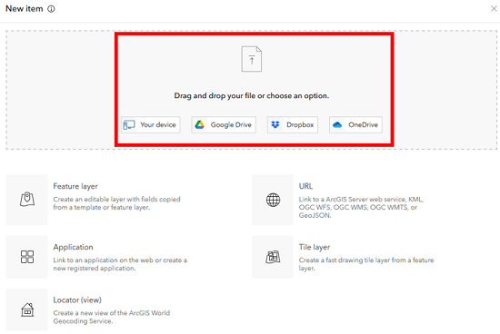   

4. Click the _Add Item_ button, and wait while your service publishes.  
5. You should now have your own **feature service** to use that looks something like:  
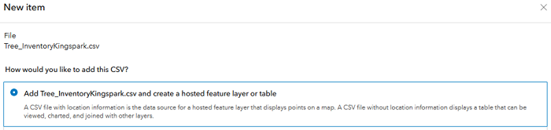   

 
## 3. Create a **heat map** do show distribution.  

1. Click the  dropdown arrow beside the **Open in Map Viewer** option at the top of the list of options on the right side of your feature service window.  
2. Select the **add to new map** option. The data may take a couple of seconds to load.  
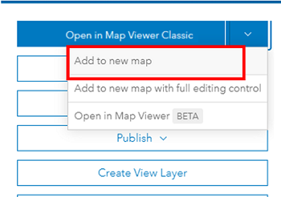   

3. The style options should open automatically in your Table of Contents.  
    1. _Choose an attribute to show_: **Show location only**  
    2. _Drawing style_: **Heat Map**  
    3. Select **options** for _Heat Map_  
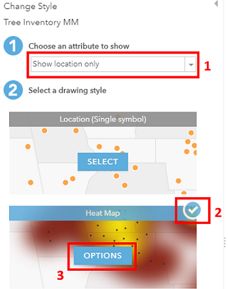   
     
3. In the Symbology options that open select the small icon on the right and select a colour ramp that works for you.  
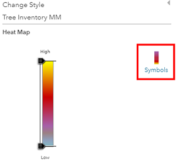   
 
4. Click _OK_ and then _Done_ at the bottom of the Table of Contents. Your map should look something like:  
   

5. **Save** a copy of the map to your personal content area by selecting the **Save As** option. Call it something meaningful and be sure to add your initials to the end of the filename.  
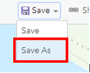   

6. Return to your **personal content** page.  

## 4. Save copies of other workshop maps shared in **My Groups** to your personal content:  

1. Click on **My Groups** in the blue Content navigation bar.  
2. This brings up items that have been shared at the Group level, I have shared four (4) maps and one feature layer with you.  
3. Save a copy of  _TreeDiameterMapKP_2200_ and _InspectionStatusMapKP_2200_ to your personal account  
4. Open each map and select the **Open in Map Viewer** option on the right side of your screen.  
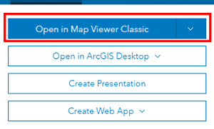 
   
5. **Save** a copy of the map to your personal content area by selecting the **Save As** option. Add your initials to the end of the filename.  

   

 
## 5. **Open** your newly saved _TreeDiameter_ map to edit symbology:  
  
1. From your personal content list click click the map title and select the **Open in Map Viewer** option on the right side of your screen.  
 

2. Ensure you are in the **Content** area of your Table of Contents to change symbology. The third tile from the left (3 stacked shapes) is the option to **change styles**.  
  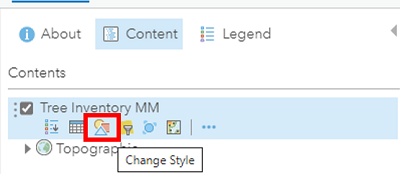   

3. In the _Styles_ dialogue that opens:  
    1. _Attribute_: **Diameter at Breast Height**  
    2. _Drawing Style_: **Counts and Amounts (size)**, then select **options**.  
	  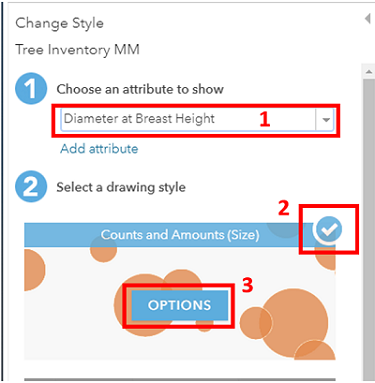   

4. In the _Counts and Amounts_ dialogue that opens:  
    1. _Symbols_: change the colour to **green**.   
    3. _Classify_: No need to check off, we just want to see the data points relative to one another.    
    5. _Transparency_: Adjust as you want.  
	  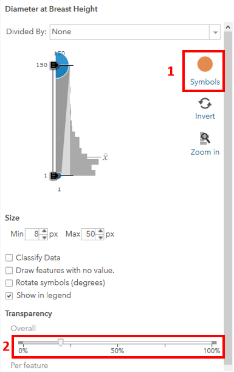   

5. Select _OK_ and then _Done_. Don’t forget to save. Your workspace should look something like:  
  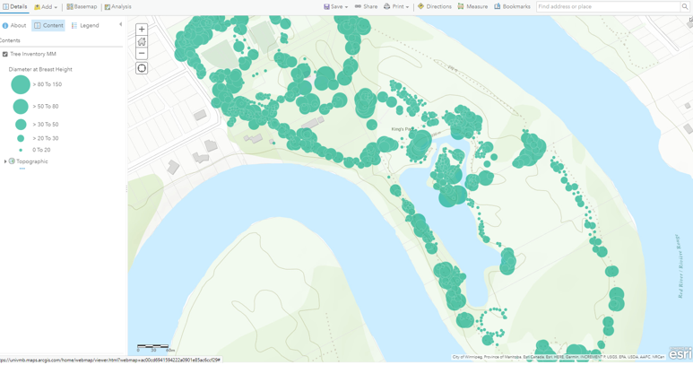   
  

## 6. **Open** your newly saved _InspectionStatusMap_ map to join external inspection data:  
  
1. From your personal content list click click the map title and select the **Open in Map Viewer** option on the right side of your screen.  
 
 
2. You will see a table appearing at the bottom of your Table of Contents.  
3. From the **Analysis** options above your Table of Contents, open the heading to **Summarize Data** and select the **Join Features** option.  
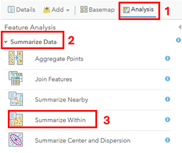   

4. In the _Join Wizard Dialogue_ select the following options. Note that most options and tools have a blue circle you can hover over for more information.  
    1. _Target_: **TreeInventory**  
    2. _Join Layer_: **InspectionStatus** table  
    3. _Join Type_: **Fields** in a table where **TreeID** = **TreeID** 
    4. _Operation_: **1:1**  
    5. Name the file something meaningful including your initials.  
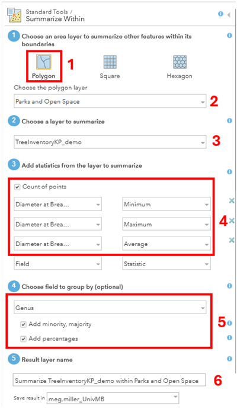   

5. Click the _Run Analysis_ option, wait for the data to join and be added to the map
6. Don't forget to save your work.  
7. Change the symbols for your new layer to visualize **Inspection Status** (open _symbology options_ for the layer in the Table of Contents and select _Inspection Status_).  
8. What do you think about the default colours selected?  
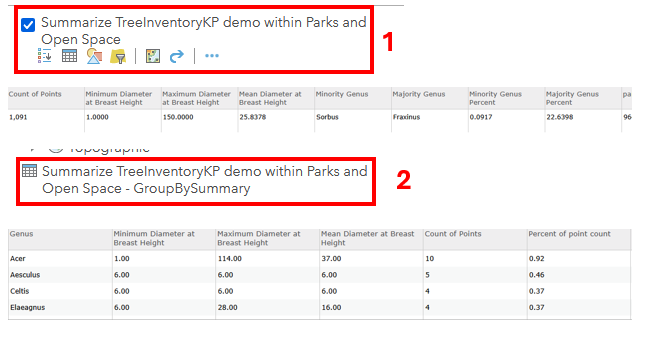   
 
9. Change the colours to something more appropriate for our message and save your work.  

That’s it! We now have the building blocks to create a StoryMap in the next section!  

