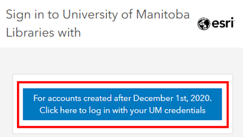
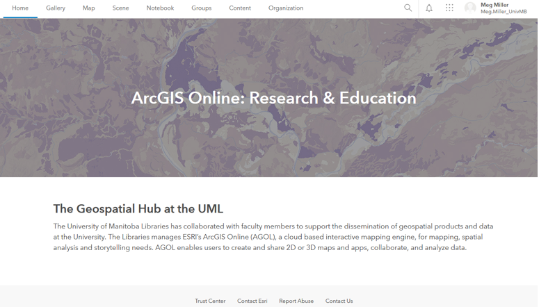
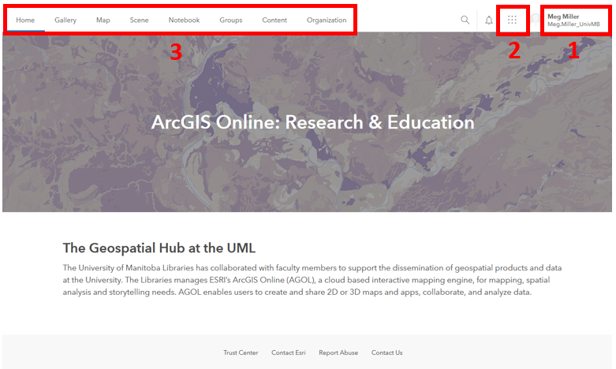

# Finding data to support your story  

<iframe width="720" height="480" frameborder="0" marginheight="0" marginwidth="0" style="border:12px solid  #fcfcfc" src="https://meginwinnipeg.github.io/slides/RVfinding.html"></iframe>

---
## 0. **Summary**:  
In this step we will be exploring the University of Manitoba's ArcGIS Online (AGOL) interface.  
This includes:  
- Account/ Online training  
- Available tools 
- Workspace options 
- Linked data sets   

---

## 1. **Access** your workspace:  
1. Navigate to UM's ArcGIS Online Portal [https://univmb.maps.arcgis.com](https://univmb.maps.arcgis.com)  
2. Log-in by clicking on the blue button for accounts created after December 1 2020.
 
 

2. The Home page is your Landing Page.
 
 

## 2. **Explore** AGOL Interface:  
Numbers 1-3 illustrate the locations of the following elements:  

1. **Account** (includes link to training materials)  
2. **Tools** (all of the different ESRI Apps available to you)  
3. **Options** (pages for different purposes (your content, maps, etc.)  

	   

## 3. **Explore** Training options:  

1. **Click** on your username in the top right corner of the screen.  
2. Select the **Training** option half way down the list.  
   
   

3. At the top of the page select the **Catalog** option, then the **Course Catalog**  
   
 
4. Take a bit of time to browse through the training options available to you.  
5. Return to the UM AGOL Home page.  

## 4. **Explore** available tools:  

1. **Click** on the waffle button that is to the left of your username in the top right of the screen to see the tools that are available.  
2. Today’s session will be focusing on **ArcGIS Online** (also linked in the top navigation of your Home page)  and **StoryMaps**.  
   

## 5. **Explore** AGOL Home options:  
Numbers 1-2 illustrate the most useful navigation options of the Landing Page:  

1. **Map** (where to go to create a new map in AGOL)  
2. **Content** (where all of your data, objects and organizational content is stored)  

	   

	 
3. We will explore these options in greater depth in the **Integrating** section.

 
