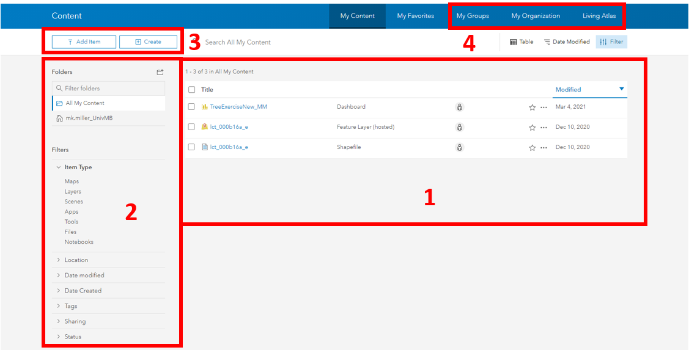
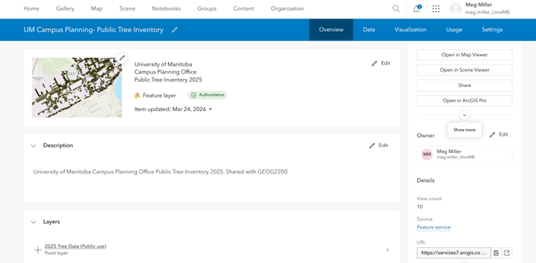
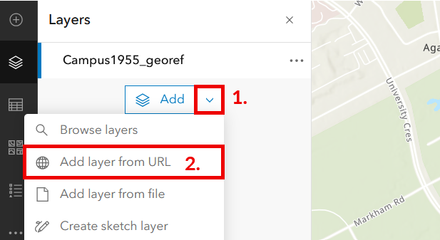
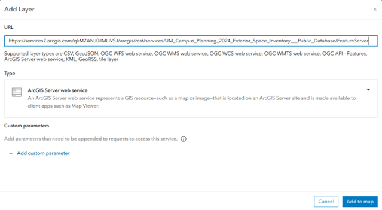
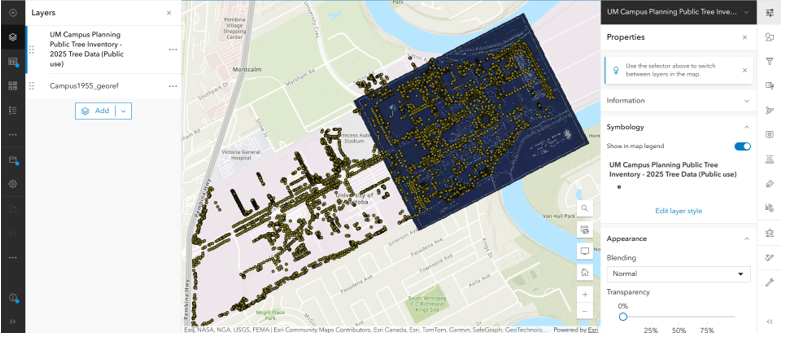

# Workspace set-up & integrating datasets

<iframe width="720" height="480" frameborder="0" marginheight="0" marginwidth="0" style="border:12px solid  #fcfcfc" src="https://meginwinnipeg.github.io/slides/RVintegrating.html"></iframe>

---

## 0. **Summary**:  
In this step we will be exploring the workshop content and making a plan for our story.  
This includes:  
- Provided workshop data  
- Organizational data  
- Data attributes  

---
 

## 1. Access your **Content** workspace:  
1. Access the **Content** area by clicking on that option in the top navigation.  
   

## 2. **Explore** the Content Panel:  
Numbers 1-4 illustrate the locations of the following elements:  

1. **Personal content** (includes all data and objects you have created)  
2. **Filters** (allows you to easily limit the things that show up in your content area)  
3. **Create New** (one of many ways to create/ add content to your workspace)  
4. **Available content** (items that have been shared to you through groups, University of Manitoba or ESRI’s Living Atlas.)  
	   
  
## 3. View **My Organization** data options:  
1. Click on **My Organization** in the blue Content navigation bar.  
2. This brings up data that has been made available to UM users. Not all content here is available for reuse.  
   
 

3. Using the search box search for _UM Campus Planning- Public Tree Inventory_ , click the title to see more details about the file.  
   
4. Now we can see a _Description_ and the _Terms of Use_ for the file, as well as options to explore the data further.  
     
  
5. Click on the **Open in Map Viewer** option.  
   
 
6. Your screen should now look something like:  
   
 

## 4. **Explore** the workspace.  
Numbers 1-4 illustrate the locations of the following elements:  
  1. **Map** options (add data, change basemap, share etc)    
  2. **Data** options (symbology, filters, pop-ups, labels, conduct simple analyses and more)  
  3. **Table of Contents** (list of layers in your map, show, hide, table, etc)  
  4. **Your map** workspace    
	   
	
## 5. **Add data** that is accessible via **URL**:  

1. Click on the arrow beside the **Add** data option on the left of your map. Select the _add layer from URL_ option.  
   
 
2. Copy + Paste this url into the dialogue to add other campus assets into your map as well: `https://services7.arcgis.com/qkMZANJ0iIMLiVSJ/ArcGIS/rest/services/UM_Campus_Planning_2024_Exterior_Space_Inventory___Public_Database/FeatureServer`   
   
  The import wizard should autodetect that it is a web service    
3. **Add item to map** in the bottom right corner of the wizard.  
Your map should now look something like:  
   
4. **Save** your map by clicking the  **Save As** option left of the map. Your map is now saved to your personal content area.  
   

5. We will now move over to the **Analysis** section to make some maps.  
 
