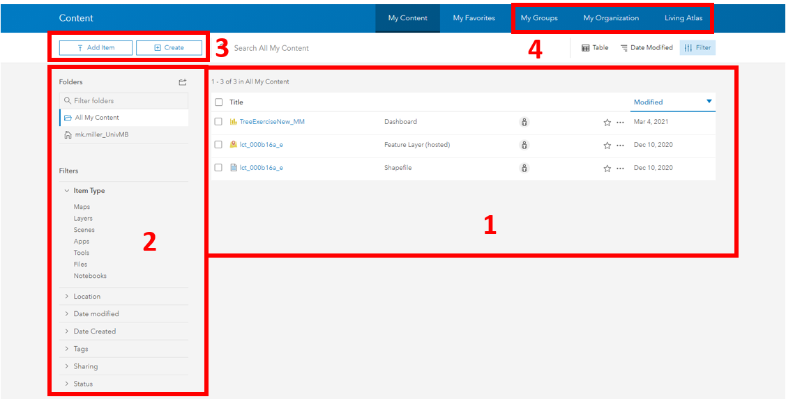
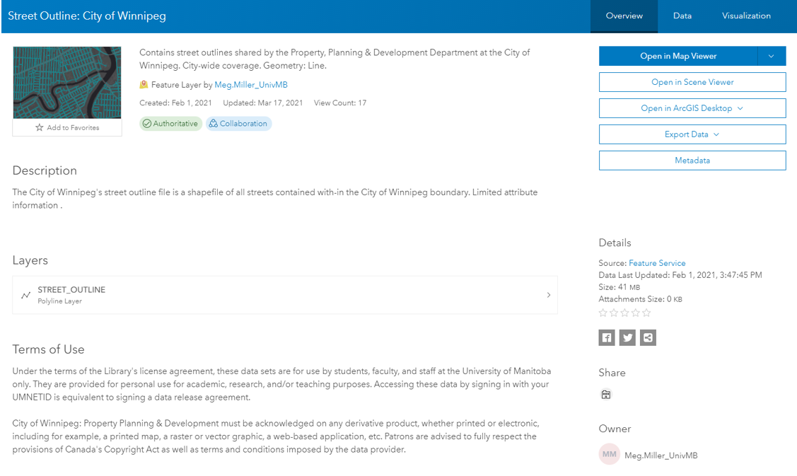
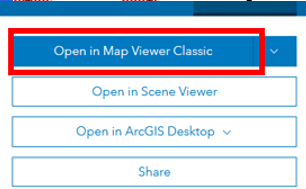
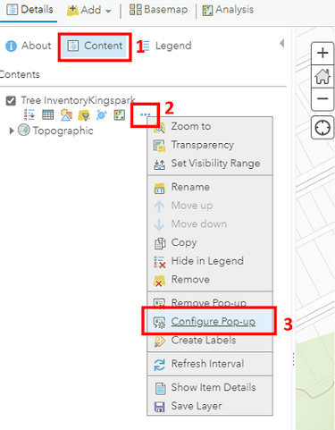
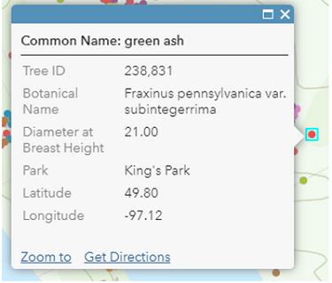
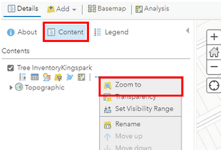

# Workspace set-up & integrating datasets

<iframe width="720" height="480" frameborder="0" marginheight="0" marginwidth="0" style="border:12px solid  #fcfcfc" src="https://meginwinnipeg.github.io/slides/RVintegrating.html"></iframe>

---

## 0. **Summary**:  
In this step we will be exploring the workshop content and making a plan for our story.  
This includes:  
- Provided workshop data  
- Organizational data  
- Data attributes  

---

## 1. Access your **Content** workspace:  
1. Navigate to UM's ArcGIS Online Portal (https://univmb.maps.arcgis.com) and ensure you are signed in.  
2. Access the **Content** area by clicking on that option in the top navigation.  
   

## 2. **Explore** the Content Panel:  
Numbers 1-4 illustrate the locations of the following elements:  

1. **Personal content ** (includes all data and objects you have created)  
2. **Filters** (allows you to easily limit the things that show up in your content area)  
3. **Create New** (one of many ways to create/ add content to your workspace)  
4. **Available content** (items that have been shared to you through groups, University of Manitoba or ESRI’s Living Atlas.)  

	   
  

##3. View **Organization** data options:  

1. Click on **My Organization** in the blue Content navigation bar.  
2. This brings up data that has been shared at the Organizational level. Be aware, not all of it is available for reuse.  
  

3. Click on the **title** for _Street Outline: City of Winnipeg_ to see more details about the file.  
 
   
4. Now we can see a _Description_ and the _Terms of Use_ for the file, as well as options to explore the data further.  
   
 
5. Return to your **personal content** page.  

## 4. View **Group** data options:  

1. Click on **My Groups** in the blue Content navigation bar.  
2. This brings up items that have been shared at the Group level.  
3. Click on the **KingsPark_GenusMap** map that has been shared with you.  
  
 
  
## 5. **Open item** using the ArcGIS Online Map Viewer:  

1. Select the **Open in Map Viewer ** option on the right side of your screen.  
 
   
2. **Explore** the AGOL interface.  
Numbers 1-4 illustrate the locations of the following elements:  

    1. **Print, Share and Save** options    
    2. **Actions** (allows add new content to the map, change your base map, conduct simple analyses)  
    3. **Table of Contents** (properties options for individual layers such as : attributes, symbology and pop-up configuration)  
    4. **Your map** workspace    

	   
 
3. **Save** a copy of the map to your personal content area by selecting the **Save As** option. Add your initials to the end of the filename.  

   
 

## 6. **Configure pop-up** in your map for visual clarity.  
Right now, our pop-up contains a lot of extra information that our audience may not be interested in:  
 
 
1. To edit, ensure the **Content** option is open in your Table of Contents and hover over the _TreeInventory_ layer to reveal its options.  
2. Select the three small dots on the right to open the **properties**, then the **Configure Pop-up** option,  
 
 
3. Edit the title for the pop-up so that the label is _Common Name_:  instead of the feature service name.  
4. Select the blue **Configure Attributes** text to select which attributes you want to show up.  
 

5. Click _OK_ to save your changes, now your pop-up should look something like:  
 

## 7. **Center/ zoom** your map for reuse.  
We will be reusing this map later in a StoryMap. How your map looks here is how it will look when it is reused so we want to center it/ set base maps accordingly.  

1. To **center**, ensure the _Content_ option is open in your Table of Contents and hover over the _TreeInventory_ layer to reveal its options.  
2. Select the three small dots on the right to open the **properties**, then the **Zoom to** option,  
 

3. Your map should now look something like:  
 
 

