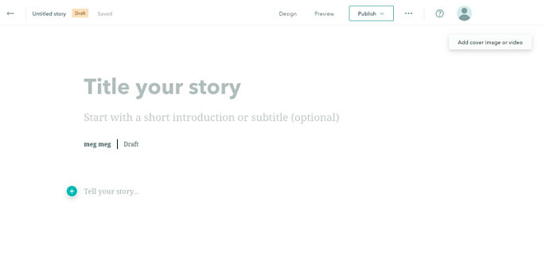
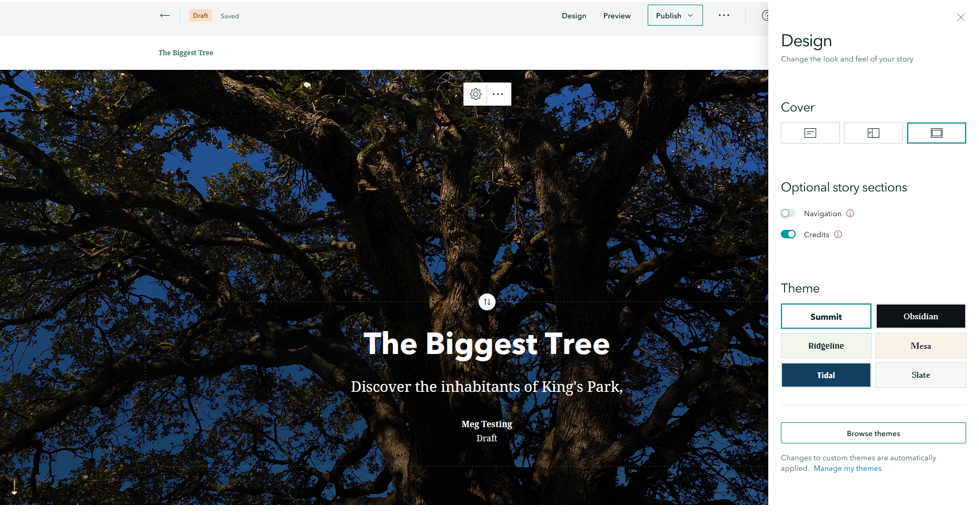
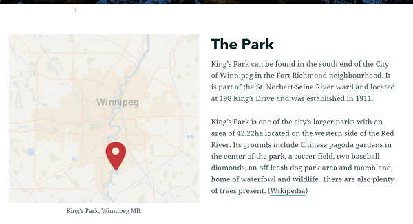

# Sharing your story as a whole using StoryMaps

---
<iframe width="720" height="480" frameborder="0" marginheight="0" marginwidth="0" style="border:12px solid  #fcfcfc" src="https://meginwinnipeg.github.io/slides/RVsharing.html"></iframe>

---

## 0. **Step Back**:  
While we have had the purpose of creating a StoryMap in the back of our minds while we were creating our maps, let’s step back take stock of what we have, and make a concrete plan.  

Our Scenario:  
_You have been hired as the GIS intern in the Public Works Department at the City of Winnipeg. The arborists have been doing a lot of work in King’s Park and entering information into their new tree inventory system. Your job is to create some materials for the public so they can see how their tax dollars are being used._  

What do we have?  
- Map of Trees by Genus  
- Heat Map of Tree Distribution  
- Map of trees by Trunk Diameter  
- Map of Tree Inspection Status  
- Workshop folder that includes: images of trees and park elements, a locator map for the park, some text to copy and paste, data csv files.  

Map out your idea:  
 
 

---

## 1. Access the **StoryMap**:  
1. Navigate or use the waffle button on your Home screen to get to the StoryMaps landing page (https://storymaps.arcgis.com/stories) and ensure you are signed in.  
2. The landing page has the same elements as ArcGIS Online, but organized in a different way.  
Numbers 1-4 describe them.  
    1. Account settings  
    2. Create a new story  
    3. List of personal/ available content  
    4. Training materials  
   

3. Select the **New Story** button to start a new story from scratch. Your Story will save automatically as you work.  
4. Your screen should look something like:  
   

 
## 2. **Explore** the StoryMap workspace.  
1. Numbers 1-5 describe the different elements available:  
    1. Add a **title** and **subtitle** by typing directly into the browser.  
    2. Add a **new object/row** to your story. 
    3. Add **media** to the row.  
    4. Adjust the **design** of your story by selecting a pre-set (colour/font/layout) or create a template of your own.  
    5. Sharing options to **Preview** and **Publish** your story.  
   

2. On your own:  
    1. Add one of the images provided to you in the workshop data as a **cover image** (3)  
    2. Adjust the **Design** (4) to see how the look of your workspace changes.  
    3. Add a creative **title/subtitle** to catch the attention of your audience.  
3. I selected to use a _Full_ cover and the _Summit_ theme for simplicity.  
   

4. This is where I would usually step back and assess the font and colour choices of my theme in relation to the project:  
- Is the colour of the theme cohesive with my background image?  
- Is personality of the font appropriate for my audience and purpose?  
- How much time do I have? Is one of the default templates good enough, or should I create a custom theme?  

## 3. Add a **new object** to your StoryMap.  
1. Hover your mouse below your cover page block, a green plus sign will appear.  
2. Clicking on the plus sign reveals all the different objects that can be added to your page.  
   
 
3. In the plan I made, I said I was going to add a text box with a locator map to the left (you can always reorder the rows later).  
    1. Select the **Image** option and upload the _locator map_ image from the workshop content that was made available to you.  
    2. Once the image is loaded you will see the image **options** by hovering over its top.  
    3. I am going to select the **float** option so that I can add park text next to it.  
       

    4. Next I will add my **Text** by clicking the _green plus sign_ that appears on the top right corner of my newly added image. Hovering over each element provides a description.  
   
 
    5. Copy and paste the Park text from the word document provided in the workshop content. You can see that you can format text as headers, lists and add hyperlinks.  
4. Step back and assess. In my case, my block looks like:  
   

 
## 4. Add an **immersive object** to your StoryMap.  
When we scroll to the bottom of the list of objects we can add to our page there are 3 immersive options: slideshow, sidecar and map tour. As all the maps we have created are of the same area and scale, vertical sidecar scrolling will be a good fit.  
   

1. Add a sidecar row to your page by clicking the green plus sign below the row you just added and selecting the **sidecar** option.  
2. Select whichever layout you prefer, and then click _Done_, your new sidecar wizard will open.  
3. Explore the sidecar builder. Numbers 1-4 describe the different elements:  
    1. **Add media**: where you add the background image/map  
    2. **Add text**: where you add your descriptive text, you can also add images, other maps, videos etc.  
    3. **Add slide**: where you add a new object inside the immersive viewer.  
    4. **Your slides**: the content that is already loaded into the viewer.  
   

 
## 5. Add a **map** to your sidecar.  
1. Click the **Add media** button at the top of the window (1) and then select the **map** option.  
2. Your available ArcGIS Online maps appear as options to select. I am going to add my _Inspection Status_ map.   
3. After adding my map, the dialogue changes to a map preview:  
   

4. I know that I will have a text box floating on the left side of my page, so I will pan and zoom my map to position it something like:  
   
 
5. Select the gear option at the top of the properties bar on the left side of your screen, here you can control how the user interacts with your map.  
6. In my case I want to allow for map navigation (scrolling and panning) and also show the legend, so I have toggled these options _on_.  
   
 
7. Click _Place Map_ in the bottom right corner of your screen to finish adding your map.  
8. I will also add **context text** to the textbox by clicking the green plus sign and selecting the **text** option. I am copy + pasting the _The Project_ text from the workshop text document.  
9. Slide 1 of my sidecar now looks something like:  
   

10. Continue to populate your sidecar with the other maps you have created. There is a link to a video, and some other images that you can try adding to your sidecar/ text boxes as well.  

## 6. Publish and share  
Once I have finished adding content and I am happy with my results, you can select the **Publish** option at the top of your screen. The builder will prompt you if any components of your StoryMap do not have the appropriate sharing settings to be displayed properly.  
**Note** It is up to you to know the permissions level on the data/ media you have embedded in your StoryMap and not break copyright.  

Congratulations! You made it through!  

Questions? Concerns?  
 
