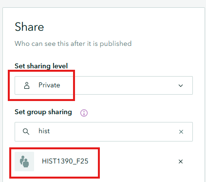

# Story mapping exercise- Henry Budd's correspondence

---
<iframe width="720" height="480" frameborder="0" marginheight="0" marginwidth="0" style="border:12px solid  #fcfcfc" src="https://meginwinnipeg.github.io/slides/sharing1390.html"></iframe>

---

## 0. Before you begin **step back** and make a plan:  
For today we will be using a template file to make our story map, but if you are making your own, it's best to sketch out a plan of what you want to share.  

Our Scenario:  
_Create a story map depicting content from Henry Budd's correspondence._   

What do we have?  
- Letter assigned to your group  
- Translation  
- Image video file that is related  
- Story map template file  

## 1. Access the template and follow directions:
Click to access the template file [Log-in to access](https://storymaps.arcgis.com/templates/34d910cee3b54bd087c78449fb590311){: .btn .btn-blue }  
  
## 2. To **share** your content to be marked:  
1. Click the **Publish** option at the top of your screen.  
2. Ensure that **Sharing level** is set to **Private** and **Group Sharing** is for **HIST1390_F25**  
   
3. Email the link or QR code that appears on the following page to your professor for marking purposes.  

 
 
Congratulations! You made it through!  

Questions? Concerns?  
 