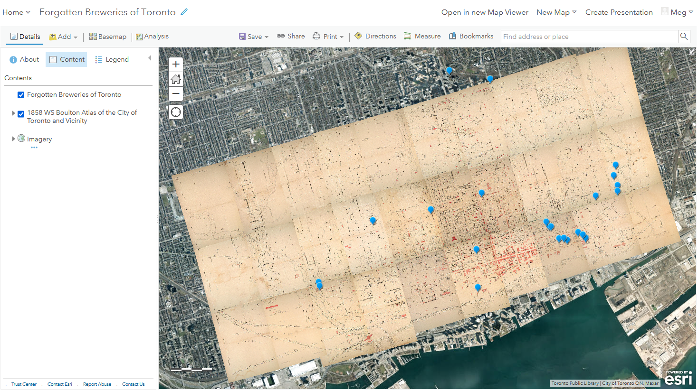
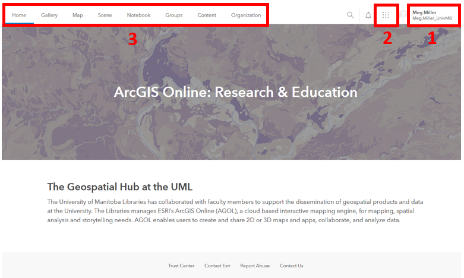
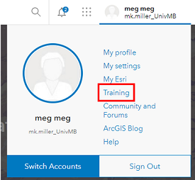
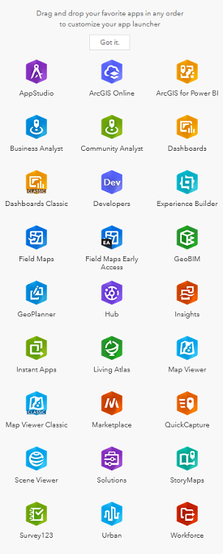
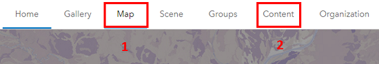
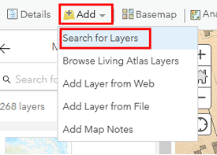
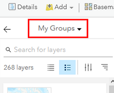
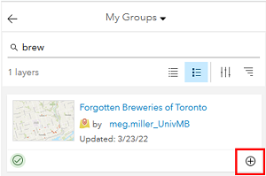
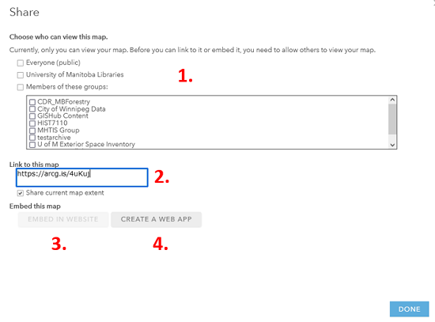

# ArcGIS Online Exercise – Toronto's Lost Breweries

---
<kbd></kbd>

---
## 0. **Housekeeping**:  
Today we will be exploring the ArcGIS Online interface by:  
1. Finding data that is available  
    - Living Atlas  
2. Integrating a CSV file  
3. Editing a popup for clarity  
4. Changing symbology  
5. Discussing export options  

# Exploration  
## 1. **Access** your workspace:  
1. Navigate to UM's ArcGIS Online Portal [https://univmb.maps.arcgis.com](https://univmb.maps.arcgis.com)  
2. Log-in by entering your UM email and password.  
3. The Home page is your Landing Page.  
   
 
## 2. **Explore** AGOL Interface:  
Numbers 1-3 illustrate the locations of the following elements:  

1. **Account** (includes link to training materials)  
2. **Tools** (all of the different ESRI Apps available to you)  
3. **Options** (pages for different purposes (your content, maps, etc.)  

	   

## 3. **Explore** Training options:  
1. **Click** on your username in the top right corner of the screen.  
2. Select the **Training** option half way down the list.  
   
   
3. At the top of the page select the **Catalog** option, then the **Course Catalog**  
   
 
4. Take a bit of time to browse through the training options available to you.  
5. Return to the UM AGOL Home page.  

## 4. **Explore** available tools:  
1. **Click** on the waffle button that is to the left of your username in the top right of the screen to see the tools that are available.  
2. Today’s session will be focusing on **ArcGIS Online** (also linked in the top navigation of your Home page).  
   

## 5. **Explore** AGOL Home options:  
Numbers 1-2 illustrate the most useful navigation options of the Landing Page:  

1. **Map** (where to go to create a new map in AGOL)  
2. **Content** (where all of your data, objects and organizational content is stored)  
	   
	
---

# Creation  
## 1. Access your **Content** workspace:  
1. Access the **Content** area by clicking on that option in the top navigation.  
   

## 2. **Explore** the Content Panel:  
Numbers 1-4 illustrate the locations of the following elements:  

1. **Personal content** (includes all data and objects you have created)  
2. **Filters** (allows you to easily limit the things that show up in your content area)  
3. **Create New** (one of many ways to create/ add content to your workspace)  
4. **Available content** (items that have been shared to you through groups, University of Manitoba or ESRI’s Living Atlas.)  
	   
  
## 3. View **Living Atlas** data options:  
1. Click on **Living Atlas** in the blue Content navigation bar.  
2. This brings up data that has been made available to ESRI users. All content here is available for reuse.  
   
 

3. Using the search box search for _1858 Boulton_ , click the title to see more details about the file.  
   
4. Now we can see a _Description_ and the _Terms of Use_ for the file, as well as options to explore the data further.  
     
  
5. Click on the **Open in Map Viewer** option.  
   
 

Your screen should now look something like:  
   
 

6. **Save** your map by clicking the  **Save As** option above the map. Your map is now saved to your personal content area.  
   
 
## 4. **Add data** that has been shared with you through a **Group**:  

1. Click on the **Add** data option above your map. Select the _Search for layers_ option.  
   
 
2. Ensure the **My Groups** option is selected from the dropdown  
   

 
 This brings up items that have been shared at the Group level, I have shared one feature layer with you.  
3. Click on the **Forgotten Breweries of Toronto** layer that has been shared with you.  
   
  
  
4. **Add item to map** using the plus sign in the bottom right corner of the item.  
Your map should now look something like:  
   

   
## 5. **Explore** the AGOL interface.  
1. Numbers 1-4 illustrate the locations of the following elements:  
    1. **Tool** options    
    2. **Actions** (allows add new content to the map, change your base map, conduct simple analyses)  
    3. **Table of Contents** (properties options for individual layers such as: attributes, symbology and pop-up configuration)  
    4. **Your map** workspace    
	  
	  
2. Numbers 5-12 illustrate the purpose of the icons found in the Table of Contents:  
    5. **Legend**     
    6. **Attribute table** (information about each data point displayed as a table)  
    7. **Symbology** (change the appearance of feature)   
    8. **Filter** (show a subset of your data)  
    9. **Cluster** (group features to reduce map clutter)  
    10. **Perform analysis** (analyze this specific layer)  
    11. **More options** (zoom, transparency, pop-ups, labels…)  
	   
 

 3. **Save** your additions by clicking the **Save** option.  

## 6. **Share** your map  
There are many ways you can share your work with the world so they can explore your work.  
1. Click the **Share**   button above the map and explore the options available to you.  
    - Share map with a group (1) or via link (2)  
    - Embed Map in a website (3)  
    - Create a stand-alone application (4)  
   

 
 
Congratulations! You made it through!  

Questions? Concerns?  
 

  

<small> Data: [Inspired by ("Lost Breweries of Toronto, 1800-1989, Marcel Fortin, 2018")](https://dataverse.scholarsportal.info/dataset.xhtml?persistentId=doi%3A10.5683%2FSP2%2FZ7K8DZ&version=&q=&fileTypeGroupFacet=&fileAccess=&fileSortField=size)</small>  

