# Conducting analysis using ArcGIS Online tools

---
<iframe width="720" height="480" frameborder="0" marginheight="0" marginwidth="0" style="border:12px solid  #fcfcfc" src="https://meginwinnipeg.github.io/slides/RVanalyzing.html"></iframe>

---

## 0. **Summary**:  
In this step we will be creating three (3) different type of maps to support our story.  

- Heat map  
- Proportional symbology  
- Map bases on joined data  

---

## 1. Access your **Content** workspace to create your own feature service:  
 
1. Navigate to UM's ArcGIS Online Portal (https://univmb.maps.arcgis.com) and ensure you are signed in.  
2. Access the **Content** area by clicking on that option in the top navigation.  
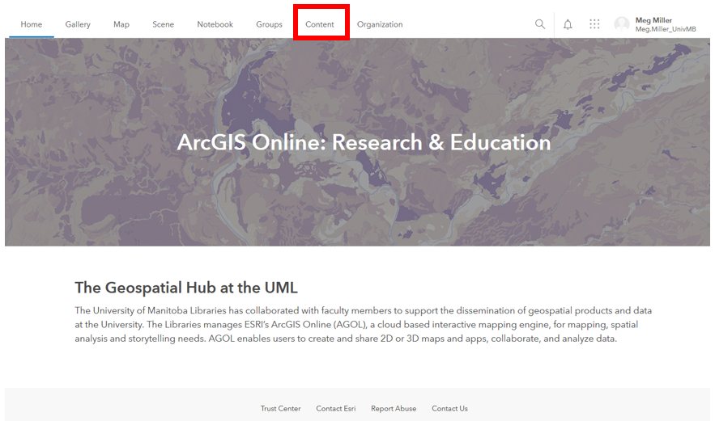   

 
## 2. **Add Item** to create a feature service from a .csv file:  
We want to add our tree data to our Content area in the form of a feature service so that we can publish content with it.    

1. Select the **Add Item** option from the top left of your content area.  
2. From the options that appear we want to select the **From your computer** option to select to .csv file from your downloaded data.  
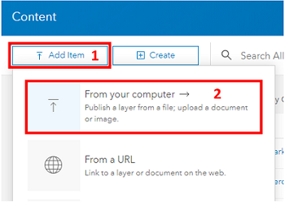   
 
3. **Navigate** to your TreeInventory_KingsPark.csv file and add it.  
In the Dialogue Box that follows:  
    1. _Title_: **SomethingMeaningful_yourinitials**  
    2. _Tags_: **7200_yourinitials**   
    3. **Check off** the option to _publish the file as a hosted layer_.  
    4. Double-check your field types and location fields: _Diameter at Breast Height_ should be a **double**, _Latitude_ and _Longitude_ set as the **location** fields.  
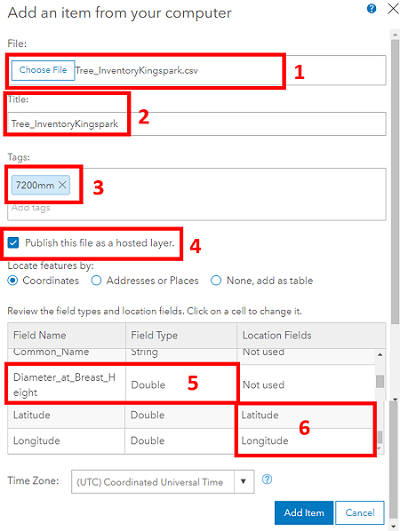   

4. Click the _Add Item_ button, and wait while your service publishes.  
5. You should now have your own **feature service** to use that looks something like:  
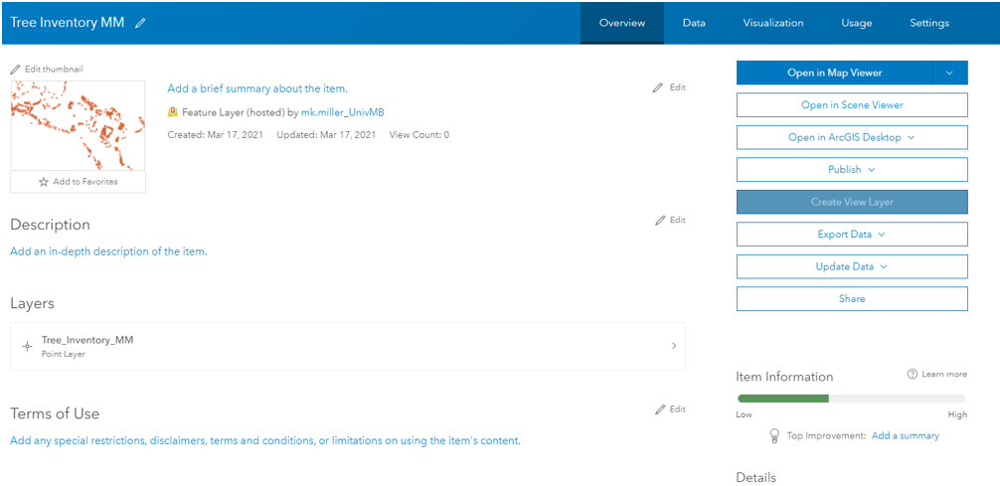   

 
## 3. Create a **heat map** do show distribution.  

1. Click the  dropdown arrow beside the **Open in Map Viewer** option at the top of the list of options on the right side of your feature service window.  
2. Select the **add to new map** option. The data may take a couple of seconds to load.  
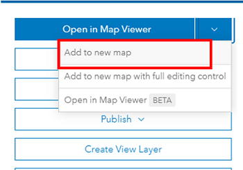   

3. The style options should open automatically in your Table of Contents.  
    1. _Choose an attribute to show_: **Show location only**  
    2. _Drawing style_: **Heat Map**  
    3. Select **options** for _Heat Map_  
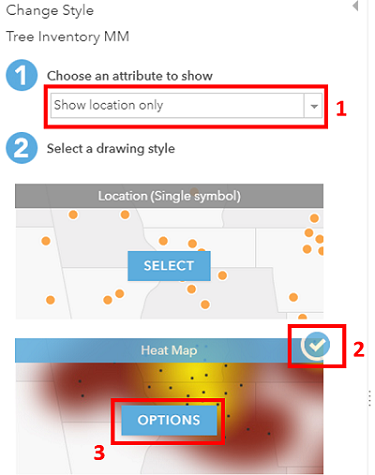   
     
3. In the Symbology options that open select the small icon on the right and select a colour ramp that works for you.  
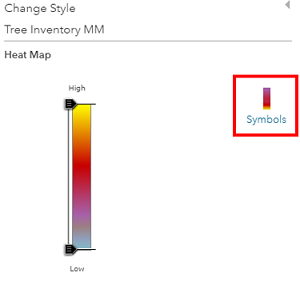   
 
4. Click _OK_ and then _Done_ at the bottom of the Table of Contents. Your map should look something like:  
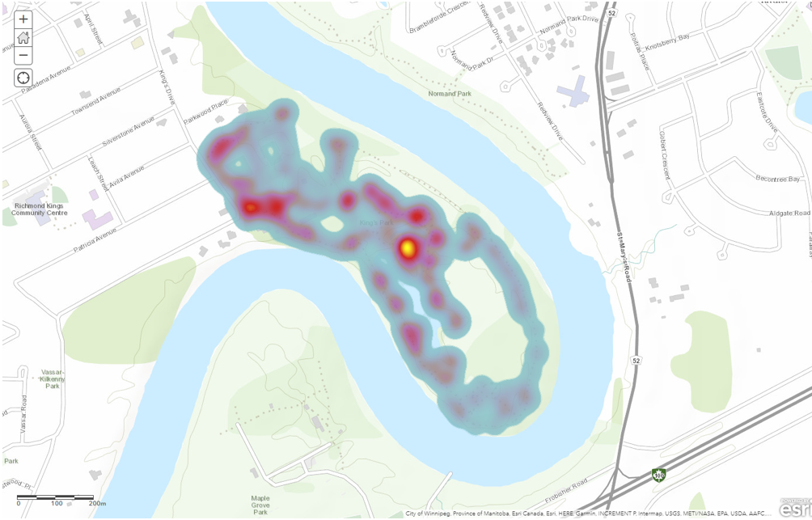   

5. **Save** a copy of the map to your personal content area by selecting the **Save As** option. Call it something meaningful and be sure to add your initials to the end of the filename.  
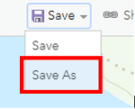   
 
 
## 4. Access your Map workspace as another way to create a **new map**:  
  
1. Access the **Map** area by clicking on that option in the top navigation. This will open the last map you were working on.  
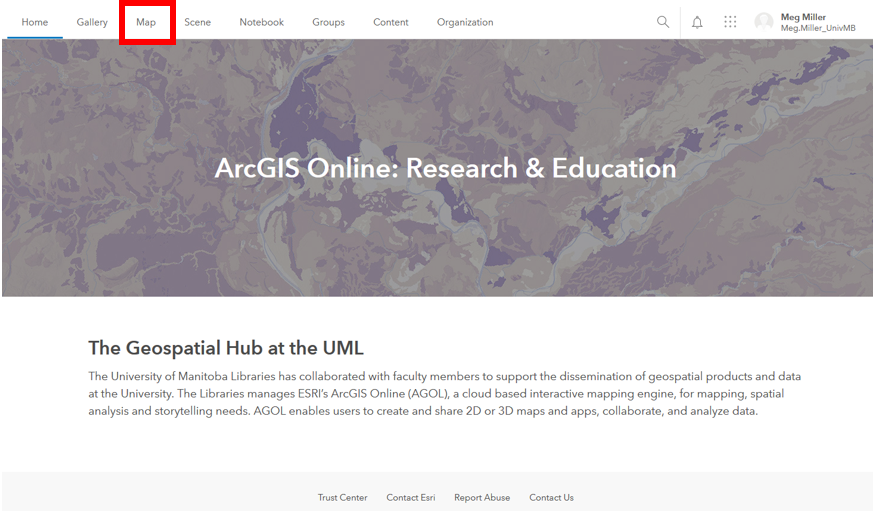   

2. At the top of your screen to the left of your user name select the **New Map** option, then **Create New Map**. You now have an empty map.  
  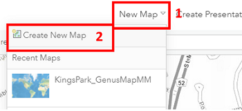   
 
3. Save your new map as _TreeDiameterMap_yourinitials_  
4. To add our feature service to the map select the **add** option above the Table of Contents and then **Search for Layers**.  
  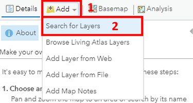   

5. Your search option will default to **My Content** where the feature service you created is saved. Click the **plus sign** in its bottom right corner to add to the map.  
  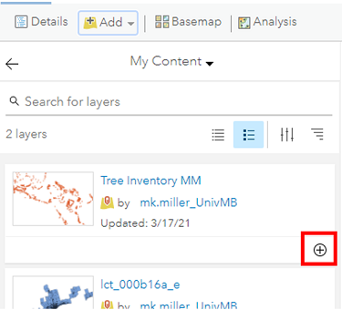   

6. **Save** your changes.  
7. Return to the **Content** area of your Table of Contents to change symbology. The third tile from the left (3 stacked shapes) is the option to **change styles**.  
  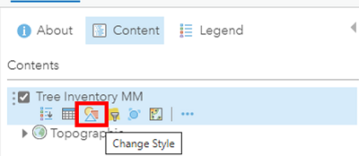   

8. In the _Styles_ dialogue that opens:  
    1. _Attribute_: **Diameter at Breast Height**  
    2. _Drawing Style_: **Counts and Amounts (size)**, then select **options**.  
	  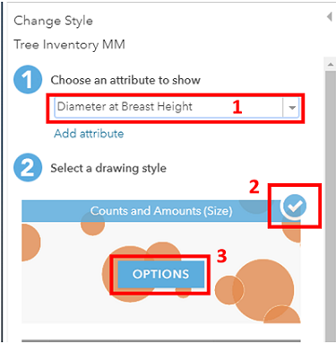   

9. In the _Counts and Amounts_ dialogue that opens:  
    1. _Symbols_: change the colour to **green**  
    2. _Classify_: check **yes**, then select **Natural Breaks**.  
    3. _Classes_: **5**  
    4. _Round Classes_: **10**  
    5. _Transparency_: Adjust as you want  
	  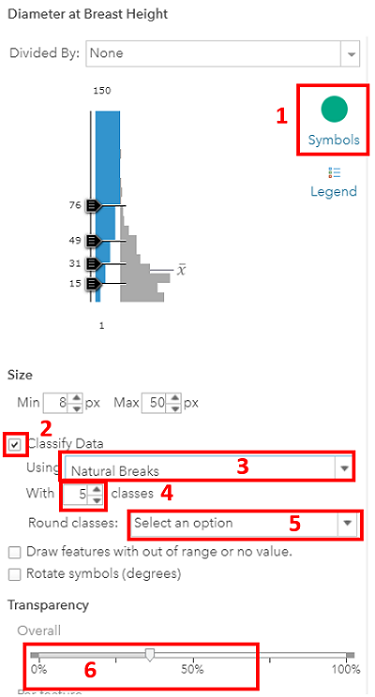   

10. Select _OK_ and then _Done_. Don’t forget to save. Your workspace should look something like:  
  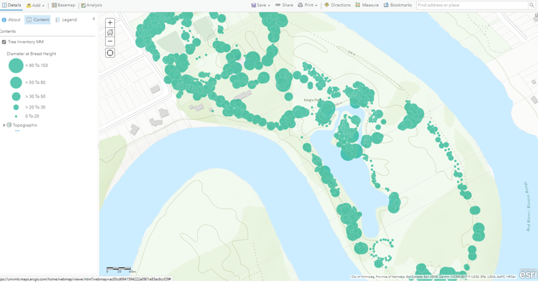   
 

## 5. Create another **new map** on depicting inspection status by joining external data to your feature service.  

1. Using the instructions from the previous step create a new map and add your feature service (Section 4, Steps 1-6).  
2. Save this map as **InspectionStatusMap_yourinitials**.  
3. To visualize our inspection status we need to do two things: Import the table and join it to our feature service.  
4. Select the **Add** option above the Table of Contents, then **Add layer from file**.  
  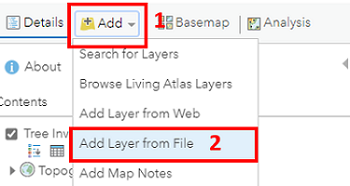   
 
5. Select the **InspectionStatus.csv** file from your local machine and click _Import_.  
6. Our table does not have a locate field (lat, long etc) we just want to import it so we can join it to our Tree layer so select the **None, add as table** option and _Add layer_.  
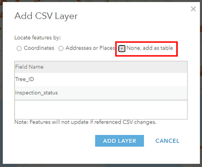   
 
7. Your table should now appear at the bottom of your Table of Contents.  
8. Save your changes.  
9. From the **Analysis** options above your Table of Contents, open the heading to **Summarize Data** and select the **Join Features** option.  
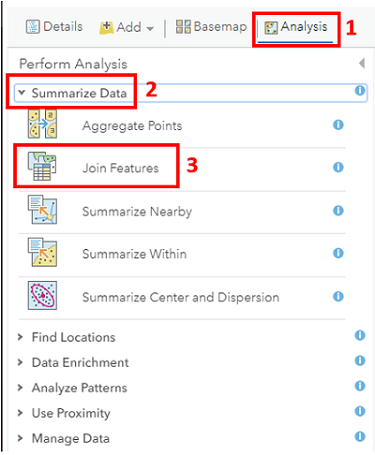   

10. In the _Join Wizard Dialogue_ select the following options. Note that most options and tools have a blue circle you can hover over for more information.  
    1. _Target_: **TreeInventory**  
    2. _Join Layer_: **InspectionStatus** table  
    3. _Join Type_: **Fields** in a table where **TreeID** = **TreeID** 
    4. _Operation_: **1:1**  
    5. Name the file something meaningful including your initials.  
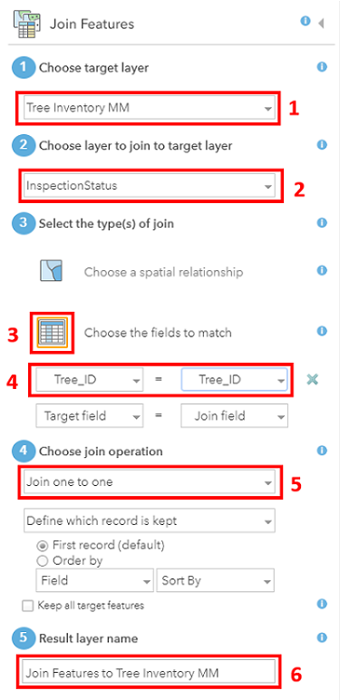   

11. Click the _Run Analysis_ option, wait for the data to join and be added to the map, then save your work.  
12. Change the symbols for your new layer to visualize **Inspection Status** (open _symbology options_ for the layer in the Table of Contents and select _Inspection Status_).  
13. What do you think about the default colours selected?  
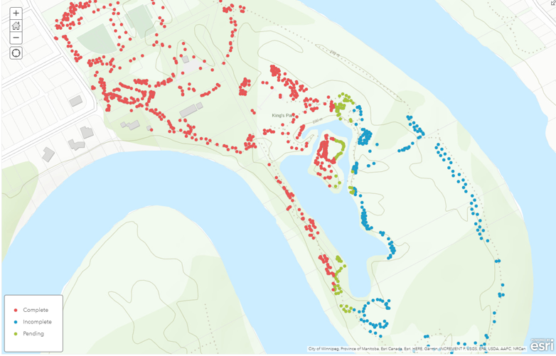   
 
14. Change the colours to something more appropriate for our message and save your work.  

That’s it! We now have the building blocks to create a StoryMap in the next section!  

