# ArcGIS Online Exercise – Exploring UM History

---
<kbd>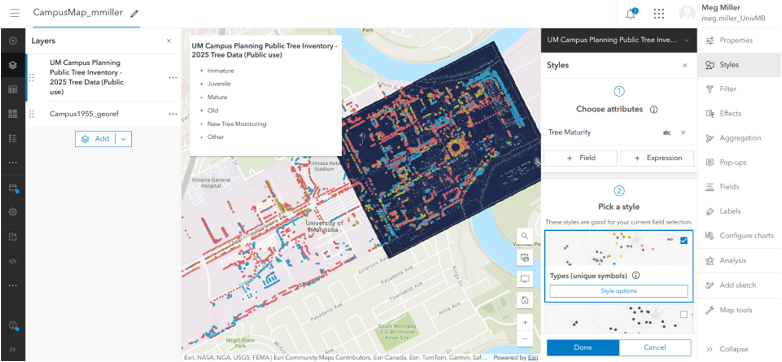</kbd>

---
## 0. **Housekeeping**:  
Today we will be exploring the ArcGIS Online interface by:  
1. Finding data that is available  
    - University of Manitoba Libraries Organization  
2. Integrating a point file  
3. Adjusting dataset parameters 
5. Discussing export options  

# Exploration  
## 1. **Access** your workspace:  
1. Navigate to UM's ArcGIS Online Portal [https://univmb.maps.arcgis.com](https://univmb.maps.arcgis.com)  
2. Log-in by entering your UM email and password.  
3. The Home page is your Landing Page.  
4. Enter your username on the sign-in sheet at the front of the room for attendance and to be added to the datasharing group  
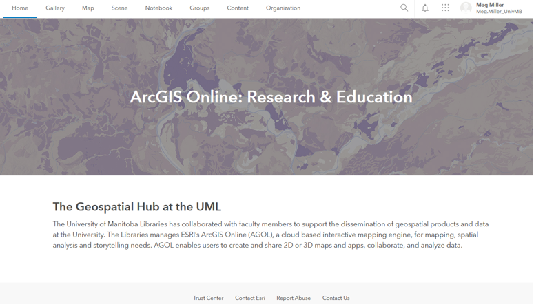   
 
## 2. **Explore** AGOL Interface:  
Numbers 1-3 illustrate the locations of the following elements:  

1. **Account** (includes link to training materials)  
2. **Tools** (all of the different ESRI Apps available to you)  
3. **Options** (pages for different purposes (your content, maps, etc.)  

	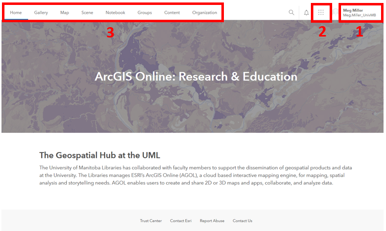   

## 3. **Explore** Training options:  
1. **Click** on your username in the top right corner of the screen.  
2. Select the **Training** option half way down the list.  
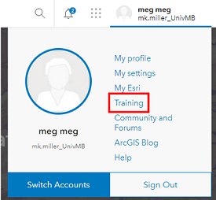   
   
3. At the top of the page select the **Catalog** option, then the **Course Catalog**  
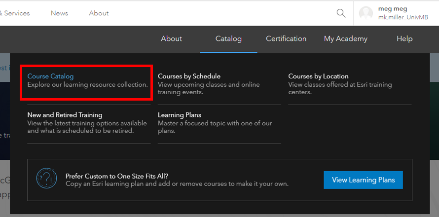   
 
4. Take a bit of time to browse through the training options available to you.  
5. Return to the UM AGOL Home page.  

## 4. **Explore** available tools:  
1. **Click** on the waffle button that is to the left of your username in the top right of the screen to see the tools that are available.  
2. Today’s session will be focusing on **ArcGIS Online** (also linked in the top navigation of your Home page).  
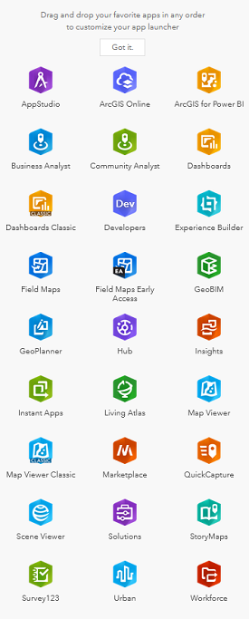   

## 5. **Explore** AGOL Home options:  
Numbers 1-2 illustrate the most useful navigation options of the Landing Page:  

1. **Map** (where to go to create a new map in AGOL)  
2. **Content** (where all of your data, objects and organizational content is stored)  
	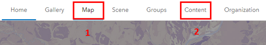   
	
---

# Creation  
## 1. Access your **Content** workspace:  
1. Access the **Content** area by clicking on that option in the top navigation.  
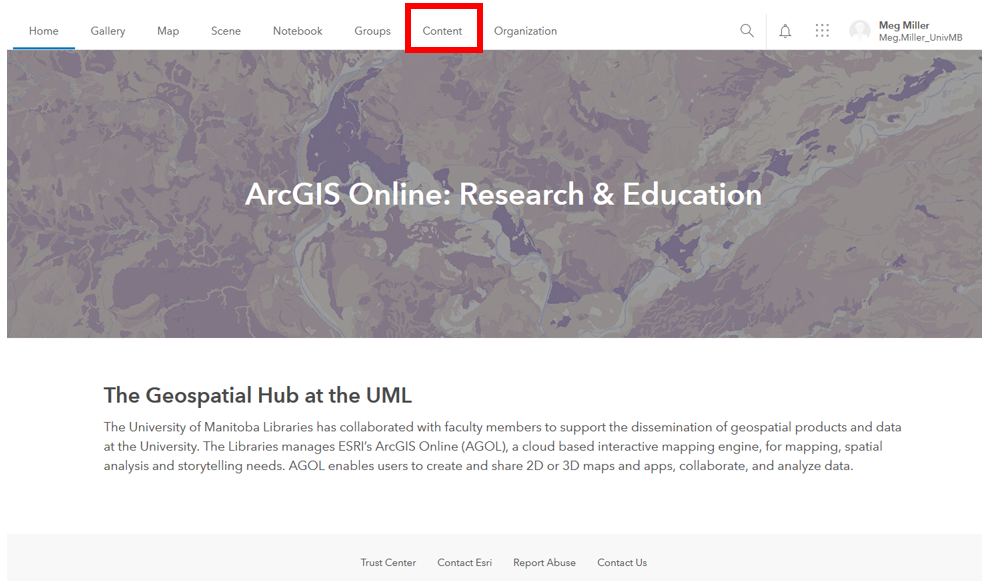   

## 2. **Explore** the Content Panel:  
Numbers 1-4 illustrate the locations of the following elements:  

1. **Personal content** (includes all data and objects you have created)  
2. **Filters** (allows you to easily limit the things that show up in your content area)  
3. **Create New** (one of many ways to create/ add content to your workspace)  
4. **Available content** (items that have been shared to you through groups, University of Manitoba or ESRI’s Living Atlas.)  
	   
  
## 3. View **My Organization** data options:  
1. Click on **My Organization** in the blue Content navigation bar.  
2. This brings up data that has been made available to UM users. Not all content here is available for reuse.  
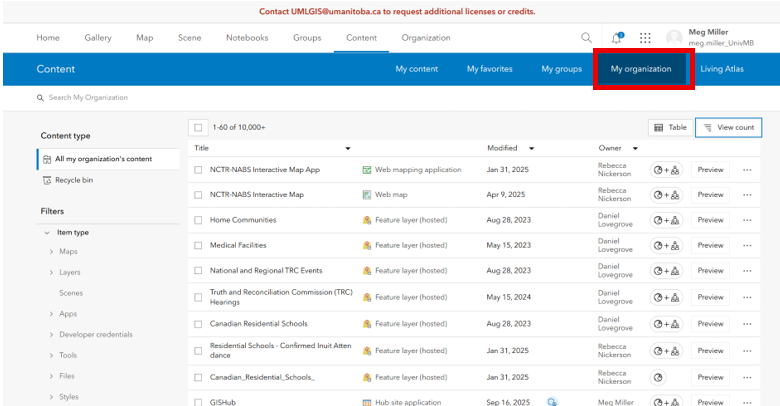   
 

3. Using the search box search for _Campus1955_georef_ , click the title to see more details about the file.  
   
4. Now we can see a _Description_ and the _Terms of Use_ for the file, as well as options to explore the data further.  
  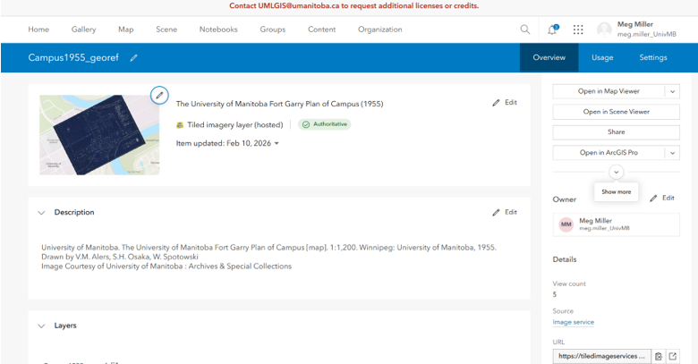   
  
5. Click on the **Open in Map Viewer** option.  
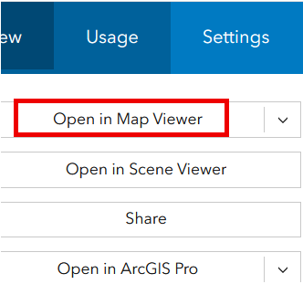   
 
6. Your screen should now look something like:  
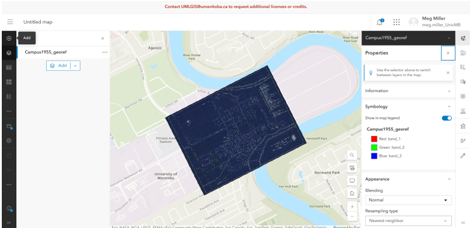   
 
7. **Save** your map by clicking the  **Save As** option left of the map. Your map is now saved to your personal content area.  
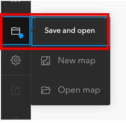   
 
## 4. **Add data** that is accessible via **URL**:  

1. Click on the arrow beside the **Add** data option on the left of your map. Select the _add layer from URL_ option.  
   
 
2. Copy + Paste this url into the dialogue: **https://services7.arcgis.com/qkMZANJ0iIMLiVSJ/arcgis/rest/services/UM_Campus_Planning_Public_Tree_Inventory/FeatureServer**   
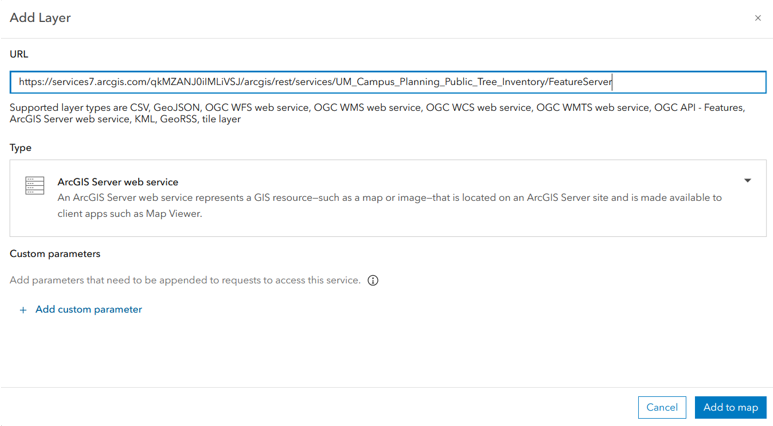   
  The import wizard should autodetect that it is a web service    
3. **Add item to map** in the bottom right corner of the wizard.  
Your map should now look something like:  
   

   
## 5. **Explore** the workspace.  
Numbers 1-4 illustrate the locations of the following elements:  
  1. **Map** options (add data, change basemap, share etc)    
  2. **Data** options (symbology, filters, pop-ups, labels, conduct simple analyses and more)  
  3. **Table of Contents** (list of layers in your map, show, hide, table, etc)  
  4. **Your map** workspace    
	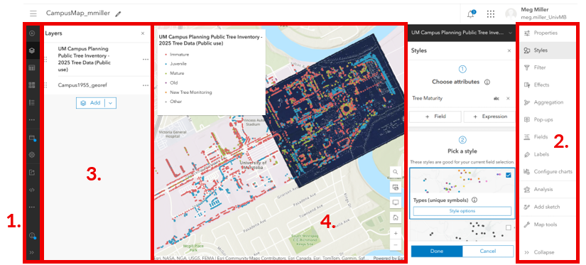  
	  
Take some time to explore the data options on the right side of the page:  
- Change the symbol for the tree layer     
- Change the transparency of the 1955 plan to see how it compares with campus today
- Filter data to show the oldest trees on campus 
- Cluster trees to reduce map clutter
- Look at analysis options  
- Explore more options (zoom, transparency, pop-ups, labels…)  
 

Once your map is how you want it, **Save** your additions by clicking the **Save** option.  

## 6. **Share** your map  
There are many ways you can share your work with the world so they can explore your work.  
1. Click the **Share** button to the left of your map and explore the options available to you.  
 
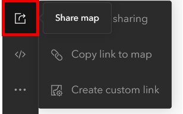   

 
 
Congratulations! You made it through!  

Questions? Concerns?  
 

<small> Data: [UM Campus Planning Public Tree Inventory - 2025 Tree Data: University of Manitoba Campus Planning, 2025](https://univmb-admin.maps.arcgis.com/home/item.html?id=1217d4b556bd445a8245f48ed8c002a1)</small>  

