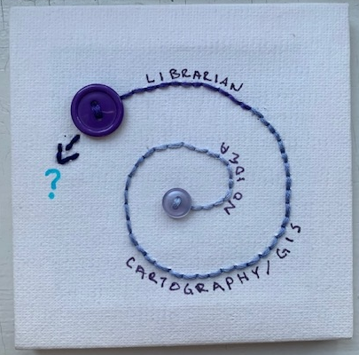
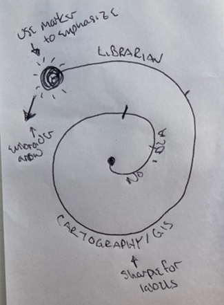
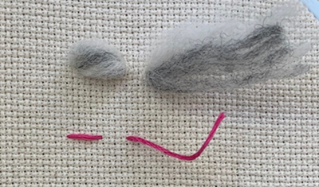
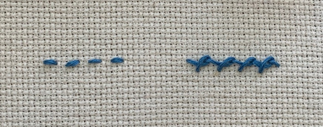
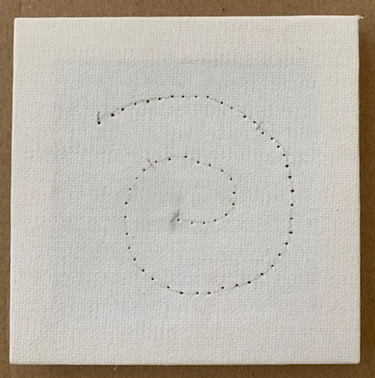
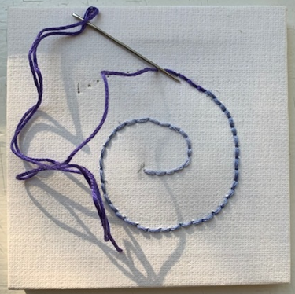
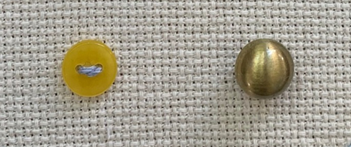
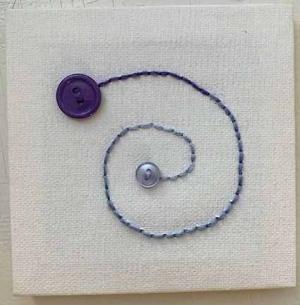

# From there to here – Making a meaningful map without a computer

---
<kbd></kbd>

Today we’re going to make our own personal map using the prompt “From there to here”. There are many ways you can interpret these words, and no interpretation is more correct than another.   
Some map ideas could be:  
* The literal distance between your home and here.
* The degree of challenge it’s taken to get here.
* How linear your path has been to get to this point in your life.
* Any other meanings this phrase can have for you.  

---

## 0. **Key Concepts**:  
### **Data Physicalization**  
Research area that studies the use of physical artifacts to convey data (1).  
 
Samples: [Data physicalization Wiki](http://dataphys.org/wiki/), Instagram...  

### **Critical Making**  
A practice that unites critical thinking and hands-on experiments to encourage learning by doing (2). A reconnection of two modes of engagement with the world that are typically held separate: critical thinking, traditionally understood as conceptually and linguistically based, and physical ‘making’, goal-based material work (3).  
 
Considerations: Sustainability, Accessibility...  

### **Visual Encoding**
Mapping inputs to visual cues. In data visualization/ mapping, this means constructing our data to be represented by visual elements like size, colour, length and placement (4). Consideration should be taken here to incorporate the Gestalt Principles. These are principles/laws of human perception that describe how humans group similar elements, recognize patterns and simplify complex images when we perceive objects (5).  
 
Some sample categories: Distance, direction, population, resistance, emotion, time...  

### **Research lifecycle**
Encompasses research activities and data organization & management across key phases of a given research project, from planning, creation (which further involves collection, processing, and analysis), dissemination, preservation, and data re-use (6).  
 
Think of what we are doing today as the foundation of how you will approach a mapping project using GIS technology. Remember that the software is just another tool, just as a needle and thread are tools.  
 

## 1. **Plan** what our overarching **project** will look like:  
To do this, we need to list our topic, our audience, what tools we have access to, the data or inputs available, any constraints and basic management strategy.   
Take some time to list these out now on the worksheet provided as you entered the room. It is also available from the Project page of this workshop for download.  

 
 
## 2. **Plan** what your **map** will look like:
Using the next section (visual encoding) of the worksheet provided, list the themes you would like to depict, and how you will do this. For the purposes of this session, we will be visualizing two locations, and the trajectory between them.  

 
Create a sketch of your map in the space provided to help you visualize how all the pieces will fit together.  

 

## 3. **Gather** your supplies: Assess your skill level and brain space (do you want an easy win, or a challenge?).   
1. Different _materials_ are easier to work with than others. 
* For example: floofy yarn will be annoying to thread, and can break, whereas cotton embroidery thread will be more straightforward to manage.  
  
* For a project of this size, precutting pieces of thread the length of your forearm should be adequate.  
2. Different _techniques_ will take different levels of expertise to master.   
* For example: a running stitch is beginner friendly, whereas a twisted chain will take more time to master.  
  
 
 
## 4. Using a pencil **sketch** your map on the canvas provided (pay attention to the frame location).

 
 
## 5: **Threading** your needle.  
This step can be frustrating if your glasses prescription isn’t up to date or you have consumed too much coffee. 
1. Moisten the end of the thread  
2. Poke it through the eye of the needle
3. Pull the needle 1/3 of the way down the thread 
<iframe width="400" height="225" src="https://www.youtube.com/embed/CcedHcmPR7U" title="How to thread needle? Hand embroidery guide for beginners." frameborder="0" allow="accelerometer; autoplay; clipboard-write; encrypted-media; gyroscope; picture-in-picture; web-share" referrerpolicy="strict-origin-when-cross-origin" allowfullscreen></iframe>
 
If you need support, there are two needle threading tools available or ask a neighbour (trim the wet end of your thread off to be polite).  
  
## 6: **Knotting** the thread.
We don’t want our thread to fall out of our map background once we start sewing, so we will tie a knot close to the bottom of the tail (long end).  
1. Tie a knot at the opposite end of the thread from the needle, leaving around a 1cm tail. An overhand knot is a popular choice here.  
<iframe width="400" height="225" src="https://www.youtube.com/embed/6l9q6vJ3IIs?list=PLnbijZ6dbxUanE4w0NLmk6lJkUx_icp2w" title="Starting knot | How to do &#39;&#39;beginning knot&#39;&#39; for Hand embroidery | basics guide for beginners" frameborder="0" allow="accelerometer; autoplay; clipboard-write; encrypted-media; gyroscope; picture-in-picture; web-share" referrerpolicy="strict-origin-when-cross-origin" allowfullscreen></iframe>
 
 
## 7: **Embroider** a line.  
At this stage, some people like to use a thumbtack to poke holes along the line they have drawn so it is easier to see there to insert the needle. 

  
 

1. Select one of stitch types from below to use to depict the line (or any other stitch you are familiar with).  
<iframe width="300" height="490" src="https://www.youtube.com/embed/BqKKOYRs1iE" title="6 Basic Embroidery Stitches" frameborder="0" allow="accelerometer; autoplay; clipboard-write; encrypted-media; gyroscope; picture-in-picture; web-share" referrerpolicy="strict-origin-when-cross-origin" allowfullscreen></iframe>  

2. Stitch along the line.  
  
 

3. If you realize you want to make a change, you will need to unthread your needle and pull out your stitches.  
4. When you reach the end of your line, end your stitch on the bottom of the fabric.

## 8: **Tying off** the thread  
So that our work does not unravel, we need to finish the line.   
1. Tie off your sewing by using one of the techniques depicted below. 

<iframe width="400" height="225" src="https://www.youtube.com/embed/D9Bk4aQUDFU?list=PLnbijZ6dbxUaIa7E2LuWBJuC5k1-IHW5y" title="How to do End knot/ Finishing knot in hand embroidery | Beginners guide basics" frameborder="0" allow="accelerometer; autoplay; clipboard-write; encrypted-media; gyroscope; picture-in-picture; web-share" referrerpolicy="strict-origin-when-cross-origin" allowfullscreen></iframe>
 
 
## 9. Attaching **buttons** to depict location.  
You will find two different styles of buttons in the button jar: flat (with 2-4 holes) or shank (post on bottom with a hole).  
  
 
### If your button is **flat**.  
1. Thread your needle, and tie a knot at the tail to keep the button affixed.  
2. Beginning on the bottom of the fabric, poke the needle through to the surface where you want to attach the button > place button onto needle point > pull thread all the way through fabric.
3. Orient button in the desired direction > stitch downward through the opposite hole (diagonal)
4. Push needle back through one of the remaining holes > complete the stitch using the remaining empty hole.  
5. Repeat steps 2-4.  
6. Tie off your button.  

### If your button has a **shank**  
1. Thread your needle, and tie a knot at the tail to keep the button affixed.  
2. Beginning on the bottom of the fabric, poke the needle through to the surface where you want to attach the button > place button onto needle point > pull thread all the way through fabric.
3. Orient button in the desired direction > stitch downward through the opposite side of the loop into the canvas.
4. Repeat steps 2-3.  
6. Tie off your button.  
 

## 10. Add additional **ornamentation** if desired:  
###  Fabric Markers  
Using fabric markers you can add details to emphasize/ provide context to certain elements of your map if desired.  
**IMPORTANT** allow this to dry or it will smear. 

###  Embroidery  
Using decorative stitches like french knots can add interest to your design.  

###  Sharpie  
Using a fine tipped permanent marker you can details like labels, cartographic elements like a north arrow, and your signature.  
**IMPORTANT** allow this to dry or it will smear.  

Congratulations! You made it through!  

Questions? Concerns?  
 

<small> Sources: Definitions (Data Physicalization) [(1)](https://doi.org/10.1007/978-3-319-27648-9_94-1), (Critical Making)[(2)](https://doi.org/10.37514/TPC-B.2022.1725.2.12), [(3)](http://opendesignnow.org/index.html%3Fp=434.html), (Visual Encoding) [(4)](https://doi.org/10.1016/j.neucom.2023.126287), [(5)](https://www.interaction-design.org/literature/topics/gestalt-principles), (Research Lifecycle) [(6)](https://umanitoba.ca/libraries/research-lifecycle-um), YouTube Creators- [Crafts by Geesh](https://www.youtube.com/@CraftsbyGeesh), [HandiWorks](https://www.youtube.com/@HandiWorks)</small>