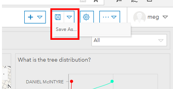
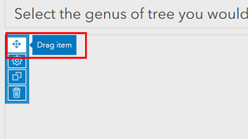
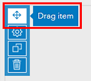

# Workshop: Data Exploration with ESRI Operations Dashboard

---
<kbd></kbd>

---

## 0. Step back: 
Before you dive in to a project make sure you are using the appropriate tool.  
Thinking about your purpose will help you choose:  
  <table style="width:60%">
  <tr>
    <th></th>
    <th>Insights</th>
    <th>Dashboards</th>
  </tr>
  <tr>
    <td>Are you looking to conduct analyses?</td>
    <td>Yes!</td>
    <td>No, just visualize.</td>
  </tr>
  <tr>
    <td>What is your study timeframe?</td>
    <td>What might happen in the future.</td>
    <td>Events happening now.</td>
  </tr>
  <tr>
    <td>What sort of questions are you asking?</td>
    <td>‘How’ & ‘Why’</td>
    <td>‘What’</td>
  </tr>
  </table>		

Then decide what your actual object will look like. The goal of creating a dashboard is to allow your audience to explore your research at their own pace, with a bit of guidance from you to give them context.  
In this case we will be updating the following dashboard to add visual interest, facilitate understanding of trends and create a cohesive experience.  
 

## 1. Access your **workspace**:   
1. Log-in to the Dashboards app on your UM ArcGIS Online account [https://univmb.maps.arcgis.com/apps/opsdashboard/index.html](https://univmb.maps.arcgis.com/apps/opsdashboard/index.html).  
2. The landing page has options for you to create new dashboards, view your existing projects or projects that have been shared with you.  
3. Select the **Shared dashboards** option to view the dashboards available.  
4. Click the **more information** option  on the bottom of the _TreeExercise_New_ to open dashboard options.  

	  

## 2. Make your own **copy** of the dashboard to work from:  
1. Click the **Edit Dashboard** option to open the dashboard  

	  
 
2. Click the **dropdown arrow** by the save option at the top of the page, then select the **‘Save As’** option.  

	  
 
3. Edit the Title to include your initials (Ie: _TreeExerciseNew_MM_).  
4. Click _Save_, the screen will refresh and you now have your own dashboard to get started with!  

## 3. Add an **image** to create balance and visual interest.  
1. Hover over the **small blue rectangle** that appears in the top left corner of the background information block.  
2. Select the **gear** to modify the contents of the block.  

	  
 
3. Click in the blank space above the title text to position your cursor where you want the image to be placed.  
4. Select **‘Insert Image’** from the available options to open the image dialogue.  

	  
 
5. **Paste** the following image path into the URL box: https://umanitoba.ca/libraries/units/archives/tribune/photos/WolseleyElmTree18.jpg  
6. Adjust the **width** of the image to _‘275’_ so that the image is scaled appropriately to our dashboard.  

	  
 
7. Click _OK_ to insert the image.  
8. Double check your image has inserted above the title.  
9. Click _‘Done’_ on the bottom right side of the screen to save your edits.  
10. Your screen should now look something like:  

	  
	
 
## 4. Add an **indicator** to the dashboard:  
1. Click **Add Element** at the top of your dashboard.  
2. Select the **Indicator option** from the list.  

	  
 
3. Click on the layer under the _'Daniel McIntyre Trees by Genus’_ map to select the data to link to the counter (in our case all the maps are using the same data set).  

	  
 
4.  In the data panel that opens:  
    1. _Value Type_: **statistic**,  
    2. _Statistic_: **count**  

        
 
5. In the indicator panel:  
    1. _Bottom Text:_ **Trees**  
    2. _Icon:_ **Right** > Select a tree from the icon options.  
    3. Click the colour swatch to open the colour picker and give it a colour.  

	    

6. Click _‘Done’_ in the bottom right corner of the screen to create your indicator.  
7. **Move** your indicator to be positioned below the _Descriptive text_ box.  
    1. Hover over the small blue bar on the top left corner of your Indicator to reveal the **Drag Item** option at the top of the list.  

	    
  
    2. **Click** and **drag** the item until you are over top of the Descriptive text box move your mouse towards the bottom of the box and you will be given the option to dock as a row, release the mouse button.  
    3. Adjust the size of the objects to reveal the entire text box by **dragging the margins** between the two objects downwards.  

	    
 
8. Your dashboard should now look something like:  

	  
 

## 5. **Link** header filter to dashboard.  
1. Hover over the **dropdown filter** in the top right corner of the screen to reveal the **filter configuration** option.  

	  
 
2. Under the actions panel click the **‘Add Target’** option, and add the following three (3) elements:  
- _DanielMcIntyre_trees (this is the Genus map)_  
- _What is the tree distribution (this is our line graph_  
- _Indicator_  

	  
 
3. Click _‘Done’_ in the bottom right corner to save your changes.  
4. Now selecting different options from the dropdown should filter your dashboard elements.  

## 6. **Edit** and **relocate** a chart.  
The line graph is an inappropriate choice here as it implies the dataset is continuous, and it’s colour palette does not match with the rest of the dashboard. If we step back, we can see the two tree charts are very similar in that they both break things down by neighbourhood and tree location (park, boulevard…). Once we adjust from horizontal to vertical bars, we can see these are ideal candidates to stack!  
1. Hover over the **small blue rectangle** in the corner of the Tree Distribution chart to reveal the **configuration** options.  

	  
	
2. Under the **Chart** options we will adjust Orientation to be _Vertical_  

	  
 
3. Under the **Series** options:  
    1. **Type**: _Bar_  
    2. **Park Colour**: Click red box and enter _‘#4f7a83’_  
    3. **Boulevard Colour**: Click red box and enter _‘#adadad’_  

	  
 
4. In the bottom right corner click _‘Done’_ to save your edits.  
5. Now your graph should look something like:  

	  
 
6. **Move** your chart to be **stacked** on top of the other neighbourhood chart.
    1. Hover over the **small blue bar** on the top left corner of your Indicator to reveal the **Drag Item** option at the top of the list.  
      
 
    2. **Click** and **drag the item** until you are over top of the middle of the other chart. A small blue square will appear (sorry, I can’t screenshot this) and the option to **stack** the items will be revealed, release your mouse button.  
7. Your Dashboard should now look something like:  

	  
 
## 7. Add a **Legend** to the Genus map.  
While the map depicting tree types does have an included legend that can be opened, for ease of use we are going to add a separate legend next to it to improve dashboard usability.  
1. Click **Add Element** at the top of your dashboard.  
2. Select the **Map Legend** option from the list.  

	  
 
3. Ensure _‘Daniel McIntyre Trees by Genus’_ is selected for the map.  
4. In the bottom right corner, click _‘Done’_ to create your legend.  
5. **Move** your legend so that it is in line with the tree type map.  
    1. Hover over the **small blue bar** on the top left corner of your Indicator to reveal the **Drag Item** option at the top of the list.  

	  
 
    2. **Click** and **drag** the item until you are over the right side of your tree map, the option to _dock as a column_ will be revealed, release your mouse button.  
    3. Adjust the size of your legend by **dragging the margin** between the legend and map to the right (you will probably need to resize all of your maps).  
7. Your Dashboard should now look something like:  

	  
 

Congratulations! You made it through!  
Questions? Concerns?  
 
<small> Data: [Winnipeg Open Data: Tree Inventory](https://data.winnipeg.ca/Parks/Tree-Inventory/hfwk-jp4h)</small>  
