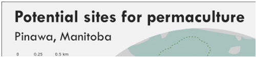
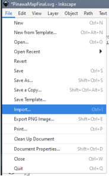
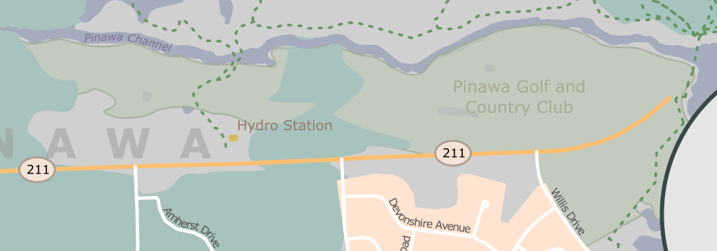
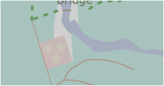

# Inkscape exercise – Tips for map layout editing

---
<kbd></kbd>

---

### **Basic actions**  

## 1. **Open** the Common Tasks file  
1. Launch Inkscape on your computer  
2. File > Open > _CommonTaskInkscape.svg_  

## 2. **Explore** the interface  
  

Inkscape is a very keyboard heavy program. The help menu or Google can help you navigate.   
 
The vertical toolbar on the left shows Inkscape's **drawing and editing tools**. Depending on your screen resolution, the **Commands bar** with general command buttons, such as _Save_ and _Print_, can be found either in the top part of the window, right below the menu, or on the right side of the window, in between the scroll bar and the Snap Controls bar.  
Above the white **Canvas**, is the **Tool Controls bar** with controls that are specific to each tool. The **status bar** at the bottom of the window will display useful hints and messages as you work.  
Similar to GIS software, information is organized into layers and sublayers via the layers panel  that can be found on the right side of the page. The **layers dialog** is an easy way to keep track of items on your canvas, but you cannot drill down to find individual objects.  
  

The **XML Editor**  and **CSS selector**  are where you will find information on individual objects (referred to as nodes)  
  
   
This can be helpful if you are trying to figure out why your object is acting the way it is. Today’s session will not be focusing on this.  
 

## 3. **Navigating** the workspace
1. To **pan** the canvas (move around), the easiest is to hold down the _ctrl key + arrow keys to move left, right, up or down_. You can also use _ctrl + b_ to show the scrollbars.  
2. There are many ways to **zoom** your document.  
    1. The **Zoom tool**  (in the toolbar on left) lets you to zoom into an area by dragging around it.  
    2. You can click in the zoom entry field (in the bottom right region of the document window, labelled “Z”), type a precise zoom value in %, and press enter.  
    3. Use the ‘-‘or ‘+’ keys to zoom in and out  
3. The most used tool is the **Selector**. Click the topmost button (with the arrow) on the toolbar  to activate it. In activating an object eight arrow-shaped handles appear around the object.    
Now you can: 
    - **Move** the object by dragging it.  
    - **Scale** the object by dragging any handle  
With a second click the handles change.    
Now you can:  
    - **Rotate** the object by dragging the corner handles.
 	
While using the Selector, you can also use the numeric entry fields in the **Tool Controls bar** (above the canvas) to set exact values for coordinates (X and Y) and size (W and H) of the selection. 

### **Task 1:** Stroke and fill, and drawing new shapes  
The simplest way to colour an object is select it and click a swatch in the palette below the canvas, _right clicking_ the swatch allows you to select if you want to use the color for the outline or fill.  
  
The advanced option is to use the **Fill and Stroke dialog**  (Found on the toolbar on the right side of the page). Here you can set the fill, stroke colour and stroke style for an object.  
  

1. **Select** the star and use either method to change the fill as instructed.  
  
2. Select the **rectangle tool**  in the left toolbar and draw one next to the star by left clicking and dragging in on the canvas  
3. Use the steps above to give it a yellow colour.  
  
 
### **Task 2:** Duplicating and grouping  
**Duplicating** an object is a tidier way of copying an object within the workspace. The duplicate is placed on top of the original and is selected, so you can drag it away. It preserves the layer organization.  
1. **Select** your object and click the **‘duplicate’** icon  from the right toolbar.  
2. **Drag** your copy off the symbol so you can see them both.  
Several objects can be combined into a **group**. A group behaves as a single object when you drag or transform it. When maps are exported from QGIS objects within layers are grouped together.  
3. To select multiple objects hold the **shift-key** down as you click them.  
4. Right-click and select group, or click the ‘group’ icon  from the right toolbar.  
  
 
### **Task 3:** Draw a curved line  
There are multiple ways to draw a curved line in Inkscape. **Bezier** , **freehand** , and **calligraphic** .   
1. Experiment with the line tools from the left toolbar to determine which will make a curved line most like the one drawn in the example box.  
  

### **Task 4:** Text on a path  
Sometimes you will want your **text** to flow with a **path**. This is common when labeling water features or other linear features such as roads.  
1. Find or draw a **line** that you want your text to follow.   
2. **Type** some text in the same layer using the text tool   
3. **Select** both the line and the text by holding down the shift key while clicking.  
4. Click the **Text menu** from the top of the page and then **put on path**  
  
 
It should look something like:  
  
 
### **Task 5:** Alignment  
Inkscape has tools to make **aligning** and **distributing** objects more efficient than doing it by hand, especially for layout elements in a map. Here we want to center our pentagons.  
1. Click on the **Align and Distribute** icon   in the right toolbar. In the dialogue that opens you can see all the different options.  
  
 
2. Hold down the **shift key** and click each of the three shapes.  
3. Select the option to **center on the vertical axis**.  
Your workspace should look something like:  
  
 
### **Task 6:** Navigating within a group  
As was previously mentioned, when objects are imported from QGIS they are often in deeply nested groups which can be frustrating to work with.  
1. Double clicking is the most intuitive way to access items within a group, but it is not the most efficient.  
2. Holding down the **ctrl key** and clicking the object will in most cases select it.  
  
 
3. If all else fails select the **Extensions menu** (top of the page) > **Arrange** > **Deep ungroup**.  
  
 
### **Task 7**: Complete a polygon  
Often when polygons are exported from QGIS they are broken apart. As such, they may behave in unexpected ways. To close the polygon, we need to find the broken nodes, and join them. This example is obvious, but in practice, these gaps may be much smaller.  
1. Click the shape once to **select** it.  
2. Select the **edit nodes** tool  below the standard selection arrow, and the nodes will appear at each corner.  
  
 
3. Hold down the **shift key** and select the two nodes you want to **join** with the pointer (they will highlight quickly).  
4. Use the keyboard command **‘ctrl + j’** to join the two points.   
Your shape should now look like:  
  
 
### **Task 8:** Filter an object  
In production mapping **filtering** would be done outside of the vector editing tool using something like Photoshop or GIMP. But for simple effects, or one-off maps using the filters in Inkscape. Here we are going to blur the edge of a box so that it fades more into its surroundings.  
1. Using the selection arrow **select** the green rectangle.  
2. Click the **Filter menu** (top of the page) and explore the options available.  
  
 
3. **Ctrl + Z** will **undo** any changes you do not wish to keep.  
My box looked something like:  
  
 

## 5 minute break

# 4. Map Exercise  
 
  

## 1. **Open** the map file  
1.  File > Open > _PinawaMap.svg_  

## 2. **Explore** the interface  
 
  

## 3. **Delete** purple guide bubble  
1. **Unlock** _‘Layout Help’_ layer in list of layers by clicking the lock to unlock and make editable:  
  

2. Click once on the purple circle under the title block to **select** it.  
3. Use the **delete key** on your keyboard to remove the object.  
 
Your page should now look something like:  
  
 
## 4. **Edit** the Surround text  
1. **Unlock** the Surround Text layer to begin editing.  
2. Change the Title and subtitle to something more meaningful. I chose:  
Title: _Potential sites for permaculture_  
Subtitle: _Pinawa, Manitoba_  
Once the text is selected you can use the Text dialogue  or toolbar that appears at the top of the page to change the font type, colour and size.  
  

3. The _Summary Info bubble_ is looking quite crowded, we could make the font smaller, but if we step back, we can see that there is duplicated information between other bubbles and what appears here.  
    1. **Select** the text you want to remove and use the delete key to remove it.  
 
This leaves me with something like:  
  
 
## 5. **Import** cloud cover chart  
Inkscape can be unstable at times, instead of trying to import an overly complex layout from QGIS it is easier to do it in bite sized pieces. In this case, I exported all three maps separately. We are missing a cloud cover chart from the top right corner of the canvas.  
1. In the layers panel ensure that the **Weather Chart** layer is selected and unlocked.  
  
 
2. Open the **File** menu (top of the page) > Import > _coverprecipPNG.png_  
  

3. Accept defaults on the _import dialogue_.  
4. Using the _corner handle_  **scale** the chart so it fits within the bubble.  
5. Once you have things how you want them, **lock** the layer back up.  
Your screen should look something like:  
  
  
## 6. Use **trace image** to fix golf course fill  
Sometimes you will need to make larger edits to your map after it has been exported from the GIS. In this case, in looking at the aerial imagery we can see that the golf course extends beyond what the government provided data gives us.  
1. In the Layers panel **drag** the _Trace Image layer_ so that it sits below the _Leisure Area_ layer. You can now see where the Golf course fill should be.  
  

2. Ensure the _Leisure Area_ layer is **selected** in the Layers panel and use the **Freehand** tool  to sketch in the missing part of the shape. Overlap it with the existing shape.  
  
 
3. Now we can use the **union** action to combine with the existing leisure polygon. _Shift click_ to select both shapes.  
4. Select the **Path** menu (top of screen) > **Union**  
  

For the union to properly work, everything needs to be in the same layer, and completely _ungrouped_ (this is where a _deep ungroup_ can come in handy).  
After reordering the layers, and applying a less aggressive fill, my golf course looks like:  
  
 
## 7. Use **Symbols** for cemetery  
There is a small cemetery in the top left corner of the map. We could label it, but it isn’t that important in out theme, so we can just symbolize it a little differently. In this case with a cross symbol, and fill that blends into the base a bit better.  
  
 
1. Find the _Graveyard layer_ in the Layers panel and ensure it is **unlocked** and **selected**.  
2. Select the **Graveyard** polygon and assign it a _light brown fill_.  
3. Click **Objects** Menu (top of page) > **Symbols** > _United States National Park Symbols_ > _first aid_   
  
  
4. **Drag** the symbol onto the map and **resize/ recolour/ duplicate** it to create a fill.  
Mine looks something like:  
  
 
## 8. Continue making edits to the map using the actions we covered in today’s session.  
I have provided you with a file of a potential ‘final’ you can look at for inspiration, or you can go your own way.   
  
 
## 9. **Export** as .png  
Once your map is how you want it, you will need to export as an image so it can be used in other applications.  
1. File > **Export PNG Image**  
  
 
(A rule of thumb, 300DPI resolution for print, 150DPI for web)  
 

 
Congratulations! You made it through!  
 

Questions? Concerns?  
 

<small> Data: [OpenStreetMap](https://www.openstreetmap.org/), [Manitoba Land Inventory](https://mli2.gov.mb.ca/), [Meteoblue Climate](https://www.meteoblue.com/en/weather/historyclimate/climatemodelled/pinawa-provincial-park_canada_6104825)</small>  
