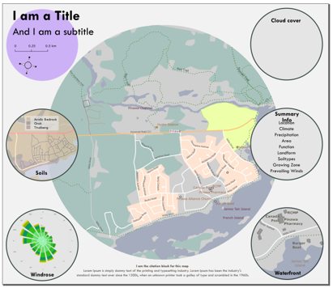
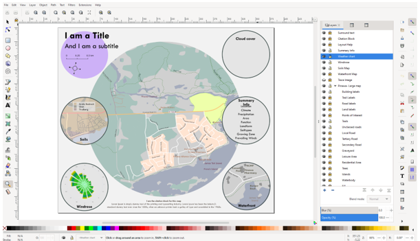
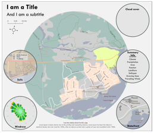
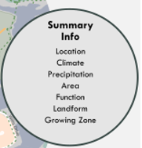
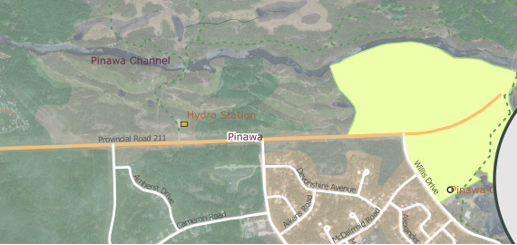
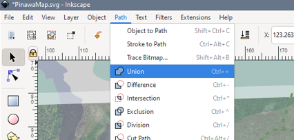
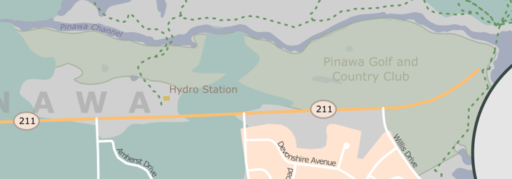
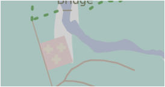

# Inkscape exercise – Tips for map layout editing
<small>Intermediate</small>

---
<kbd></kbd>

---

#  Map Exercise  
 
  

## 1. **Open** the map file  
1.  File > Open > _PinawaMap.svg_  

## 2. **Explore** the interface  
 
  

## 3. **Delete** purple guide bubble  
1. **Unlock** _‘Layout Help’_ layer in list of layers by clicking the lock to unlock and make editable:  
  

2. Click once on the purple circle under the title block to **select** it.  
3. Use the **delete key** on your keyboard to remove the object.  
 
Your page should now look something like:  
  
 
## 4. **Edit** the Surround text  
1. **Unlock** the Surround Text layer to begin editing.  
2. Change the Title and subtitle to something more meaningful. I chose:  
Title: _Potential sites for permaculture_  
Subtitle: _Pinawa, Manitoba_  
Once the text is selected you can use the Text dialogue  or toolbar that appears at the top of the page to change the font type, colour and size.  
  

3. The _Summary Info bubble_ is looking quite crowded, we could make the font smaller, but if we step back, we can see that there is duplicated information between other bubbles and what appears here.  
    1. **Select** the text you want to remove and use the delete key to remove it.  
 
This leaves me with something like:  
  
 
## 5. **Import** cloud cover chart  
Inkscape can be unstable at times, instead of trying to import an overly complex layout from QGIS it is easier to do it in bite sized pieces. In this case, I exported all three maps separately. We are missing a cloud cover chart from the top right corner of the canvas.  
1. In the layers panel ensure that the **Weather Chart** layer is selected and unlocked.  
  
 
2. Open the **File** menu (top of the page) > Import > _coverprecipPNG.png_  
  

3. Accept defaults on the _import dialogue_.  
4. Using the _corner handle_  **scale** the chart so it fits within the bubble.  
5. Once you have things how you want them, **lock** the layer back up.  
Your screen should look something like:  
  
  
## 6. Use **trace image** to fix golf course fill  
Sometimes you will need to make larger edits to your map after it has been exported from the GIS. In this case, in looking at the aerial imagery we can see that the golf course extends beyond what the government provided data gives us.  
1. In the Layers panel **drag** the _Trace Image layer_ so that it sits below the _Leisure Area_ layer. You can now see where the Golf course fill should be.  
  

2. Ensure the _Leisure Area_ layer is **selected** in the Layers panel and use the **Freehand** tool  to sketch in the missing part of the shape. Overlap it with the existing shape.  
  
 
3. Now we can use the **union** action to combine with the existing leisure polygon. _Shift click_ to select both shapes.  
4. Select the **Path** menu (top of screen) > **Union**  
  

For the union to properly work, everything needs to be in the same layer, and completely _ungrouped_ (this is where a _deep ungroup_ can come in handy).  
After reordering the layers, and applying a less aggressive fill, my golf course looks like:  
  
 
## 7. Use **Symbols** for cemetery  
There is a small cemetery in the top left corner of the map. We could label it, but it isn’t that important in out theme, so we can just symbolize it a little differently. In this case with a cross symbol, and fill that blends into the base a bit better.  
  
 
1. Find the _Graveyard layer_ in the Layers panel and ensure it is **unlocked** and **selected**.  
2. Select the **Graveyard** polygon and assign it a _light brown fill_.  
3. Click **Objects** Menu (top of page) > **Symbols** > _United States National Park Symbols_ > _first aid_   
  
  
4. **Drag** the symbol onto the map and **resize/ recolour/ duplicate** it to create a fill.  
Mine looks something like:  
  
 
## 8. Continue making edits to the map using the actions we covered in today’s session.  
I have provided you with a file of a potential ‘final’ you can look at for inspiration, or you can go your own way.   
  
 
## 9. **Export** as .png  
Once your map is how you want it, you will need to export as an image so it can be used in other applications.  
1. File > **Export PNG Image**  
  
 
(A rule of thumb, 300DPI resolution for print, 150DPI for web)  
 

 
Congratulations! You made it through!  
 

Questions? Concerns?  
 

<small> Data: [OpenStreetMap](https://www.openstreetmap.org/), [Manitoba Land Inventory](https://mli2.gov.mb.ca/), [Meteoblue Climate](https://www.meteoblue.com/en/weather/historyclimate/climatemodelled/pinawa-provincial-park_canada_6104825)</small>  
