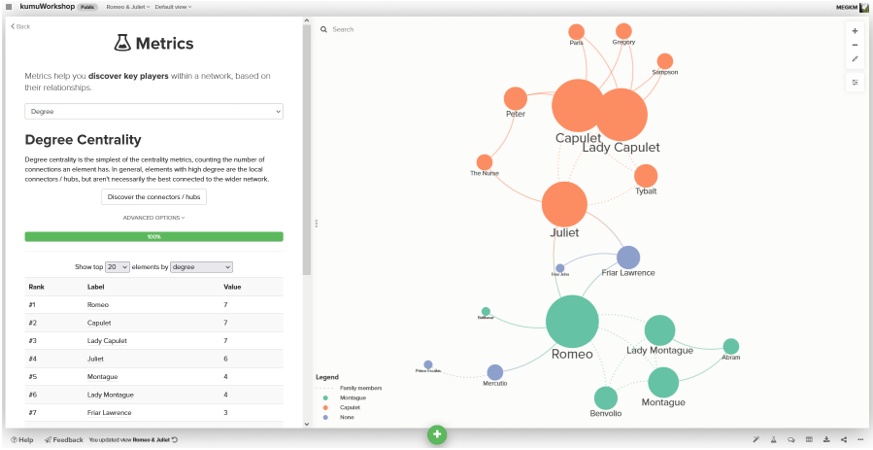
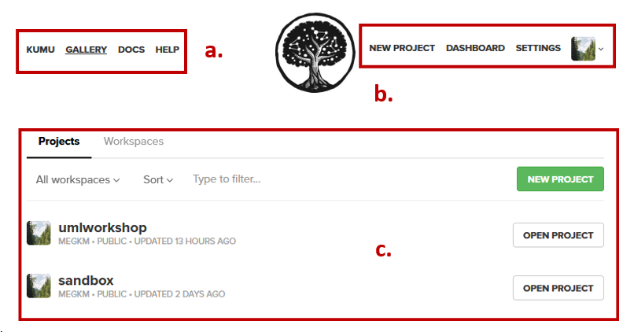
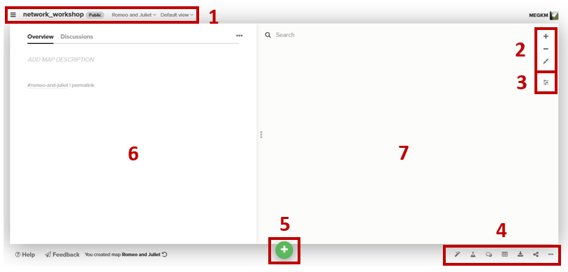
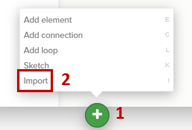
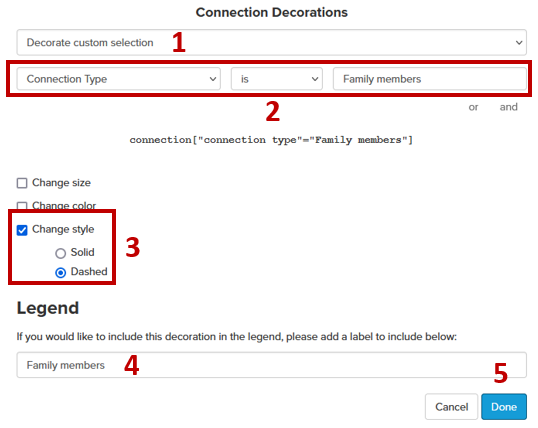
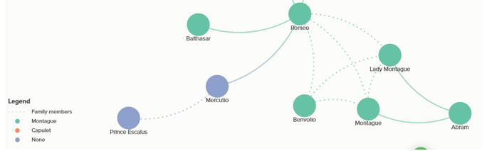
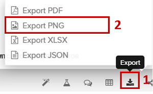

# Kumu exercise – visualizing a simple network

---
<kbd></kbd>

---

## 0. **Step back**:  
Before diving in, we need to take a moment:  
- Consider your **data** and what **relationships** you're trying to visualize.  
- Select the **appropriate** tool.  
- **Clean** and structure your data.  
- Open the **Help**  document for your tool.  

We have two .csv files in our data folder- one for _nodes_ (people) and one for _edges_ (relationships). While some tools will allow you to combine these files into one or use proprietary file types, best practice is to keep these elements **separate** and in a **plain text** format.  
 

## 1. **Access** your workspace:  
1. Log-in to your free Kumu account [https://kumu.io/dashboard](https://kumu.io/dashboard)  
2. The dashboard page is your landing page.  
3. Letters a-c illustrate the locations of the following elements:  
    1. Kumu **support** options  
    2. **User menus** (access workspaces, dashboard, account)  
    3. **Project listing** (options individual projects and workspaces)  

	  
 

## 2. Create a **new project** workspace:  
1. Click on the option to create a **new project** from the top of the page. 
2. Fill out the **project metadata** fields to give your project a _name_ and _description_.  
3. Click the blue button at the bottom of the wizard to proceed to then next screen.  
**NOTE** - Free accounts are public.  
 
	  

4. Letters a-d illustrate the locations of the following elements:  
    1. **Map name** (one project can have multiple maps).   
    2. Select the **Stakeholder** template (equivalent to social network).  
    3. Elements (nodes and edges) will be **fixed** in location to start.  
    4. Connections (edges) are **undirected** (in our data set)  
Then click the **Get Started** button  

	  
 

 
## 3. **Explore** Kumu workspace:  
Numbers 1-7 illustrate the locations of the following elements:  
1. Kumu **project space navigation**  (change view, delete project etc.)  
2. **Map space navigation** (to zoom in and out of your map)  
3. **Settings** (access to element properties for visualizing)  
4. Map **actions** (quick actions, metrics, data table, export and share)  
5. Add **Data** (draw nodes and edges or import from a file)  
6. Element **overview** (attributes for whatever is selected in the map)  
7. **Map space** (where your map will live)  

	  
 

## 4. **Import** your nodes and edges data:  
1. Click the **green plus sign** at the bottom of the page and select the **import** option to load your data into the map.
  
	  
 
2. In the dialogue that follows in the **csv** import, browse to your _nodes_RJ.csv_ file.
3. Click the blue **import button** to proceed to the next screen.
 
	  
 
4. A **preview** of your data appears. Double-check to make sure the fields are showing up as you expect. 
5. Click the green **Save import** button at the bottom of your screen if all looks well.
 
	  
 
6. Your map should look something like:  
	  
7. Repeat **steps 1-5** with your _edges_RJ.csv_ file.  
**Note**- In step 5 ensure you do **not** click the checkbox to overwrite existing data. This will remove your _nodes_ data from the map.  
 
	  
 
8. Your map should look something like:
 
	  
 

## 5. Adjust node **styles** of the map to draw out themes.  
In our nodes file, we had a field for ‘Loyalty’ (_Montague, Capulet or None_).  
1. Click the **options** button on the right side of the map to open the **settings panel**.  
 
	 
 
2. Change the **Color by** field to _Loyalty_  and select a colour palette of your choice.  
 
	 
 
3. Your map should now look something like:
 
	
  

## 6. Set **rules** to decorate edges.  
Next we want to pull out the types of relationships that are found in the data- namely _who is related_, which is captured in the _edges_ data table and symbolize them with a dashed line.  
In the Settings panel:  
1. Select the **Decorate Connections** option from the list of rules (at the bottom of the panel).  
   
	  
 
2. In the **dialogue box that opens**, fill it out as follows:  
    1. _Decorate custom selection_  
    2. **Connection Type** is _Family members_  
    3. Click the **change style** box and select the **Dashed** option  
    4. Type the label _Family members_ in the **Legend** text box  
    5. Click the blue **Done** button to close the wizard  
 
      
3. Your network map should now look something like:  
 
    	
 

## 7. Calculate a **metric** to unlock proportional symbols.  
Our current data did not come in with any degree data in the table. To be able to symbolize the nodes with proportional symbology depending on their degree of connectedness we need to calculate this metric.  
1. Select the **metrics** option from the list of tools at the bottom of the screen, and then **social network analysis**  
  
	  
 
2. In the dialogue that opens select the **Degree** option from the dropdown, and click the **Discover the connectors** button.  
A table will appear below the button that displays the degree values for each of our characters.
 
	  
 
 3. Now when we return to the **Style: Size** drop-down at the top of the **settings** panel we have the option to symbolize. 
4. Select **degree** from the drop-down and adjust the sizes as you see fit.  
 
	 
  
5. Your network map should now look something like:
 
 	
 

## 8. Make final adjustments and **export** network map.  
You’ve taken some time to adjust colour, placement and line weights, and your map is exactly how you want it for publication.  
1. Select the **Export** option from the list of tools at the bottom of the screen, and then the **format** you need.  
 
	
 
2. The **Embed** option to the right of Export allows you to copy code snippet and include the live interactive network map in a website.

Congratulations! You made it through!  

Questions? Concerns?  
 

<small> Data: [Shakespeare Play Data (Kaggle)]( https://www.kaggle.com/datasets/kingburrito666/shakespeare-plays)</small> 
