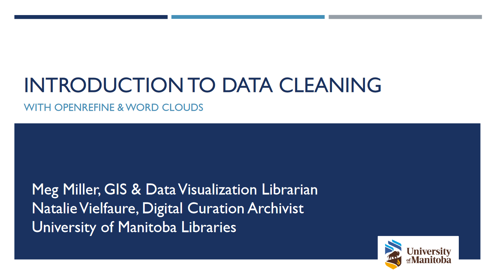

# Introduction to data cleaning with OpenRefine

*Follow along and interact with the slides below if you want:*
 

  
  

Watch the session on [YouTube](https://youtu.be/).

## Key points from slides:

- _Data Cleaning:_ Manually or programatically improving the quality of your data.    
- Major issues addressed are:
	- Inconsistencies  
    - Formatting  
    - Null Values    
- The major benefits of having clean data includes:  
	- More efficient research  
    - Easier conversion  
    - Secondary use    
- OpenRefine is an open-source desktop solution for data cleaning. It straddles the line between manual and automated and is great for beginners and more advanced users alike.    
- Many visualization tools can be found linked from the [data visualization subject guide](https://libguides.lib.umanitoba.ca/viz).  