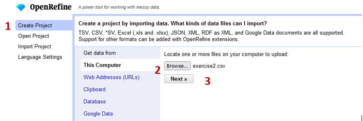
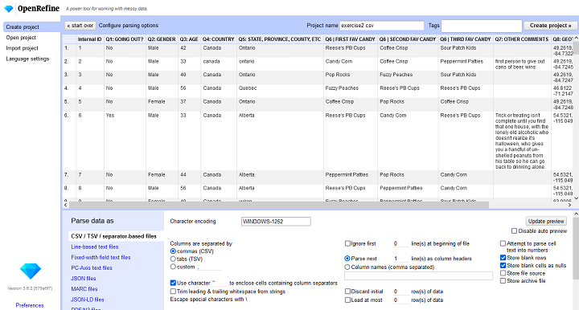
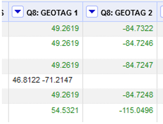
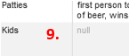

# OpenRefine exercise – Popular transformations for cleaning data

---
<kbd></kbd>

---

## 0. **Housekeeping**:  
### **Project files**  
You can access all of your created projects by clicking on Open Project. Your project list can be organized by modification date, title, row count, and other metadata you can supply (such as subject, descripton, tags, or creator). To edit the fields you see here, click About to the left of each project. There you can edit a number of available fields. You can also see the project ID that corresponds to the name of the folder in your work directory.  

### **Naming projects**  
You may have multiple projects from the same dataset, or multiple versions from sharing a project with another person. OpenRefine automatically generates a project name from the imported file, or “clipboard” when you use Clipboard importing. Project names don’t have to be unique, and OpenRefine will create many projects with the same name unless you intervene.  
 
You can edit a project's name when you create it or import it, and you can rename a project later by opening it and clicking on the project name at the top of the screen.  

### **Saving**
OpenRefine saves all of your actions (everything you can see in the Undo/Redo panel). Autosaving happens by default every five minutes.  
 
It doesn’t, however, save your facets, filters, or any kind of view you may have in place while you work. This includes the number of rows showing, and any sorting or column collapsing you may have done. A good rule of thumb is: if it’s not showing in Undo/Redo, you will lose it when you leave the project workspace.  
 
You can only save and share facets and filters, not any other type of view. To save current facets and filters, click Permalink. The project will reload with a different URL, which you can then copy and save elsewhere. This permalink will save both the facets and filters you’ve set, and the settings for each one (such as sorting by count rather than by name).  

### **Deleting projects**
You can delete projects, which will erase the project files from the workspace directory on your computer. This is immediate and cannot be undone.  

### **Sharing a project**  
Because OpenRefine only runs locally on your computer, you can’t have a project accessible to more than one person at the same time. The best way to collaborate with another person is to export and import projects that save all your changes, so that you can pick up where someone else left off.  

### **Create a project** 
An OpenRefine project is started by importing in some existing data - OpenRefine doesn’t allow you to create a dataset from nothing.  

No matter where your data comes from, OpenRefine won’t modify your original data source. It copies all the information from your input, creates its own project file, and stores it in your workspace directory.  
 
When you start OpenRefine, you’ll be taken to the Create Project screen. You’ll see on the left side of the screen that your options are to import data from your computer, the web, your clipboard, from a database or from Google Drive.  
 
If you supply two or more files for one project, the files’ rows will be loaded in the order that you specify, and OpenRefine will create a column at the beginning of the dataset with the source URL or file name in it to help you identify where each row came from. If the files have columns with identical names, the data will load in those columns; if not, the successive files will append all of their new columns to the end of the dataset.
   
You cannot combine two datasets into one project by appending data within rows. You can, however, combine two projects later using functions.  

## 1. **Import** data to OpenRefine:  
When you start OpenRefine, it opens in your web browser. Don’t worry, your data won’t be connected to the internet – it is all kept locally on your computer. The web browser is just the interface used to run the program.  
Once you’ve launched the program, 
1. Click **Create Project** (1)
2. **Get data from… This computer** (2). Choose a file, navigate to your spreadsheet of choice (in this case, _Exercise2_)
3. Click **Next** (3).

 
 
## 2. Project **preview** and **create** project
Once OpenRefine is ready to import the data, you will see a screen with _Configure Parsing Options_ at the top. You’ll see a preview of the first X rows and all identified columns. 

 
 
At the bottom of the screen, you will find options for telling OpenRefine how to process what it has found. You can tell it which row(s) to parse as column headers, as well as to ignore any number of rows at the top. You can also select a specific range of rows to work with, by discarding some rows at the top (excluding the header) and limiting the total number of rows it loads.  
OpenRefine tries to guess how to parse your data based on the file extension.  
**Encoding issues?**  
Look for character encoding issues at this stage. You may want to manually select an encoding, such as UTF-8, UTF-16, or ASCII, if OpenRefine does not display some characters correctly in the preview.  
**Note** that OpenRefine does not preserve any formatting, such as cell or text colour, that have been in the original data file. Hyperlinked text will be input as plain text, but OpenRefine will recognize links and make them clickable inside the project interface.  
Make sure the data looks right in the preview window, give your project a name (4), and click **Create Project** (5).

 
 
## 3. **Field type** transformations + **Undoing** an action
In many cases certain transformations or actions require a certain field type (string, number, date…). To change the field type of a column:  
Find the _Q3: AGE_ column. Right now the ages are being formatted as text.  
1. Select **dropdown arrow** beside the header (1) in the _Age_ column  
2. **Edit cells (2) -> Common transformations (3)> To Number (4)**  
  
 
 
Your age column should now look like the following with your ages now formatted in green as a numeric field.  

 
 
** If at any point you want to undo an action, simple click the **Undo/Redo** (5) option on the left side of the page and select the **step** (6) you wish to revert to.

 
 

## 4. Upper and lower case **transformations**   
Sometimes your data will have inconsistent font casing between entries. This can be especially true if you’re combining datasets. We want all entries to be in title case: (eg. Canada, not CANADA, Canada, CAnaDA …). To apply this transformation:  
Find the _Q4: Country_ column.  
1. Select **dropdown arrow** beside the header (1) in the _Country_ column
2. **Edit cells (2) -> Common transformations (3)> To Titlecase (4)**

 
 

 
 
## 5: **Faceting**
**Faceting** provides you a snapshot of the entries in a particular column and allows you to filter down to particular rows. _I use it most to quickly highlight problems with the data._ The facet summarizes the cells in that column to give you a big picture on that column and allows you to filter to some subset of rows for which their cells in that column satisfy some constraint.  
Find the _Provinces_ column.  
1. Click the **down arrow** (1) and choose **Facet (2) -> Text facet (3)**  

 
  
2. In the left margin, you’ll see a box containing every unique, distinct value in the Provinces column along with a count.  

 
 
In this case, we have found that the provinces have been recorded in many different ways.  
***Note** that at any time, in any cell of the Facet box, or data cell in the Refine window, you have access to edit and can fix an error immediately. Refine will even ask you if you’d like to make that same correction to every value it finds like that one (or not).  

 
  
But! There’s a smarter way…  
## 6: **Clustering**
**Clustering** uses AI and fuzzy matching to take a best guess at which pieces of text actually refer to the same thing. You can play with the **Method** and **Keying Function** to change the type of algorithm used to fuzzy match – but we’ll leave the defaults for this session.  
1. Click the **Cluster (1)** button in the Province facet on the left side of your screen.  

 
 
The **Values in Cluster** column shows you which values it thinks belong together.  
Take some time to go through the list and change values to be the the entire province name (ie: British Columbia) in title case.  
1. Click the checkbox in the **Merge? (2)** Column  
2. Edit the **New Cell Values (3)** as you see fit  
3. Click **Merge Selected and Close (4)**.  

 
 
Before we started merging, there were 43 different values in the Province column. Now there are 23, meaning we were able to automatically clean 20 values from the dataset!  

 
 
The program does a great job of matching the correct values, but as with anything automated, you should go through and look at your data for any discrepancies. For example, Alberta still has 3 entries because the algorithm doesn’t know that _AB, Albeqrrta,_ and _Alberta_ all refer to the same thing.  
At this point, you can either explore different clustering algorithms or merge these by hand using the edit option.  

## 7: **Join/ merge** columns
This question in the survey asked respondents to select their top three candy choices from a list of 8. We want to merge these columns into one with each value separated by a special character. In this case a '\|'.  
Find the _Q6 | First Fav Candy_ column.
1. Click the **down arrow** (1) and choose **Edit Column (2) -> Join columns (3)**  

 
 
2. In the dialogue that opens enter the following:  
    1. Use the **checkboxes** to select the _Q6 (First, second and third fave candy)_ (4) columns  
    2. Type the **‘\|’** (5) as the **separator** in the first textbox
    3. Select the radio button to **create a new column**, call it **Q6: TOP 3 CANDIES** (6)
    4. Click **OK(7)** to join the columns

 

 
 

## 8: **Split** column and **rename** fields
We can see the _Geotag_ column has both Latitude and Longitude in the same column separated by a comma. To visualize this data in a GIS, these need to be separate fields.   
Find the _Q8:Geotag_ column.
1. Click the **down arrow** (1) and choose Edit Column (2) -> Split into several columns (3) 

 
  
    1. Split **by separator** (4)  
    2. Type a **comma** (5) into the text box as this is the divisor between the two fields.  
    3. Ensure **Guess cell type** (6) and **Remove this Column** (7)  
	4. Click **OK** (8) to move forward with splitting the column  

 

 
 
You can see that one of the records didn’t split. You can see this is because there was no comma separating the numbers in the original entry.  
2. Each new column is assigned a new name automatically. You can change the names by:
    1. Clicking the **dropdown arrow** (9) by the column name
    2. **Edit column (10) -> Rename this column (11)**
    3. Rename the column with the positive values _‘Latitude’_, and the one with the negative values _‘Longitude’_.

 
  
## 9. Column management  
### **Deleting** a column  
Sometimes you will want to delete an entire column (use caution).  
Find the column titled _“Blank Column”_  
1. Clicking the **dropdown arrow** (1) by the column name
2. **Edit column (2) -> Remove this column (3)**

 

### **Hiding** a column  
1.  Select **dropdown arrow** beside the header (4) in any column you wish to hide  
2.  **View** (5) -> **Collapse this column** (6)  

 

_Note:_ To **unhide** or expand your columns click the drop-down arrow beside the header in the first column (All) (7). It gives you the option to expand your columns (8). 

 

Additionally, this is where the option to **show/ hide a label** in cells to see if they are truly _null_. (9)

 
  
## 10. **Advanced** OpenRefine Techniques:  
###  GREL  
OpenRefine has its own language referred to as **GREL** (General Refine Expression language) for performing custom operations. This would be similar to functions in Microsoft Excel and was created to resemble JavaScript. IE. _reinterpret()_ function to change column encoding or _uniques()_ to return an array with duplicates removed.  

### Nulls  
Say you realize after you have imported your data that you forgot to assign a _null_ value to empty cells, or you realize you want to find all cells without values to be able to work with them. The easiest way to do this is through the **Facets**.  

 

1.  Select **dropdown arrow** beside the header (1) in the column you wish to manipulate.  
2.  **Facet (2) -> Customized Facets (3) -> Facet by null (4)**  

This allows us to select all rows that have a null value in the Q7 field. Once we have isolated these records, we can either work with them as a batch or independently using other transformations before turning the facet off and returning to the complete dataset.  

## 11. **Export** your data set
Remember, we aren’t making changes to your original dataset but to an OpenRefine project file. To export your cleaned data:  

1. Click the **Export** (1) option at the top of the page
2. Select **Comma-separated value (csv)** (2)

 
 
Congratulations! You made it through!  

Questions? Concerns?  
 

## **Bonus**
The cleaned provinces column has been made available to you in the data folder for the workshop (_Exercise 3_). Try loading it into the following word cloud software to see what happens.  

- [Voyant Tools](https://voyant-tools.org/)
- [WordArt.com](https://wordart.com/create)
  

<small> Data: [Inspired by (UBC Candy Hierarchy Study)](https://www.scq.ubc.ca/wp-content/uploads/2017/10/candyhierarchysurvey2017.pdf)</small>  
