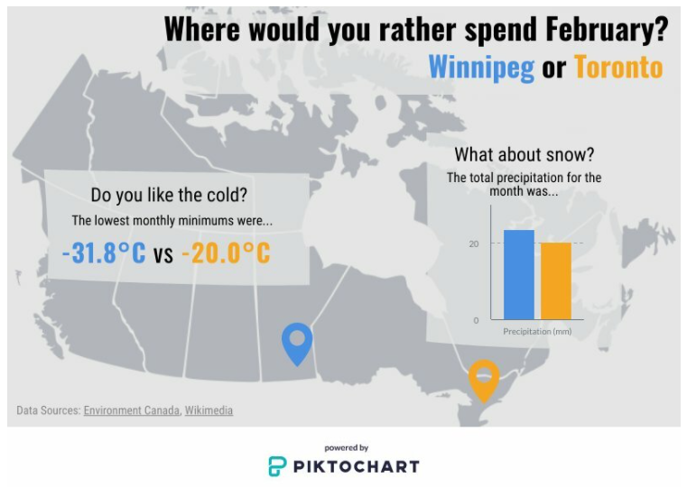
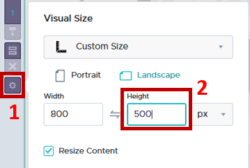
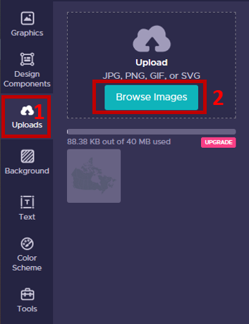
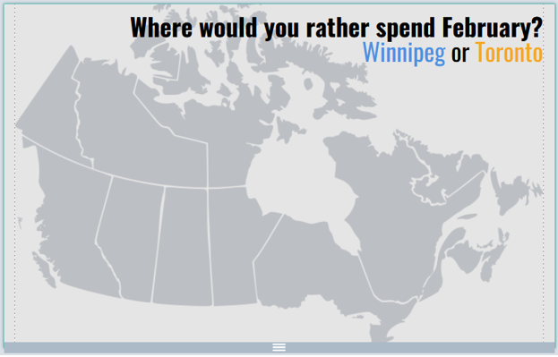

# Piktochart exercise – Making a bite-size visual

---

---

## 0. **Step back**:  
Before we dive in to making a graphic you need to decide what your purpose is…  
- Is it exploratory or explanatory? If exploratory, maybe an infographic isn’t the best option.  
- Where will it be used? This will help us select appropriate size, and visual elements.  
- What is your data capable of? Don’t mislead the audience or create chart-junk!  

Then decide what your actual object will look like. The goal of creating an infographic is to educate your user by providing context and supporting visuals around a certain theme or trend. Physically sketch out what you are thinking about.  

In this case:  

  

## 1. Access your workspace:  
1. Log-in to your free Piktochart account (https://create.piktochart.com/)  
2. The dashboard page is your landing page.  
 

## 2. Create a new item:  
1. Click on the option to create a **new item**. 
2. Select the **infographic** option
3. We will use the **blank template**

  
 
 
## 3. Explore Piktochart Workspace:  
Numbers 1-4 illustrate the locations of the following elements:  

1. Piktochart **options**  
2. **Objects** (to create a new elements)  
3. **Properties** (options for each of the specific objects)
4. **Workspace** (where you build your visual)  

	  
 

## 4. **Name** your item:  
In the top left corner of the page there is a textbox for you to name your file. I’ve named mine _January_. Name yours whatever you would like.  
	  
 

## 5. Change **workspace size**.  
We want our workspace to be smaller and in landscape orientation.  
1. Click the gear next to the workspace to open the properties menu  
2. Change the height to be 500px  

 
 

## 6. Set **background**.  
Stark white and black are hard on the eyes, so we will start by setting the background colour to a light grey.  
1. Select the Background option from the list of tools  
2. Under the Background Colours heading, select light grey by clicking on the paint bucket (or type Hex code #e5e5e5 into the box).  
   
3. Your workspace should look something like:
  	
 

## 7. **Upload** an image.  
We are going to use a map of Canada as a background image to provide some visual interest and ground the audience.  
1. Select the Uploads option from the list of tools  
2. Browse to your data folder and select the map image to upload.  
   
 
3.	Once the image has uploaded, drag and drop it into your workspace  
 

## 8. **Scale** the image to act as a background.  
We are going to scale this image up and set it so that it acts as a background.  
1. Left click the image once to select it  
2. So that it doesn’t skew, hold down the shift key and drag and of the handles that appear along the edge to increase the size to be roughly the width of the page  
3. The top and bottom of the map are cut off, but that’s ok. We just need to make sure the positions for Toronto and Winnipeg are visible  
4. In the image properties toolbar that appears while the image is selected  
    a. Change the opacity of the image to make it less dominant, by clicking the checkerboard  
    b. Then click the lock so that the image doesn’t accidentally get selected and shift, we will be placing other elements on top of it.  
	 
 
5.	Your workspace should now look something like:  

	   
 

## 9. Add a Title/ Subtitle/ Surround **text**.  
We don’t want to overwhelm the user, but we do want to create something visually interesting. A good way to think about it is to select one ornamental text for titles/ emphasis and one plain one for everything else. I selected Oswald and Roboto Condensed, but you can select whatever you want.  
1. Select the Text option from the list of tools  

 
2. Drag and drop the Title block onto your workspace  
Copy and paste the following text into the block that has appeared in your workspace:  
_Where would you rather spend January?  
Winnipeg or Toronto_  
3. You can select text within the block and change its properties using the text properties menu that appears.  
I am going to:  
    a. Bold the first line of the Title,  
    b. Right justify for visual interest  
    c. Apply a different colour to each city name  
	
4. Your workspace should look something like:  

  

## 9. **Final Report** (tab 8) – Proof your work (& change a filter size)
You’ve finally done it, your project is complete! But wait, it’s time to give it one last once over. What have you done? With all your fussing, there’s a mismatch between the publisher chart title and content!  
1. Left click once on the blue publisher chart in the workspace to activate,  
2. In the _Filters_ panel click the arrow to open the **Top 3 downloaded…** properties  
3. Adjust the **Show items** option from **‘4’** to **’3’**  
	  
4. Press **enter** to save your change.  
5. Your workspace should now look something like:  
	   
 

Congratulations! You made it through!  

Questions? Concerns?  
 

<small> Data: [SciHub data (Dryad)](https://doi.org/10.5061/dryad.q447c), [DOI Prefixes](https://gist.github.com/TomDemeranville)</small>  
