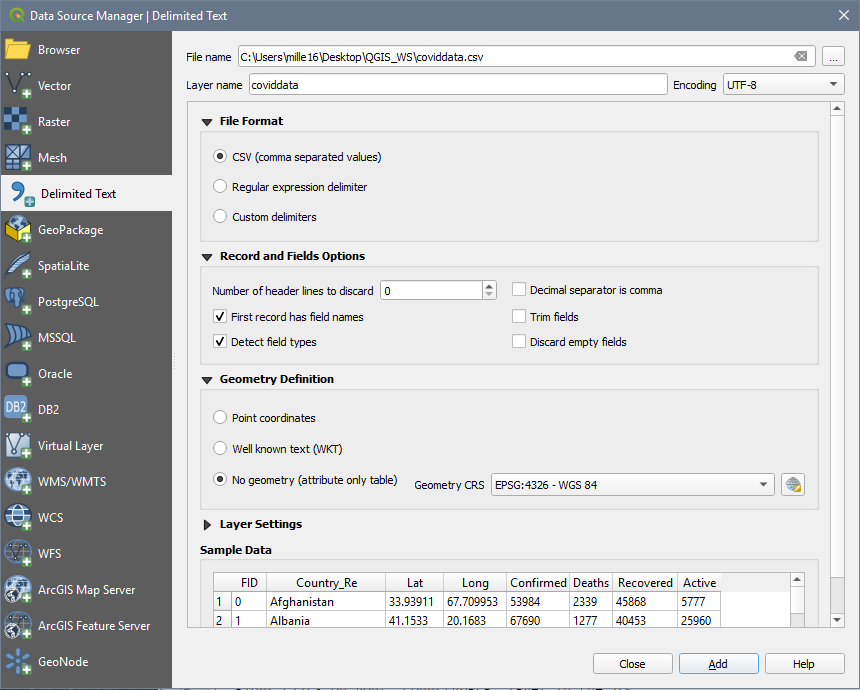
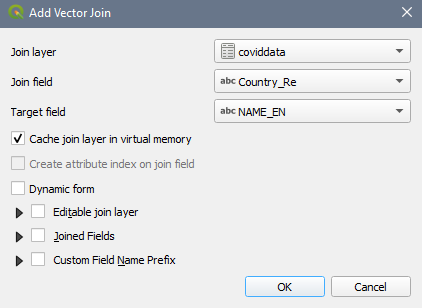
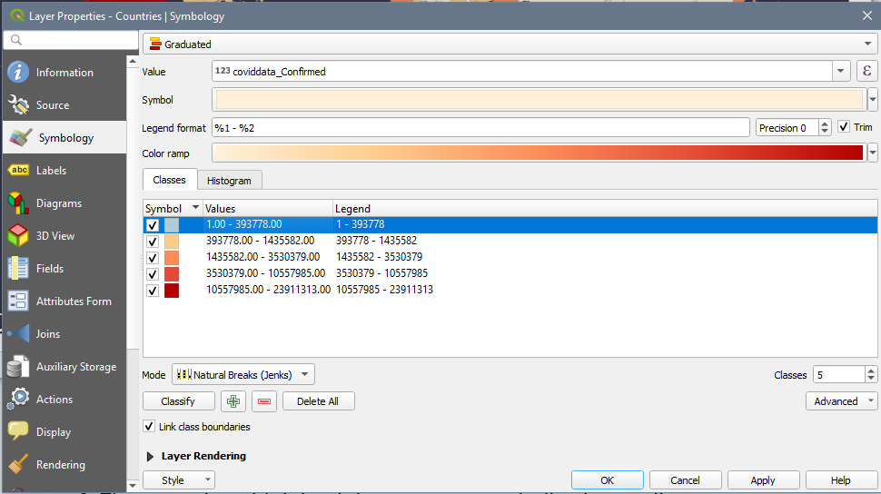
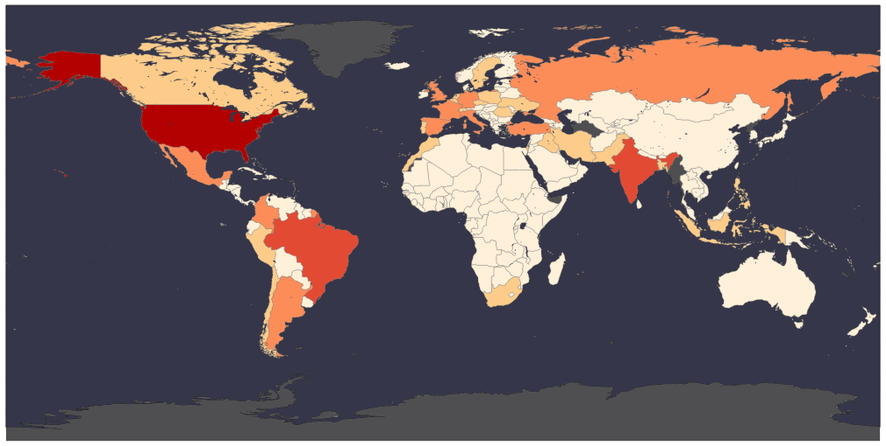
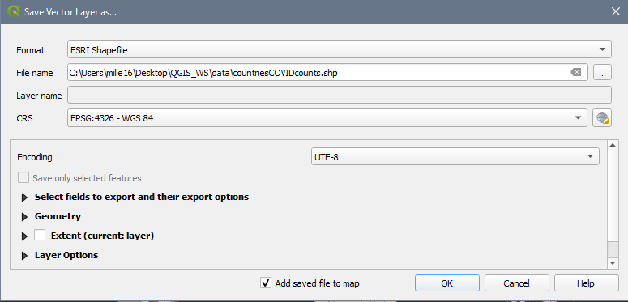

# PowerBI Exercise – Building a better dashboard

---

---

## 1. **Load** a Project:  
1. Open PowerBI from the list of programs on your computer.  
2. Load the workspace **File \> Open report \> _SciHub.pbix_**  
 

## 2. Explore the PowerBI **Interface:**  
Numbers 1-5 illustrate the locations of the following elements: 
1. Menus and tools  
2. **Fields** (specific pieces of information about a record- this is your data)  
3. **Visualizations** (where you select what type of chart you will use, the fields that will populate it and how it will look)  
4. **Filters** (where you can limit results by only selecting from records that match a certain criteria)  
5. **Workspace**

  
 

Numbers 6-8 illustrate the locations of the following views: 
6. **Reports** (dashboard visuals) 
7. **Data** (your data in tabular format)  
8. **Models** (how your data are related)  

  
 

## 3. Explore the **reports workspace** :  
This is our dashboard of visualizations. It is possible to interact with the graphics by panning, clicking and hovering to learn more about the data.  
  
 

## 4. **Explanatory text** (tab 2) is a critical but often overlooked part of a dashboard.
1. **Delete object** - we are going to delete the meaningless graphic from the page  
	1. Left click once on the chart to activate it  
	2. A button with three dots will appear in the top right corner of the object, click it, then select the **remove** option  
	  
2. **Edit and align** text - – you want to identify yourself by adding your name after the date entry in this text box, we also want to change the text alignment to _centre_ so that it flows better in the document.  
	1. Left click once on the text block to activate it – you can now adjust the text using the editor    
	2. Replace the _your name here_ text with your own name  
    3. Using your mouse **click and drag** to select all the text, then select the **align centre** option from the properties box to change the justification.  
	  
	
Your workspace should now look something like this:  
 
 

## 5. Adding data from a .csv file:  
1. There are multiple ways to add a .csv file to QGIS. The most efficient is:  
	Layer \> Add Layer \> **Add Delimited Text Layer**  
2. Click the button to the right of the _File name_ text field and select the _covidData.csv_ file in your data folder.  
3. The wizard auto-fills. Ensure that:  
	1. **File Format** : _csv_  
	2. **Record and Field Options:** _First record has field names + detect field types_  
	3. **Geometry Definition** : _No Geometry (attribute table only)_  
	4. Ensure the preview looks accurate     
4. Click **Add** button  
	  
 

## 6. Perform a **Join** to add the data from *covidData.csv* to the *Countries* file.  
1. Right click on _Countries_ and select **Properties \>**  **(Joins)** to open the dialogue box.  
2. Click the plus sign at the bottom of the dialogue to create a new Join.   
2. In the wizard, ensure that:  
	1. **Join Layer:** _coviddata_  
	2. **Join field:** _Country Re_  
	3. **Target Field:** _NAME EN_  
	4. Check off the option to cache join layer in virtual memory  
	5. Click **OK**  
	  
	6. Right click on the *Countries* layer, **open the attribute table** ,now the COVID numbers have been appended to the end of the attribute table.  
 

## 7. Create a Choropleth  
1. Right click on _Countries_ and select **Properties \>**  **(paintbrush)** to change the symbology  
2. **Symbology type** : _Graduated_ (from the dropdown)  
3. **Column** : Confirmed  
4. **Colour ramp** : Anything light to dark  
5. **Mode** : Natural Breaks (Jenks)  
6. **Classes** : 5
7. Click **Classify** to classify your data    
8. **Values** : Adjust the class cut-offs as you see fit by clicking the values  
  
9. Click Apply + OK  
 

## 8. The countries with joined data are now symbolized according to number of confirmed cases.  
  
 

## 9. Export data to a shapefile format so that it can be used in analysis.  
1. Right click on your _Countries_ layer in the TOC  
2. Select Export \> **Save Features as**  
	1. **Format** : _ESRI Shapefile_  
	2. Click the button to the right of the **File name** text field and select the appropriate directory to save your new file with the rest of your data, name it something descriptive like _CountriesCOVIDcounts_  
	3. **CRS:** _EPSG: 4326 – WGS 84_  
  
 

Congratulations! You made it through!  
 

Questions? Concerns?  

<small> Data:[Natural Earth](https://www.naturalearthdata.com/downloads/10m-cultural-vectors/), [JHU CSSE COVID-19 Data Repository](https://github.com/CSSEGISandData/COVID-19)</small>  
