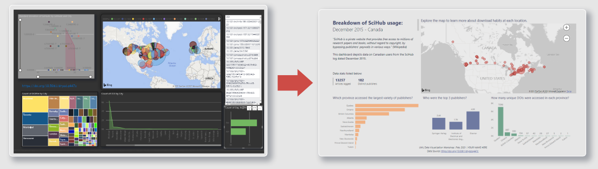
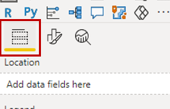

# PowerBI Exercise – Building a better dashboard

---

---

## 1. **Load** a Project:  
1. Open PowerBI from the list of programs on your computer.  
2. Load the workspace **File \> Open report \> _SciHub.pbix_**  
 

## 2. Explore the PowerBI Interface:  
Numbers 1-5 illustrate the locations of the following elements: 
1. **Menus** and **tools**  
2. **Fields** (specific pieces of information about a record- this is your data)  
3. **Visualizations** (where you select what type of chart you will use, the fields that will populate it and how it will look)  
4. **Filters** (where you can limit results by only selecting from records that match a certain criteria)  
5. **Workspace**

	  
 

Numbers 6-8 illustrate the locations of the following views: 
6. **Reports** (dashboard visuals) 
7. **Data** (your data in tabular format)  
8. **Models** (how your data are related)  

	  
 

## 3. Explore the **reports workspace** :  
This is our dashboard of visualizations. It is possible to interact with the graphics by panning, clicking and hovering to learn more about the data.  
	  
 

## 4. **Explanatory text** (tab 2) is a critical but often overlooked part of a dashboard.
1. **Delete object** - we are going to delete the meaningless graphic from the page  
	1. Left click once on the chart to activate it  
	2. A button with three dots will appear in the top right corner of the object, click it, then select the **remove** option  
	  
2. **Edit and align** text - you want to identify yourself by adding your name after the date entry in this text box, we also want to change the text alignment to _centre_ so that it flows better in the document.  
	1. Left click once on the text block to activate it – you can now adjust the text using the editor    
	2. Replace the _your name here_ text with your own name  
    3. Using your mouse **click and drag** to select all the text, then select the **align centre** option from the properties box to change the justification.  
	  
3. Your workspace should now look something like this:  
	 
 

## 5. **Tree Map** (tab 3) - Edit a field name for display purposes.  
Often our data headers will not be in plain language for our audience or formatted in a grammatically correct way. Here we will replace the data header text with a plain language descriptor, leaving our base data unchanged.
1. Left click on the bar chart once to activate it;   
2. You will be in the _Fields_ tab of the _Visualization_ panel.  
	 
3. In the _Visualizations_ pane find the _Values_ property and click on the arrow to open the properties, then select **Rename for this visual**.  
4. Change the text from _Count of publisher_DOI_prefixes.PublisherName_ to _Distinct publishers_  
	  
5. Press **Enter** to save your changes.  
6. You can now see the changes in the tooltip:  
	  
 

## 6. **Pie** (tab 4)- Add data to a new visualization.  
I have already created the container for you, all that needs to be done is to populate the graph.  
1. Left click once on the chart to activate it  
2. To populate the graphic select the following options from the _Fields_ and _Visualizations_ Panels:  
	1. In the **Fields Panel**, ensure you have the _SciHub_Publishers_ dataset activated  
	2. Click the **checkbox** beside the _Day_Night_ field to link it to the chart.   
    3. Now **drag and drop** the _Day_Night_ field from the Fields panel to the **Values** property of the Visualizations panel. It should auto-load as a count.  
	  
3. Your workspace should now look something like this:  
	 
 

## 7. **Outliers** (tab 5) – Turn off slider, edit title, add labels.
While the zoom slider on the y-axis does help us to contend with the high volume of downloads coming out of QC (compared to other provinces), it isn’t necessarily the most user-friendly solution. Instead, we will add labels to our bars.  
1. Left click once on the bar chart in the workspace to activate  
2. In the _Visualization_ panel ensure the **format** option is selected,  
	  
3. Toggle the **Zoom slider** option from the **'on'** to the **'off'** position  
	  
4. Toggle the **Data labels** slider option from the **'off'** to the **'on'** position, we now have labels, but not meaningful ones.  
5. Open the **Data Labels** dropdown by clicking on the arrow and change the **Display Units** from **‘auto’** to **‘none’**.  
	  
6. Open the **Title** dropdown and edit the _Title_ to remove the reference to the slider.  
	  
7. Your workspace should now look something like this:  
	   
 

## 8. **Map** (tabs 6 & 7)– Adjust base map, convert a report to a tool tip. 
We want our dashboard to look like a cohesive whole with the data being the primary focus, but also not overwhelming the user.  
1. Left click once on the map to activate it  
2. In the _Visualization panel_ ensure the *format* option is selected,  
	  
3. Open the **Map styles** dropdown and change the theme from ‘**Aerial’** to **‘Grayscale’**. 
	  
4. When we hover over a data point on our map we get a large white box for a tooltip, to adjust another report to be a tooltip, we need to properly size it.
	1. Open the **City Summary tooltip tab** at the bottom of the page, you can see that the page size is much larger than the content.  
	2. Left click once in the whitespace of the workspace to select,   
    3. In the _Visualization_ panel ensure the **format** option is selected,  
	  
	4. Open the **Page size** dropdown and change the type from **‘Letter’** to **‘Tooltip’**.  
	  
	The workspace should have snapped to your content size.  
5. Now when you return to the _Map / UX_ tab at the bottom of your screen, when you **mouse-over** a data point it should look something like:  
	 
 

## 9. **Final Report** (tab 8) – Proof your work (& change a filter size)
You’ve finally done it, your project is complete! But wait, it’s time to give it one last once over. What have you done? With all your fussing, there’s a mismatch between the publisher chart title and content!  
1. Left click once on the blue publisher chart in the workspace to activate,  
2. In the _Filters_ panel click the arrow to open the **Top 3 downloaded…** properties  
3. Adjust the **Show items** option from **‘4’** to **’3’**  
	  
4. Press **enter** to save your change.  
5. Your workspace should now look something like:  
	   
 

Congratulations! You made it through!  

Questions? Concerns?  
 

<small> Data: [SciHub data (Dryad)](https://doi.org/10.5061/dryad.q447c), [DOI Prefixes](https://gist.github.com/TomDemeranville)</small>  
