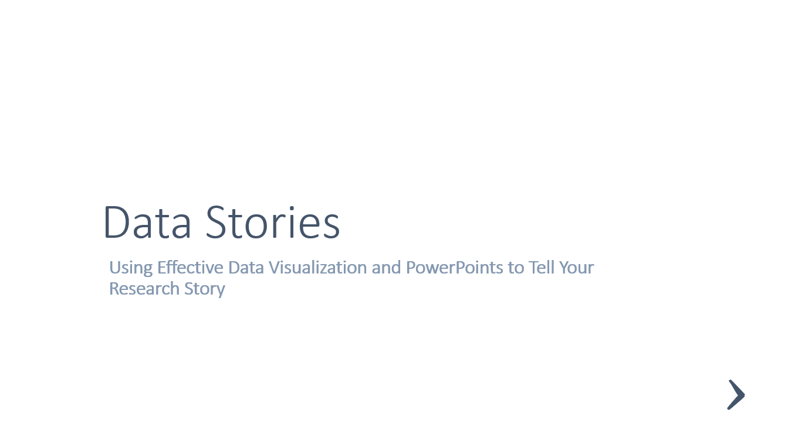

# Effective Presentations

*Follow along and interact with the slides below if you want:*
 

  

Watch the session on [YouTube](https://youtu.be/).

## Key points from slides:

-  Point1    
-  Point 2
	- Subpoint1 
    - Subpoint2 
-  Many visualization tools can be found linked from the [data visualization subject guide](https://libguides.lib.umanitoba.ca/viz).  