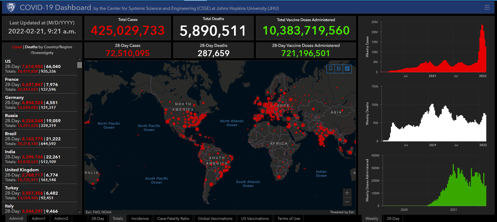
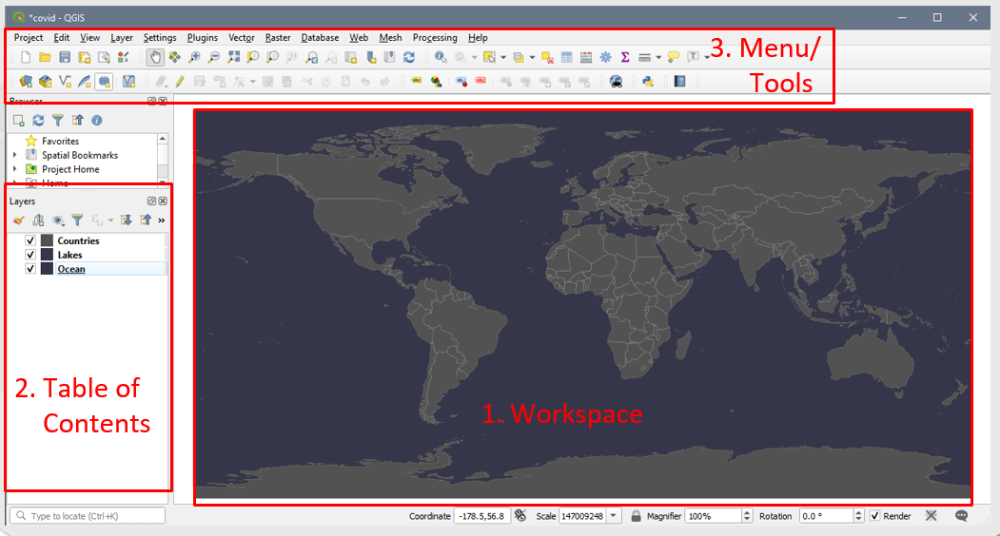
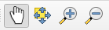
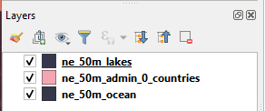
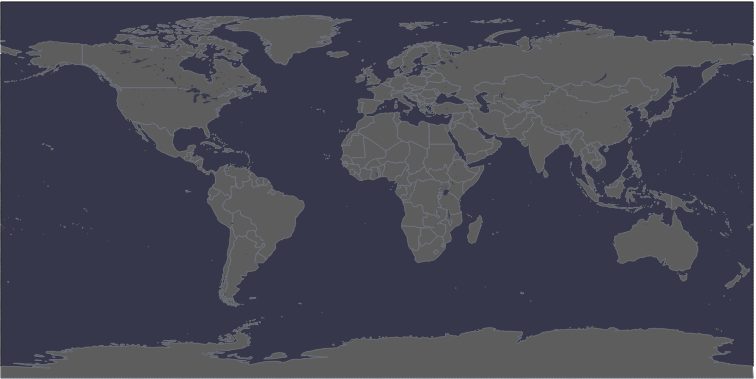
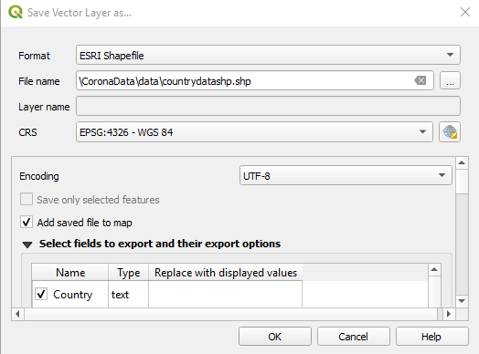
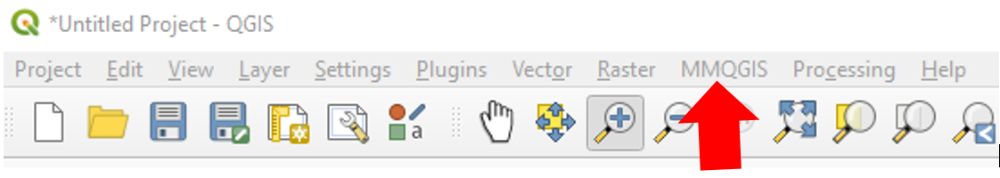
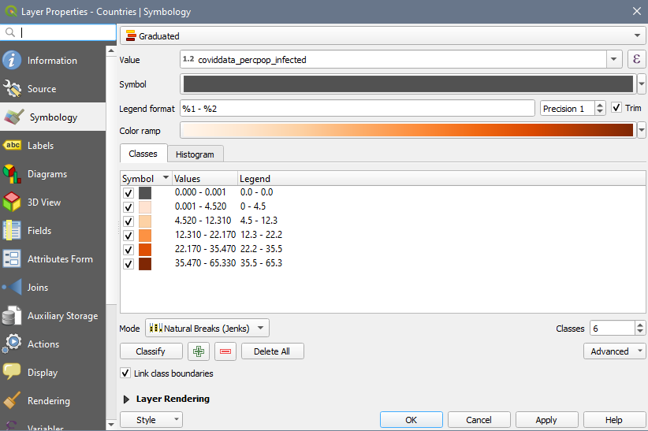
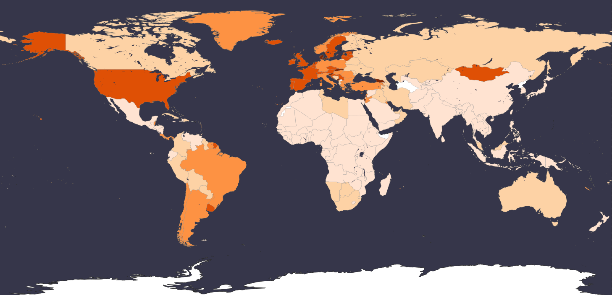

# QGIS Exercise – Rebuild the COVID-19 map as a choropleth

## 1. **Open** QGIS:  
	Load the workspace (Project \> Open \> _Covid.qgz_)  

## 2. **Interface:**  
	Workspace, Table of Contents (TOC), Menu/Tools  
	  

## 3. Explore the **workspace** :  
	  
	Try using the pan (hand) and zoom (magnifying glasses) to move around the map  

4. Explore the **Table of Contents**  
	1. Right click on a layer, **open the attribute table** , if we want to map COVID cases, what is missing?  
	2. To makes the _ne\_50m\_lakes_ file visible, **drag it up the list** so it is above _ne\_50m\_admin\_0\_countries_ file  
		  
	3. Right click on _ne\_50m\_admin\_0\_countries_ and select **Properties \>**  **(paintbrush)** to change the symbology to a simple dark grey fill with a lighter grey stroke.  
		  
		Your map should now look something like:  
		  

5. Adding data from a .csv file  
	1. Layer \> Add Layer \> **Add Delimited Text Layer**  
	2. Click the button to the right of the _File name_ text field and select the _CountryData.csv_ file in your data folder  
	3. The wizard auto-fills. Ensure that:  
		1. **File Format** : _csv_  
		2. **Record and Field Options:** _First record has field names + detect field types_  
		3. **Geometry Definition** : _Point coordinates_  
		4. **Xfield** = _longitude_ **Yfield** = _latitude_  
		5. **Geometry CRS:** _EPSG: 4326 – WGS 84_  
	4. Click **Add** button  

6. Export data to a shapefile format so that it can be used in analysis  
	1. Right click on your _CountryData_ layer in the TOC  
	2. Select Export \> **Save Features as**  
		1. **Format** : _ESRI Shapefile_  
		2. Click the button to the right of the _ **File name** _text field and select the appropriate directory to save your new file, name it something descriptive like _CountryDataSHP_  
		3. **CRS:** _EPSG: 4326 – WGS 84_  
	  

7.  Add a Plugin to perform analysis  
	1. Plugins \> **Manage and Install Plugins**  
	2. Search: MMQGIS  
	3. Click Install Plugin (it should now appear in the Menu area)  
	   

8. Perform a **Spatial Join** to join the data from _CountryDataSHP_ with the _ne\_50m\_admin\_0\_countries_ file  
	1. MMQGIS \> Combine \> Spatial Join  
	2. In the wizard, ensure that:  
		1. **Output Shape (Target) Layer:**_ne\_50m\_admin\_0\_countries_  
		2. **Spatial Operation:** _Contains_  
		3. **Data (Join) Layer:** _CountryDataSHP_  
		4. **Fields:** ctrl + click to select: _Country, Confirmed, Deaths, Recovered, Latitude, Longitude_  
		5. **Field operation** : _First_  
		6. **Output:** Navigate to your folder and save as _spatialjoin.shp_  

9. Create a Choropleth  
	1. Right click on _spatialjoin.shp_ and select **Properties \>**  **(paintbrush)** to change the symbology  
	2. **Symbology type** : _Graduated_ (from the dropdown)  
    3. **Column** : Confirmed  
    4. **Colour ramp** : Anything light to dark  
    5. **Mode** : Quantile  
    6. **Classes** : 5  
    7. **Values** : Adjust the class cut-offs as you see fit by clicking the values  
	  
    8. Click Apply + OK  

10. The countries with joined data are now symbolized according to number of confirmed cases.  
	  

Congratulations! You made it through!  

Questions? Concerns?  
