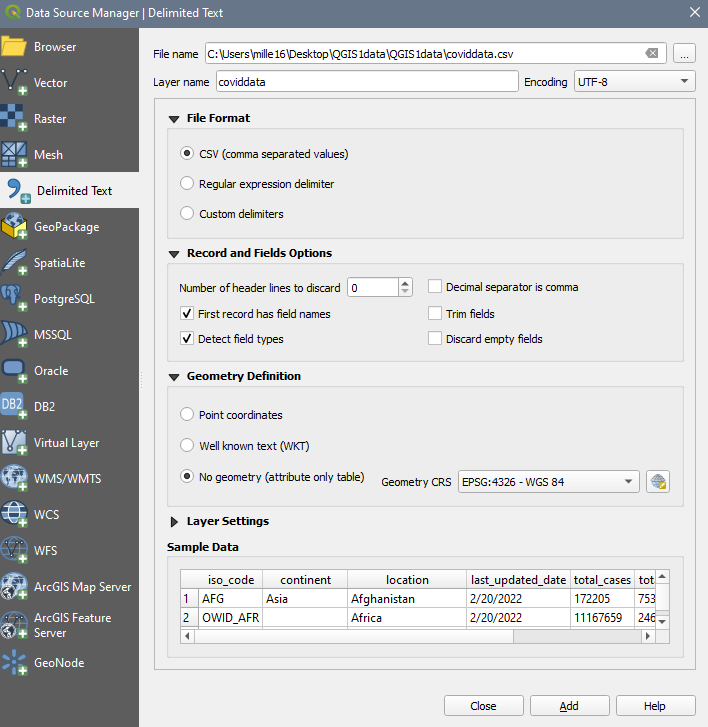
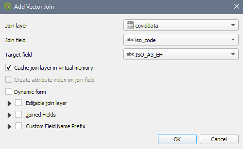

# QGIS Exercise – Building the COVID-19 map

---

---

## 1. **Load** a Project:  
1. Open QGIS from the list of programs on your computer.  
2. Load the workspace (**Project \> Open \> _Covid.qgz_**  
 

## 2. **Interface:**  
Numbers 1-3 illustrate the locations of the following elements: 
1. Workspace  
2. Table of Contents (TOC)  
3. Menu/Tools  
  
 

## 3. Explore the **workspace** :  
Try using the pan (hand) and zoom (magnifying glasses) to move around the map.  
  
 

## 4. Explore the **Table of Contents**  
1. There is a *Lakes* file listed in the TOC but it is not visible on the map:  
	To makes the *Lakes* file visible, **drag it up the list** so it is above *Countries* file.  
	  
	Your map should now look something like:  
	  
2. Right click on the *Countries* layer, **open the attribute table** , if we want to map COVID cases, what information is missing from the *Countries* file?  
 

## 5. Adding data from a .csv file:  
1. There are multiple ways to add a .csv file to QGIS. The most efficient is:  
	Layer \> Add Layer \> **Add Delimited Text Layer**  
2. Click the button to the right of the _File name_ text field and select the _covidData.csv_ file in your data folder.  
3. The wizard auto-fills. Ensure that:  
	1. **File Format** : _csv_  
	2. **Record and Field Options:** _First record has field names + detect field types_  
	3. **Geometry Definition** : _No Geometry (attribute table only)_  
	4. Ensure the preview looks accurate     
4. Click **Add** button  
	  
 

## 6. Perform a **Join** to add the data from *covidData.csv* to the *Countries* file.  
1. Right click on _Countries_ and select **Properties \>**  **(Joins)** to open the dialogue box.  
2. Click the plus sign at the bottom of the dialogue to create a new Join.   
2. In the wizard, ensure that:  
	1. **Join Layer:** _coviddata_  
	2. **Join field:** _Country Re_  
	3. **Target Field:** _NAME EN_  
	4. Check off the option to cache join layer in virtual memory  
	5. Click **OK**  
	  
	6. Right click on the *Countries* layer, **open the attribute table** ,now the COVID numbers have been appended to the end of the attribute table.  
 

## 7. Create a Choropleth  
1. Right click on _Countries_ and select **Properties \>**  **(paintbrush)** to change the symbology  
2. **Symbology type** : _Graduated_ (from the dropdown)  
3. **Column** : Confirmed  
4. **Colour ramp** : Anything light to dark  
5. **Mode** : Quantile  
6. **Classes** : 5  
7. **Values** : Adjust the class cut-offs as you see fit by clicking the values  
  
8. Click Apply + OK  
 

## 8. The countries with joined data are now symbolized according to number of confirmed cases.  
  
 

## 9. Export data to a shapefile format so that it can be used in analysis.  
1. Right click on your _Countries_ layer in the TOC  
2. Select Export \> **Save Features as**  
	1. **Format** : _ESRI Shapefile_  
	2. Click the button to the right of the **File name** text field and select the appropriate directory to save your new file with the rest of your data, name it something descriptive like _CountriesCOVIDcounts_  
	3. **CRS:** _EPSG: 4326 – WGS 84_  
  
 

Congratulations! You made it through!  
 

Questions? Concerns?  
