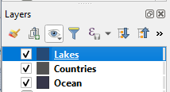
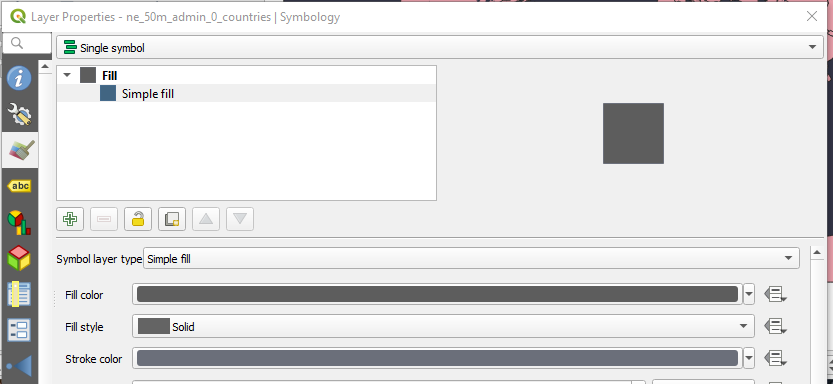
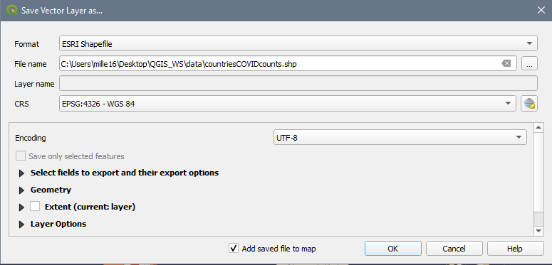

# QGIS Exercise – Building the COVID-19 map

---

---

## 1. **Open** QGIS:  
Load the workspace (Project \> Open \> _Covid.qgz_)  
 

## 2. **Interface:**  
 Numbers 1-3 illustrate the locations of the following elements: Workspace, Table of Contents (TOC), Menu/Tools  
  
 

## 3. Explore the **workspace** :  
  
Try using the pan (hand) and zoom (magnifying glasses) to move around the map.  
 

## 4. Explore the **Table of Contents**  
1. Right click on a layer, **open the attribute table** , if we want to map COVID cases, what is missing?  
2. To makes the *Lakes* file visible, **drag it up the list** so it is above *Countries* file  
	  
3. Right click on *Countries* and select **Properties \>**  **(paintbrush)** to change the symbology to a simple dark grey fill with a lighter grey stroke.  
	  
	Your map should now look something like:  
	  
 

## 5. Adding data from a .csv file  
1. Layer \> Add Layer \> **Add Delimited Text Layer**  
2. Click the button to the right of the _File name_ text field and select the _CountryData.csv_ file in your data folder  
3. The wizard auto-fills. Ensure that:  
	1. **File Format** : _csv_  
	2. **Record and Field Options:** _First record has field names + detect field types_  
	3. **Geometry Definition** : _Point coordinates_  
	4. **Xfield** = _longitude_ **Yfield** = _latitude_  
	5. **Geometry CRS:** _EPSG: 4326 – WGS 84_  
4. Click **Add** button  
 

## 6. Export data to a shapefile format so that it can be used in analysis  
1. Right click on your _CountryData_ layer in the TOC  
2. Select Export \> **Save Features as**  
	1. **Format** : _ESRI Shapefile_  
	2. Click the button to the right of the _ **File name** _text field and select the appropriate directory to save your new file, name it something descriptive like _CountryDataSHP_  
	3. **CRS:** _EPSG: 4326 – WGS 84_  
  
 

## 7.  Add a Plugin to perform analysis  
1. Plugins \> **Manage and Install Plugins**  
2. Search: MMQGIS  
3. Click Install Plugin (it should now appear in the Menu area)  
   
 

## 8. Perform a **Spatial Join** to join the data from *CountryDataSHP* with the *Countries* file  
1. MMQGIS \> Combine \> Spatial Join  
2. In the wizard, ensure that:  
	1. **Output Shape (Target) Layer:**_Countries_  
	2. **Spatial Operation:** _Contains_  
	3. **Data (Join) Layer:** _CountryDataSHP_  
	4. **Fields:** ctrl + click to select: _Country, Confirmed, Deaths, Recovered, Latitude, Longitude_  
	5. **Field operation** : _First_  
	6. **Output:** Navigate to your folder and save as _spatialjoin.shp_  
 

## 9. Create a Choropleth  
1. Right click on _spatialjoin.shp_ and select **Properties \>**  **(paintbrush)** to change the symbology  
2. **Symbology type** : _Graduated_ (from the dropdown)  
3. **Column** : Confirmed  
4. **Colour ramp** : Anything light to dark  
5. **Mode** : Quantile  
6. **Classes** : 5  
7. **Values** : Adjust the class cut-offs as you see fit by clicking the values  
  
8. Click Apply + OK  
 

## 10. The countries with joined data are now symbolized according to number of confirmed cases.  
  
 

Congratulations! You made it through!  
 

Questions? Concerns?  
