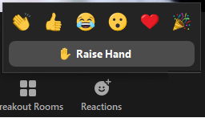

# Participating online

## Audio
Your  microphone will be muted by default to improve audio quality. This session is recorded so that you can refer back to the content at your own pace.  

## Zoom
The toolbar provides limited methods to interact with the instructor or your peers.  

  
 

## Raise hand button
Use the _Raise Hand_ button to indicate for me to slow down. Try and think of these sessions as a live YouTube video. Asking for assistance with specific technical issues will not be helpful to the broader audience.  

  

## Chat window
Use the _Chat_ window to comment or ask a the instructor a question at any time. Instructors will do their best to respond, sometimes waiting for a break in the lesson to do so. If your question requires a lengthly response I will follow-up after the session with you via e-mail.  

## Share your screen
 If you have in-depth questions, it is best to book a one-on-one consultation or attend office hours for the session which will be held the following Wednesday 12-1pm.  

